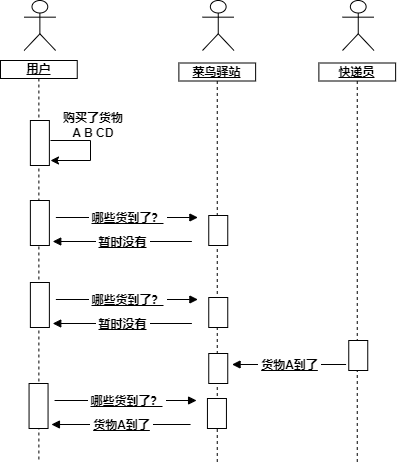
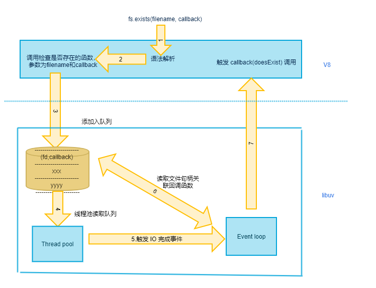

## 1 Node.js 体系结构

其实我就是想写一下 Node 的底层架构，但是说道底层这个东西，我就想起来了我上学时候的一门课《计算机体系机构》，就是把计算机各个部件的运行原理给串起来来讲，所以我就把这章的名字定为 Node.js 体系结构，但愿讲得够底层。

### 1.1 网络 IO 模型变迁
Node.js 是一门服务器语言，为了体现 Node 的优越性，我们这里不得不扯一下服务器开发的一些历史。

我们最常见的服务器程序一般是基于 HTTP 和 TCP 协议来提供服务的，HTTP 底层又基于 TCP ，所以我们直接来描述 TCP 协议在服务器端实现的逻辑。在操作系统中TCP的通信过程又被称之为网络IO操作，下面描述的就是网络IO操作的简史。

TCP 服务在建立完 socket 监听后，会调用 accept() 函数来监听客户端的连接请求，但是这个过程是堵塞的。也就是说如果函数没有返回，当前线程会一直等待，而且在这个等待的过程中无法做任何事情。伪代码如下：

```
while(true) {
    socket = accept();
}
```
**代码 1.1.1 socket建立连接伪代码**

代码 1.1中我们通过accept函数，服务器和客户端之间建立了一个socket连接，建立完连接之后，就可以开始发送接收数据的操作。但是当程序运行到accept函数的时候，是堵塞的，也就是说这个函数不运行完成，代码是没法继续运行的。
假设我们现在 accept 函数返回了，那么我们就可以读取这个连接发送过来的请求数据了：

```
while(true) {
    socket = accept();
    while(true) {
        data = read(socket);
        //process_data(data);//处理数据
    }
}
```
**代码 1.1.2 读取socket数据伪代码**

不过和 accept 一样，这个 read 函数依然是堵塞的。照这个趋势下去，一个服务器只能给一个连接做服务了，其他的连接就干等着。这可不是我们想要的结果。

我们的前辈们想到的解决方案是fork子[进程](https://zh.wikipedia.org/wiki/%E8%A1%8C%E7%A8%8B)，每次跟客户端建立一个连接，都创建一个新的子进程来维护当前连接，在这个新的子进程中进行发送和接收数据。这种子进程的模型的典型代表就是 Apache 1.x。我们来看一下伪代码：

```
while(true) {//主进程代码
    socket = accept();
    var child = fork(socket);
}

while(true) {//子进程代码
    data = read(socket);
}
```
**代码 1.1.3 子进程读取socket数据伪代码**

看上去是一个好的解决方案，各个socket连接在读取数据的时候都是在单独的一个进程中完成的，不会互相堵塞。不过进程的创建是一个耗时的操作，而且操作系统对于启动的最大进程数也是有限制的，如果服务器创建大量线程，有可能导致系统其他进程无法启动(所以一般服务器都会限制启动子进程的最大数目，这个时候在程序里面会维护一个socket队列，来决定那些连接被丢入子进程进行处理。)。这个时候[线程](https://zh.wikipedia.org/wiki/%E7%BA%BF%E7%A8%8B)便进入了大家的视野，它作为cpu的最小调度单位，具有比进程更少的资源占用，最好的性能。线程有进程创建，对于一个进程来说，它所创建的线程共享其内存数据，且可以被统一管理。由于使用线程的逻辑和使用进程的逻辑类似，所以这里不给出伪代码。 Apache 从2.x开始增加了对多线程的支持。  

即使使用了线程，但是计算机的CPU每次可以处理的线程数是有限的（单核CPU每次处理一个线程，双核可以同时处理两个，Intel使用超线程技术，可以使一个核心处理两个线程，所以说我们常用的i5处理器，虽然是两核但是却可以同时处理四线程），为了让各个线程公平对待，CPU在单位时间内会切换正在处理的线程。但是这个切换动作是比较耗时的，CPU在将处理的线程任务切换走之前要暂存线程的内存，在切换入一个新的要处理的进程之前要读取之前暂存的线程内存，当然还要考虑到CPU内部还要有一套调度算法，来决定什么时候将线程切换到CPU进行处理。所以说使用线程也会遇到性能瓶颈，不会像我们想的那样，线程数起的越多，性能越好。

不过在操作系统中有非堵塞IO（nonblocking IO）的概念，既然它叫这个名，那么我们前面讲的就应该叫堵塞IO（blocking io）了。我们还是通过类比来解释在读取socket数据时两者的区别，同时看看这个传说中的非堵塞IO能否解决我们的问题。

我们把socket通讯过程类比为你在淘宝上买东西的过程，你在淘宝上下单买了件商品（socket连接建立了）。对于堵塞 IO 来说，你需要给快递员打电话，并且你还不能挂断，在快递员没有通知你商品到之前，你啥事也不能干。


**图 1.1 堵塞 IO 类比时序图**

我们用一幅图来描述上述过程的话，那他应该如 **图 1.1** 所示，其实在真实场景中，用户就是你的应用程序，而快递员就是你的 Linux 内核。

对于非堵塞 IO 来说，为了了解到包裹是否送达了，你只需要定时给快递员打电话咨询。不过你在打完电话之后还可以忙别的，比如说看会儿书，喝喝茶。然后你想起来，我靠还有一个快递呢，于是赶紧再打一个电话，结果发现人家快递员已经在楼下等了半天。所以说，要想尽早得到快递，你得一直跟快递员打电话（俗称呼死他）。


**图 1.2 非堵塞 IO 类比时序图**

> 有人问，为什么不是快递员给你打电话，而是你给快递员打电话，首先声明一下，为了简化描述的工作量，我们现在先按照linux操作系统来讲，在linux系统中只能用户去调用内核函数，没有内核函数主动通知用户程序的功能。我们这里内核函数就是快递员，用户程序就是你自己，所以只能你自己打电话给快递员。同时大家需要注意，对于非堵塞 IO 这个定义，有不同的叫法，有的管我们刚才提到的这种方式交非堵塞 IO ，但是有的管 IO 多路复用 （下面马上讲）叫非堵塞 IO。

OK，下面要轮到我们的 IO 多路复用闪亮登场了。 一般你在淘宝上买东西，填写邮寄方式的时候，都是直接写你自己的地址，不过淘宝其实提供了菜鸟驿站这个东西，你可以在不方便的情况下把，把包裹的邮寄地址写成菜鸟驿站。这个样子你的所有快递就都可以由菜鸟驿站来代收了，不过你仍然要打电话询问驿站的工作人员，快递来了吗（因为我们用的是linux，在这个操作系统下，内核是不会主动通知用户程序的，这个步骤在linux中称为事件查询）。



**图 1.3 IO 多路复用类比时序图**

回到上面的栗子，你可能会问如果单纯一件商品的话，自己直接等快递显然比先送到菜鸟驿站再打电话问要快。是的，没错！但是不要忘了，为了收多件快递，没订购一件商品，都要克隆出另外一个你（fork子进程或者创建线程），来等着收快递，一旦你淘宝上下单量很大，管理这些克隆人的成本就会陡增（主要耗费在进程或线程的上下文切换和调度）。所以说在连接数不大的情况下使用堵塞IO反而效率更高。

这个IO 多路复用在linxu上几经更新，发展到现在，使用的最新技术就是 epoll ，nginx底层就是利用了这个技术。其实通过前面的栗子，我们发现 IO 多路复用中依然有堵塞过程（不断打电话给菜鸟驿站的过程），但是我们在实际编程中可以专门做一个子线程来做打电话的工作（相当于给你请了一个秘书），然后主线程可以该干嘛干嘛。

## 1.2 libuv

Node 的开发者 Ryan dahl，起初想构建一个可以处理大量HTTP连接的web服务，他知道使用C语言可以实现这个目标，前面章节讲到 IO 多路复用在大量连接数的时候，性能要优于堵塞 IO。但那是C语言开发效率太低了，特别是当你做web开发的时候，当时恰逢08年，谷歌刚推出V8引擎，我们的Ryan dahl 经过各种选型和权衡后，最终选择用C、C++做了一个 IO 处理层，结合V8引擎，组成了 Node。这个 IO 处理层，就是我们现在说到的 libuv。

我们前面的内容是基于 linux 描述的，但是类似于 epoll 的操作，在不同的操作系统实现库函数是不同的，在 windows 上有IOCP，MAC上有kqueue,SunOS上有event ports，这个时候有一个抽象层对外提供统一的 api 是一个好的选择，libuv就解决了这个问题，但是这不是他所有的功能。

libuv的[官方文档](http://docs.libuv.org/en/v1.x/design.html)在阐述他的架构的时候给出来这么一张图，但是仅仅凭着这么一张图并不能让你对其内部机制理解得更透彻。

我们知道 node 使用了 V8 引擎，但是在 node 里面 V8 充当的角色更多的是语法解析层面，另外它还充当了 JavaScript 和 c/c++ 的桥梁。但是我们都知道 Node 中一切皆可异步，但这并不是通过 V8 来实现的，充当这个角色的是 libuv。libuv 作为实现此功能的幕后工作者，一直不显山不露水，今天就要将其请到前台来给大家展示一下。

js 怎样做一个异步代码，`setTimeout`函数即可搞定：

```javascript
setTimeout(function(){console.log('timeout 0');},0);
console.log('outter');
```
**代码 1.2.1 一个简单的js定时器演示**

> 最终输出结果先是打印 `outter` 然后打印 `timeout 0`。

想要深挖为什么会出现这样的结果，要首先来研究一下 libuv 的事件轮询机制。在libuv中，有一个**句柄（handle）**的概念，每个句柄中存储数据和回调函数之类的信息，句柄在使用前要添加到对应的**队列（queue）**或者**堆（heap）**中，其实只有定时器句柄使用了[最小堆](https://zh.wikipedia.org/wiki/%E6%9C%80%E5%A4%A7%E2%80%94%E6%9C%80%E5%B0%8F%E5%A0%86)的数据结构，其他句柄使用队列的数据结构进行存储。libuv在进行每一次事件轮询的时候都会从每个类型的句柄中，取出关联的队列或者堆结构进行处理。下面给出事件轮询的流程图：
  
**图1.2.1 默认事件轮询流程图**

如上图所示，从第2步开始处理事件轮询中的各种类型的堆和队列结构，其中：

- 定时回调，处理 `setTimeout` 和 `setInterval` 的回调。
- pending 回调，处理各种 IO 事件完成的回调函数，不过不包括关闭事件。
- idle 和 prepare 回调，仅仅在内部使用，有兴趣大家可以参见libuv的测试文件 [test_idle.c](https://github.com/libuv/libuv/blob/v1.x/test/test-idle.c) 。
- IO 事件查询，就是前面讲到的检测 IO 多路复用事件的操作。
- check 回调，在 Node.js 中被用作运行 `setImmediate` 回调。
- 句柄关闭回调，用来运行一些类似于 socket  句柄关闭的回调函数。

接着，讲述一下libuv的线程模型，因为要想实现一个无堵塞的事件轮询必须依靠线程。libuv 中大体上可以把线程分为两类，一类是事件轮询线程，一类是文件 IO 处理线程。第一类事件轮询线程是单线程；另外一类称其为文件 IO 处理线程多少有些不准确，因为他不仅能处理文件 IO，还能处理 DNS 解析，也能处理用户自己编写的 node 扩展中的逻辑，它是一个线程池，如果你想自己编写一个 c++ 扩展来处理耗时业务的话，就会用上它（我们将在第9章讲c++扩展内容）。

我们这里拿文件IO处理举个栗子，来描述这两类线程之前是怎么通信的。libuv 在处理完一个文件 IO 操作后，会把处理后的结果发送到 pending 队列中；事件轮询线程读取 pending 队列，执行回调函数，也就是图1.2.1中第3步操作。下面是我们演示用的函数：

```javascript
var fs = require('fs');

fs.exists(__filename, function (exists) {
  console.log(exists);
});
```

**代码 1.2.3 fs.exists 函数示例**

[fs.exists](https://nodejs.org/dist/latest-v6.x/docs/api/fs.html#fs_fs_exists_path_callback) 是 Node 自带的函数，我们在调用的时候传了两个参数，第一个 `__filename` 是 Node 中的一个全局变量，它的值其实是当前执行文件的所在路径，第二个参数是一个回调函数，回调函数中 `exists` 用来表示当前是否存在，很明显当前这段代码最终打印的结果肯定是 `true`，当然我们这里更关心的是整个流程处理，下面用一副数据流向图来将上面流程总结一下：



**图 1.2.2 Node 中文件IO处理数据流向图**

### 1.3 参考链接

- [Linux IO 概览](http://blog.lucode.net/linux/linux-io-overview.html)
- [Libuv 源码阅读](http://masutangu.com/2016/10/libuv-source-code/)
- [The Node.js Event Loop, Timers, and `process.nextTick()`](https://nodejs.org/en/docs/guides/event-loop-timers-and-nexttick/)


