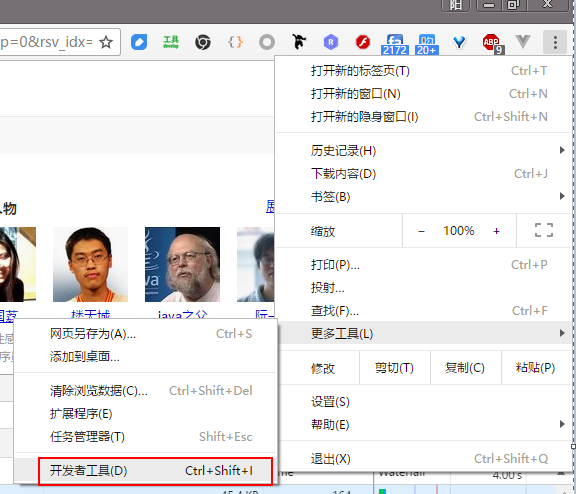

## 3 Node 基础

### 3.1 安装

打开 [Node官网](https://nodejs.org) ,引入眼帘的就是它的下载地址了，windows下提供的是安装程序（下载完之后直接双击安装），linux下提供的是源码包（需要编译安装），详细安装流程这里省略掉，我想这个不会难倒各位好汉。

### 3.2 旋风开始

在讲 Node 语法之前先直接引入一段 Node 的小例子，我们就从这个例子着手。首先我们在随意目录下创建两个文件 `a.js` `b.js`。

```javascript
exports.doAdd = function(x,y) {
    return x+y;
};
```  
**代码 3.2.1 a.js**  

```javascript
const a = require('./a');

console.log(a.doAdd(1,2));
```  
**代码 3.2.2 b.js**  

和普通前端 javascript 不同的是，这里有两个关键字 `exports` 和 `require`。这就牵扯到模块话的概念了，javascript 这门语言设计的初衷是开发一门脚本语言，让美工等从业人员也能快速掌握并做出各种网页特效来，加之当初语言创作者开发这门语言的周期非常之短，所以在 javascript 漫长的发展过程中一直是没有模块这个语言特性的（直到最近ES6的出现才打破了这个格局）。

>
Node 是最近几年才发展起来的语言，前端 js 发展的历史要远远长于他，2000年以后随着 [Ajax](https://zh.wikipedia.org/wiki/AJAX)技术越来越流行，js的代码开始和后端代码进行交互，逻辑越来越复杂，也越来越需要以工程化的角度去组织它的代码。模块化就是其中一项亟待解决的问题，期间出现了很多模块化的规范，[CommonJS](https://en.wikipedia.org/wiki/CommonJS)就是其中的一个解决方案。由于其采用同步的模式加载模块，逐渐被前端所抛弃，但是却特别适合服务器端的架构，服务器端只需要在启动前的时候把所有模块加载到内存，启动完成后所有模块就都可以被调用了。

我们在命令行中进入刚才我们新创建的那个文件夹下，然后运行 `node b.js`，会输出 `3` ，这就意味着你的第一个node程序编写成功了。

在a.js中 exports 对象会被 `导出`，在 b.js 中通过require 就能得到这个被导出的对象，所以我们能访问这个被导出对象的 doAdd 函数。假设我们在 a.js 中还有一个局部变量：

```javascript
var tag = 'in a.js';
exports.doAdd = function(x,y) {
    console.log(tag,x,y);
    return x+y;
};
```  
**代码 3.2.3 a.js**  

这里定义的 `tag` 变量是没法在 `b.js` 中读取的，其作用区域仅仅被局限在 `a.js` 中。如果在 b.js 中打印 `console.log(a.tag)` 会输出 `undefined`。


这里 `b.js` 里我们引用 `a.js` 时用 require('./a')，假设我们现在的目录结构是这样的

```
---a.js
---b.js
---lib
|-------c.js
```  
**目录3.2.1**

这个时候我们在b.js 中就可以通过 `const c = require('./lib/c');` 来引入 c.js。同时 node 本身还包含了各种系统API。比如通过require('fs')，可以引入系统自带的 [文件操作库](https://nodejs.org/dist/latest-v6.x/docs/api/fs.html)。下面就举一个操作文件的栗子：

```javascript
const fs = require('fs');

exports.getData = function(path,callback) {
    fs.exists(path,statCallback);
    
    function statCallback(exists) {
        if (!exists) {
            return callback(path+'不存在');
        }
        const stream = fs.createReadStream(path);
        let data = '';
        stream.on('data',function(chunk) {
            data += chunk;
        });
        stream.on('end',function() {
            callback(false,data);
        });
    }
};

```  
**代码 3.2.4 c.js**

代码 3.2.4中 函数 `exists` 用来判断文件是否存在， `createReadStream` 函数返回一个 **readable stream(可读流)**，node 中IO（包括文件IO和网络IO）处理采用[stream](https://nodejs.org/dist/latest-v6.x/docs/api/stream.html)(流)的方式进行处理。同时在流的内部还使用[EventEmitter](https://nodejs.org/dist/latest-v6.x/docs/api/events.html#events_class_eventemitter)来触发事件，具体到 代码 3.2.4中，我们会看到 `data` 事件和 `end` 事件，分别表示当前有新读入的数据、当前的数据全都读取完毕了。

接下来我们写一个测试代码来对 c.js 进行测试：

```javascript
const path = require('path');
const c = require('./lib/c');

c.getData(path.join(__dirname,'test.txt'),function(err,data) {
    console.log(err,data);
});
```  
**代码 3.2.5 fs_test.js**  

注意上述代码中的全局变量 `__dirname` 他获取的是当前代码文件所在的路径，我们在 fs_test.js 同级目录下放了一个 test.txt，所以这里使用 `path.join(__dirname,'test.txt')` 来获取一个绝对路径。假设我们的test.txt 在目录data中，

```
---fs_test.js
---data
|------test.txt
```  
**目录 3.2.2**  
那么就写 `path.join(__dirname,'data/test.txt')`。

## 3.3 做一个Apache
现在我们做个更让人兴奋的栗子，做一个 Apache，当然这里的 Apache 不是武装直升机，而是一个服务器，熟悉php的人对他肯定不会陌生。你在本地安装它之后，然后在其默认的网站目录中放一张图片，我们假设它为a.jpg，然后你就可以通过 http://localhost/a.jpg 来访问它了。下面的内容就是要模拟这个过程。

要做这个处理，我们首先要搞懂 node 中的 http 包。我们抄一段 node 官网给出的快速搭建 http 服务器的代码吧：

```javascript
const http = require('http');

const hostname = '127.0.0.1';
const port = 3000;

const server = http.createServer((req, res) => {
  res.statusCode = 200;
  res.setHeader('Content-Type', 'text/plain');
  res.end('Hello World\n');
});

server.listen(port, hostname, () => {
  console.log(`Server running at http://${hostname}:${port}/`);
});
```  
**代码 3.3.1 example.js**

直接运行 `node example.js`，然后我们打开 chrome ，输入网址 http://localhost:3000,就会在网页上看到 `Hello world`。OK，我们回头看一下代码，关键部分在于 `createServer` 的回调函数上，这里有两个参数 `req` 和 `res`，这两个变量也是 [stream](https://nodejs.org/dist/latest-v6.x/docs/api/stream.html) 类型，前者是**readable stream(可读流)**，后者是**writeable stream(可写流)**，从字面意思上推测出前者是用来读取数据的，而后者是用来写入数据的。大家还有没有记得我们在**代码 3.2.4**中函数`fs.createReadStream` 也返回一个 readable stream。接下来就是一个见证奇迹的时刻， stream 类上有一个成员函数叫做 `pipe`，就像它的名字 **管道** 一样，他可以将两个流通过管子连接起来：


**图 3.3.1 pipe原理**  

有了pipe这个功能，我们就能将 fs.createReadStream 函数得到的可读流转接到res这个可写流上去了。说干就干，我们简单修改一下代码 3.3.1，就可以让其成为一个 Apache：

```javascript
const http = require('http');
const fs = require('fs');
const path = require('path');

const hostname = '127.0.0.1';
const port = 3000;
const imageDir = __dirname + '/images';


const server = http.createServer((req, res) => {
    const url = req.url;
    const _path = path.join(imageDir , url);
    fs.exists(_path,function(exists) {
        if (exists) {
            res.statusCode = 200;
            res.setHeader('Content-Type', `image/${path.extname(url).replace('.','')}`);
            fs.createReadStream(_path).pipe(res);
        } else {
            res.statusCode = 404;
            res.end('Not Found');
        }
    });
    
});

server.listen(port, hostname, () => {
  console.log(`Server running at http://${hostname}:${port}/`);
});
```  
**代码3.3.2 app.js**

我们仅仅使用了一句`fs.createReadStream(_path).pipe(res);`,就便捷的将文件流输出到HTTP的响应流中了，是不是很强大。OK来看一下效果，运行 `node app.js`，在浏览器中打开 `http://localhost:3000/a.png` 就能看到显示效果。

  
**图 3.3.2 最终我们的apache显示效果**

## 3.4 HTTP请求参数

既然我们称 Node.js 是一门后端语言，那他就应该能处理 HTTP 请求中的请求参数，比如说我在 URL 上添加查询参数（类似于这种 `/xxx?a=1&b=2`），再比如说通过表单提交数据。 Node 确实提供了处理这两种数据的能力，只不过让人感觉到稍显“低级”。为什么这么说来，下面就一一道来。  

### 3.4.1 GET 请求
首先我们来简单描述一下 HTTP 请求，打开浏览器，并且打开开发者工具，  
  
**图3.4.1.1 通过菜单打开控制台**  
然后使用谷歌搜 `node`，我们定向到开发者工具的 Network 标签页，然后开第一条网络请求，鼠标单击点开这条网络请求，会显示格式化好的HTTP 请求和响应的数据包内容：  
  
**图3.4.1.2 使用谷歌搜索 node**  
  
我们这里仅仅关注一下 `General` 部分，`Request URL` 中 `?` 后面是一大串请求参数，在我们这里是

`?newwindow=1&safe=strict&site=&source=hp&q=node&oq=node`

，由于参数太长了，我们故意省略掉一些。然后还有一个参数 `Request Method（请求方法）` 为 GET，HTTP 协议中很几种常用的请求方法：GET POST HEAD PUT DELETE，其中最常用的就是前两者。这个栗子中给出的请求方法正是 GET 请求，它将参数类似 `?key1=value&key2=value2` 方式组织在一起，拼接在请求地址的后面，发送到服务器端，服务器要解析这个请求参数，然后得到参数 key1 的值是 value1， key2 的值是 value2，继而进行逻辑处理。  
具体到上面这个栗子中，我们要在后端取到 `source` 这个参数的值，应该怎么做呢？ 可能很多之前有 php 或者 java 经验的开发者，会通过 `$_GET['source']` 或者 `request.getParamater("source")` 能够轻而易举的把这件事给办了，但是 node 不行。下面我们对**代码 3.3.1**稍加改造来实现这个目的：

```javascript
const http = require('http');
const url = require('url');
const hostname = '127.0.0.1';
const port = 3000;

const server = http.createServer((req, res) => {
  res.statusCode = 200;
  const query = url.parse(req.url,true).query;
  console.log(query);
  res.setHeader('Content-Type', 'text/plain');
  res.end(`Hello World from ${query['source']}\n`);
});

server.listen(port, hostname, () => {
  console.log(`Server running at http://${hostname}:${port}/`);
});
```  
**代码 3.4.1.1 get.js GET 请求参数处理**  

运行 `node get.js`，打开浏览器输入 `http://127.0.0.1:3000/?newwindow=1&safe=strict&site=&source=hp&q=node&oq=node`，会打印出 `Hello World from hp`。

注意**代码 3.4.1.1** 中的 `url` 库的 [parse](https://nodejs.org/dist/latest-v6.x/docs/api/url.html#url_url_parse_urlstring_parsequerystring_slashesdenotehost)函数，它对 URL 地址进行解析，得到 URL 中的域名、请求路径等参数，其中第二参数在这里要设置true，否则它不会解析请求参数。 

### 3.4.2 POST 请求

刚才我们在演示 GET 请求的使用的是谷歌搜索的栗子，它的请求参数在地址栏中都可以看到，这种方式简介明了，你甚至可以给朋友发一个网址，他就可以搜出来跟你一样的内容。但是有时候，我们还要在互联网上做一些比较隐私的事情，比如说登录某个网站，你肯定不想让你的用户名、密码出现在浏览器的地址栏中，这个时候 POST 请求就派上用场了。

我们把**代码 3.4.1.1**稍微修改一番，来演示一下后端怎样读取 POST 参数：

```javascript
const http = require('http');
const url = require('url');
const qs = require('querystring');
const hostname = '127.0.0.1';
const port = 3000;

const server = http.createServer((req, res) => {
  res.statusCode = 200;
  const query = url.parse(req.url,true).query;
  let postStr = '';
  req.on('data',function(data) {				
    postStr += data;
  });
  req.on('end', function() {
    const post = qs.parse(postStr);
    res.setHeader('Content-Type', 'text/plain');
    res.end(`Hello ${post['name']} World from ${query['source'] || 'unknown'}\n`);
  });
  
});

server.listen(port, hostname, () => {
  console.log(`Server running at http://${hostname}:${port}/`);
});
```   
**代码 3.4.2.1 post.js POST参数处理**

从**代码 3.4.2.1**可以看出处理 POST 参数时竟然要需要从流中读取数据，这是由于在 HTTP 协议中 POST 数据被认为可以发送大容量的请求数据，所以为了防止堵塞，Node 强制使用流来处理这部分数据。

由于不能直接通过浏览器输入地址来测试 POST 请求，所以推荐大家使用一个 chrome app来测试 POST 请求，它就是 [Postman](https://chrome.google.com/webstore/detail/postman/fhbjgbiflinjbdggehcddcbncdddomop?utm_source=chrome-ntp-icon)。安装完成之后，打开主界面，下拉菜单区域选择 `POST`，然后输入地址 `http://localhost:3000`，打开 Body 标签，选择`x-www-form-urlencoded`，最后点击 Send 按钮，完成后就会输出`Hello sunny World from unknown`。

  
**图3.4.2.1 Postman 发送 POST 请求**

这里之所以需要选择`x-www-form-urlencoded`，是由于 POST 数据包有很多组织方式，我们最常用的就是这种方式，其数据格式依然是`key1=value1&key2=value2`，而 Node 自带的 [querystring.parse函数](https://nodejs.org/dist/latest-v6.x/docs/api/querystring.html#querystring_querystring_parse_str_sep_eq_options) 正是用来处理这种字符串的。同时我们可以点击 Code 按钮，来查看 POST请求发送的请求数据包：

  
**图3.4.2.2 POST请求数据包**

你可以留意到请求包中当中有一个空行（HTTP协议中用空行来分割请求头和请求正文），空格下面的`name=sunny&password=1234`就是我们 POST 到后台的数据。

## 3.5 总结

我们用两个小节讲述了 Node 中如何处理静态资源和动态请求，看完这些之后，如果你是一个初学者，可能会因此打退堂鼓，这也太麻烦了，如果通过这种方式来处理数据，跟 php java 之类的比起来毫无优势可言嘛。大家不要着急，Node 社区已经给大家准备了各种优秀的 Web 开发框架，比如说 [Express](https://expressjs.com/)、[Koa](http://koajs.com/)，绝对让你爱不释手。你可以从本书的第5章中学习到 express 基本知识。

本章示例代码可以从这里找到：https://github.com/yunnysunny/nodebook-sample/tree/master/chapter2 。
