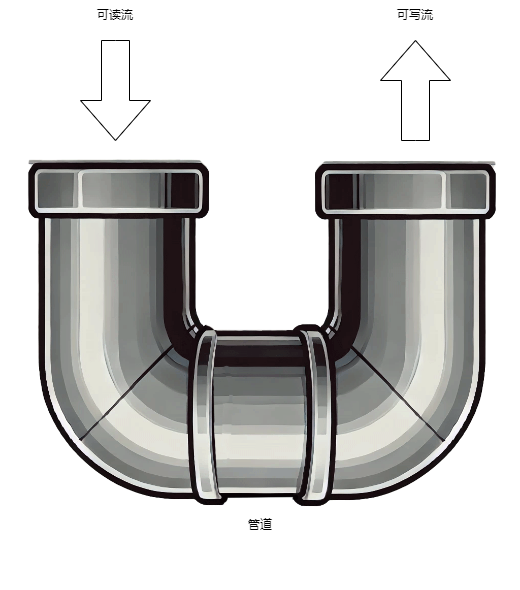

## 3 Node 基础

### 3.1 安装

打开 [Node官网](https://nodejs.org) ,引入眼帘的就是它的下载地址了，windows下提供的是安装程序（下载完之后直接双击安装），linux下提供的是源码包（需要编译安装），详细安装流程这里省略掉，我想这个不会难倒各位好汉。

### 3.2 旋风开始

在讲 Node 语法之前先直接引入一段 Node 的小例子，我们就从这个例子着手。首先我们在随意目录下创建两个文件 `a.js` `b.js`。

```javascript
exports.doAdd = function(x,y) {
    return x+y;
};
```
**代码 3.2.1 a.js**  

```javascript
const a = require('./a');

console.log(a.doAdd(1,2));
```
**代码 3.2.2 b.js**  

和普通前端 javascript 不同的是，这里有两个关键字 `exports` 和 `require`。这就牵扯到模块化的概念了，javascript 这门语言设计的初衷是开发一门脚本语言，让美工等从业人员也能快速掌握并做出各种网页特效来，加之当初语言创作者开发这门语言的周期非常之短，所以在 javascript 漫长的发展过程中一直是没有模块这个语言特性的（直到最近 ES6 Module 的出现才打破了这个格局）。

>Node 是最近几年才发展起来的语言，前端 js 发展的历史要远远长于他，2000 年以后随着 [Ajax](https://zh.wikipedia.org/wiki/AJAX) 技术越来越流行，js的代码开始和后端代码进行交互，逻辑越来越复杂，也越来越需要以工程化的角度去组织它的代码。模块化就是其中一项亟待解决的问题，期间出现了很多模块化的规范，[CommonJS](https://en.wikipedia.org/wiki/CommonJS) 就是其中的一个解决方案。由于其采用同步的模式加载模块，逐渐被前端所抛弃，但是却特别适合服务器端的架构，服务器端只需要在启动前的时候把所有模块加载到内存，启动完成后所有模块就都可以被调用了。
>
>CommonJs 算是一种规范，但是不是 JavaScript 语言固有的语法，后续 JavaScript 语法出现 ES6 Module 的时候算是真正在语法层面有了模块化的实现。但是 CommonJs 已经占据了先机，所以一般在开源的第三方代码中都是用 CommonJs 规范来进行模块化管理，我们本书也是全部采用 CommonJs 的风格进行代码展示。

我们在命令行中进入刚才我们新创建的那个文件夹下，然后运行 `node b.js`，会输出 `3` ，这就意味着你的第一个node程序编写成功了。

在a.js中 exports 对象会被 `导出`，在 b.js 中通过require 就能得到这个被导出的对象，所以我们能访问这个被导出对象的 doAdd 函数。假设我们在 a.js 中还有一个局部变量：

```javascript
var tag = 'in a.js';
exports.doAdd = function(x,y) {
    console.log(tag,x,y);
    return x+y;
};
```
**代码 3.2.3 a.js**  

这里定义的 `tag` 变量是没法在 `b.js` 中读取的，其作用区域仅仅被局限在 `a.js` 中。如果在 b.js 中打印 `console.log(a.tag)` 会输出 `undefined`。

需要留意的是上面所有代码中 `exports.xxx` 其实是缩写，最终会被 Node 解析为 `module.exports.xxx`，所以我们也通过 `module.exports = ABC` 这种模式来导出整个对象，例如下面这种模式：

```javascript
module.exports = {
    fieldx: a,
    setFieldX: function(nv) {
        this.fieldx = nv;
    }
};
```

**代码 3.2.4**

## 3.3 做一个Apache
现在我们做个更让人兴奋的栗子，做一个 Apache，当然这里的 Apache 不是武装直升机，而是一个服务器，熟悉php的人对他肯定不会陌生。你在本地安装它之后，然后在其默认的网站目录中放一张图片，我们假设它为a.jpg，然后你就可以通过 http://localhost/a.jpg 来访问它了。下面的内容就是要模拟这个过程。

要做这个处理，我们首先要搞懂 node 中的 http 包。我们抄一段 node 官网给出的快速搭建 http 服务器的代码吧：

```javascript
const http = require('http');

const hostname = '127.0.0.1';
const port = 3000;

const server = http.createServer((req, res) => {
  res.statusCode = 200;
  res.setHeader('Content-Type', 'text/plain');
  res.end('Hello World\n');
});

server.listen(port, hostname, () => {
  console.log(`Server running at http://${hostname}:${port}/`);
});
```
**代码 3.3.1 example.js**

直接运行 `node example.js`，然后我们打开 chrome ，输入网址 http://localhost:3000 ，就会在网页上看到 `Hello world`。OK，我们回头看一下代码，关键部分在于 `createServer` 的回调函数上，这里有两个参数 `req` 和 `res`，这两个变量也是 [stream](https://nodejs.org/dist/latest-v6.x/docs/api/stream.html) 类型，前者是**readable stream(可读流)**，后者是**writeable stream(可写流)**，从字面意思上推测出前者是用来读取数据的，而后者是用来写入数据的。大家还有没有记得我们在**代码 3.2.4**中函数`fs.createReadStream` 也返回一个 readable stream。接下来就是一个见证奇迹的时刻， stream 类上有一个成员函数叫做 `pipe`，就像它的名字 **管道** 一样，他可以将两个流通过管子连接起来：



**图 3.3.1 pipe原理**  

有了pipe这个功能，我们就能将 fs.createReadStream 函数得到的可读流转接到res这个可写流上去了。说干就干，我们简单修改一下代码 3.3.1，就可以让其成为一个 Apache：

```javascript
const http = require('http');
const fs = require('fs');
const path = require('path');

const hostname = '127.0.0.1';
const port = 3000;
const imageDir = __dirname + '/images';


const server = http.createServer((req, res) => {
    const url = req.url;
    const _path = path.join(imageDir , url);
    fs.exists(_path,function(exists) {
        if (exists) {
            res.statusCode = 200;
            res.setHeader('Content-Type', `image/${path.extname(url).replace('.','')}`);
            fs.createReadStream(_path).pipe(res);
        } else {
            res.statusCode = 404;
            res.end('Not Found');
        }
    });
    
});

server.listen(port, hostname, () => {
  console.log(`Server running at http://${hostname}:${port}/`);
});
```
**代码3.3.2 app.js**

我们仅仅使用了一句`fs.createReadStream(_path).pipe(res);`,就便捷的将文件流输出到HTTP的响应流中了，是不是很强大。OK来看一下效果，运行 `node app.js`，在浏览器中打开 `http://localhost:3000/a.png` 就能看到显示效果。

  
**图 3.3.2 最终我们的apache显示效果**
## 3.4 流进阶

node 的 stream API 是 node 的核心，HTTP 和 TCP 的各种 API ，都是基于 stream 之上的。但是 stream API 本身又过于复杂，让人难以理解。虽然官方文档洋洋洒洒写了一长串的说明，但是好多实现的细节是没有在文档中透露出来的，究其原因还是内部逻辑太繁琐，导致很难用几段话讲清楚。

### 3.4.1 原理分析

首先 stream 的设计初衷是为了“节流”，说的直白些就是内存中待处理的数据量过大，如果处理的速度过慢，就是导致内存中挤压的数据越来越多，最终导致进程不稳定或者内存溢出进而崩溃，而 stream 的存在，就是构建一个缓冲地带。stream 的类（从功能上分为两种 [`Writable`](https://nodejs.org/dist/latest-v12.x/docs/api/stream.html#stream_class_stream_writable) 和 [`Readable`](https://nodejs.org/dist/latest-v12.x/docs/api/stream.html#stream_class_stream_readable) ）在初始化的时候会指定一个 `highWaterMark` 参数，借助此来约定内部使用缓冲区的长度，超过这个参数，就不应该往缓冲区添加数据了。下面对于 `Readable` 和 `Writable` 中的 `highWaterMark` 的使用流程分别进行说明。

`Readable` 通过 [push](https://nodejs.org/dist/latest-v12.x/docs/api/stream.html#stream_readable_push_chunk_encoding) 函数添加数据，数据在其内部存储为一个双向链接的数据结构（具体参见 [BufferList](https://github.com/nodejs/node/blob/master/lib/internal/streams/buffer_list.js) 源码，令人遗憾的是这么方便的数据结构在 Node API 中却没有暴露），如果当前链表中的数据长度达到 `highWaterMark`，`push` 函数就会返回 `false`，不过你依然可以调用 `push` 写入数据。也就是说内部链表的数据长度会大于 `highWaterMark`，Node 内部对于可读流的内存控制完全交给了调用者本身，这个 `highWaterMark` 就是一个警示作用，告诉你现在缓冲区已经满了，你自己看着办吧，如果你不理会，继续往里面写，撑爆了内存是你自己的责任，与我无关。`Readable` 通过 [read](https://nodejs.org/dist/latest-v12.x/docs/api/stream.html#stream_readable_read_size) 函数读取数据，读取的时候可以指定长度，如果指定了长度就从内部链表的队尾移出指定长度的元素交给调用者；如果没有指定长度，就会把所有元素移出交给用户。

`Writable` 内部维持一个计数器，代表有多少条数据还未写入完成，通过 [write](https://nodejs.org/dist/latest-v12.x/docs/api/stream.html#stream_writable_write_chunk_encoding_callback) 函数添加数据，此时计数器加一（假设我们此时只写一条数据），其内部调用 [`_write`](https://nodejs.org/dist/latest-v12.x/docs/api/stream.html#stream_writable_write_chunk_encoding_callback_1) 来实现实际的写操作，在 `_write` 实际写完之后在其回调函数中计数器减一。每次调用 `write` 时，如果计数器的值小于 `highWaterMark`，就返回 `true`，这样你可以安心的写；如果为 `false` 就代表当前待写入的数据超标了，如果再写入就有可能会导致内存中的数据越积越多，最终雪崩。这种将主动权放给调用者的行为是和 `Readable` 是如出一辙的。

`highWaterMark` 默认以字节为单位，但是在以下两种情况下，它的单位会发生改变：流对象的构造函数支持传入 `objectMode` 参数，默认为 `false`，如果设置为 `true`，则 `highWaterMark` 的单位变成对象个数；流对象的构造函数支持传入 `defaultEncoding` 参数，对于可读流来说默认为 `null`（此时 `highWaterMark` 的单位为字节），对于可写流来说默认为 `utf-8`（此时如果写入的数据中含有中文等字符，则写入的元素个数算 1 个，而不是 3 个）。 不过如果同时设置 `objectMode` 为 `true` 和 自定义的 `defaultEncoding` 参数时，`defaultEncoding` 参数将会被忽略。

流对象，还支持通过调用 `setDefaultEncoding` 来在使用过程中修改编码方式，这个时候会使读写流的计数方式动态发生更改，也算是一个比较隐蔽的坑。
### 3.4.2 创建自定义读写流

#### 3.4.2.1 自定义可读流

先实现一个可读流，具体代码如下：

```javascript
const { Readable } = require('stream');

class MyReadable extends Readable {
    _read () {
        console.log('调用了 _read 函数');
    }
}

const reader = new MyReadable({
    highWaterMark: 4,
});
console.log('现有流模式', reader.readableFlowing);
console.log('在流有数据前读取', reader.read());
const data = ['a', 'b', 'c', 'd', 'e', 'f'];
const dataLen = data.length;
for (let i = 0; i < dataLen; i++) {
    const pushResult = reader.push(Buffer.from(data[i]));
    if (!pushResult) {
        console.warn('达到highWater值了，最好不要再 push 了', i);
    } else {
        console.log('没有达到highWater值', i);
    }
}
for (let i = 0; i < 3; i++) {
    console.log('read after push', i, reader.read());
}
// 给可读流推送 null，表示数据已经读取完毕
reader.push(null);
console.log('可读取结束后读取', reader.read());
// 因为在流结束后，调用 push 函数，下面这句会触发可读流的 error 事件
reader.push('a');
reader.on('error', (err) => {
    console.error('可读流出错', err);
});
// nodejs 中如果对于对象的 error 事件没有监听器，会导致进程触发 uncaughtException 事件
process.on('uncaughtException', (err) => {
    console.error('uncaughtException', err);
});
```

**代码 3.4.2.1.1 chapter3/stream/read_simple.js**

我们将 reader 对象的 highWaterMark 值设置为 4，所以在下面的 for 循环中 i 为 4 的时候，就打印 `达到highWater值了，最好不要再 push 了` 的警告。可读流的 push 函数可以接受一个特殊值，就是 null 值，调用 push(null) 后，整个流就处于结束状态，不允许调用者再次调用 push 函数，否则会直接抛出 error 事件。

> Node 中对于对象的 error 事件一定要添加事件监听回调函数，否则从对象中抛出的 error 事件，会外溢到进程级别的 uncaughtException 事件，而一旦触发 uncaughtException 事件，进程默认就会退出。

上述代码中创建了一个简单的可读流。可读流提供了两种读取模式，flow 模式和 no-flow 模式，可读流有一个 `readableFlowing` 属性，默认为 `null`。从上述代码的输出中也可以发现，在没有做任何函数调用的情况下，可读流的 `readableFlowing` 为 `null`。

如果给可读流对象增加 `data` 事件监听、调用函数 `resume` / `pipe` ，将会使用可读流进入 flow 模式，此时 `readableFlowing` 会被置为 true。调用 `pause` / `unpipe` 函数或者添加 `readable` 事件监听会将可读流切换到 no-flow 模式，并且将 `readableFlowing` 置为 false，这个时候必须手动调用函数 `resume` / `pipe` 才能将其切换回 flow 模式，如果在这种情况下添加 `data` 事件是无法切换为 flow 模式的。

注意，如果你同时给可读流添加了 `readable` 和 `data` 的事件，则 `readable` 的优先级高于 `data`，流将回进入 no-flow 模式。当你将 `readable` 事件移出，只保留 `data` 事件时，则回到 flow 模式。同时需要注意到，添加了 `readable` 事件后，调用 `pause` `resume` 这两个函数是没有意义的。

在可读流的使用过程中，你应该尽量选择一种读取模式，以此降低自己代码的复杂度。Node 中通过调用可读流不同函数来隐式的修改其工作模式的方式，确实是一种比较让人艰涩难懂的设计。比如说下述代码：

```javascript
const { Readable } = require('stream');

class MyReadable extends Readable {
    _read () {
        console.log('_read has been called');
    }
}

const reader = new MyReadable();
const initSize = 6;
for (let i = 0; i < initSize; i++) {
    reader.push(Buffer.from([i & 0xff]));
}
reader.on('readable', function () {
    console.log('get data');
});

//
reader.on('data', (chunk) => {
    console.log('流模式2', reader.readableFlowing);
    console.log('data event', chunk);
});

console.log('流模式', reader.readableFlowing);
```

**代码 3.4.2.1.1 chapter3/stream/readable_event_emit_one.js**

我们同时添加了 readable 和 data 事件，readable 的优先级高，所以程序中 readableFlowing 属性为 false。data 事件中也接收不到任何事件回调。

但是我们一旦将第 15 行稍作改动，改成 `console.log('get data', reader.read());` ，你就会发现不但 readable 事件中读取数据了，`data` 事件中也能读取出数据了。而上述这种诡异的行为，也在官方文档中的犄角旮旯中得到了[官方解释](https://nodejs.org/api/stream.html#event-readable)。

> If both `'readable'` and [`'data'`](https://nodejs.org/api/stream.html#event-data) are used at the same time, `'readable'` takes precedence in controlling the flow, i.e. `'data'` will be emitted only when [`stream.read()`](https://nodejs.org/api/stream.html#readablereadsize) is called.

翻译一下就是两个事件都监听时，在 `readable` 中触发 `read()` 调用时，会级联触发 `data` 事件。我相信没有几个开发者会逐字逐句的阅读官方文档，所以编写流相关的代码，大家还是尽量简洁。
#### 3.4.2.2 自定义可写流

```javascript
const { Writable } = require('stream');

class MyWritable extends Writable {
  _write(chunk, encoding, callback) {
    setTimeout(function() {
      callback();
    },100);
  }
}

const writer = new MyWritable({
  highWaterMark: 3
});

for (var i=0;i<6;i++) {
   const result = writer.write(Buffer.from([i & 0xff]));
   console.log('推荐下次继续写',result);
}
writer.on('drain',function() {
  console.log('现在可以放心写了');
});
writer.on('error',function(err) {
  console.error('写错误',err);
});
```

**代码 3.4.2.2.1**

这里为了更快的观察可写流内置缓冲区被写满的现象，这里将 `highWaterMark` 的值设置为 3，这样在 15 行循环到 2 的时候写操作就会返回 false。正常情况下 write 函数返回 false 的时候，就需要停下写入，等待 `drain` 事件触发后再写入，上面的程序明显是一个不规范的写法。

`_write` 函数是供给内部调用使用的，在自己来实现可写流的子类时，这个函数是必须要实现的。`_write` 内部通过 `callback` 函数来标记写入完成。这个回调函数调用之前，认为数据是没有写入成功的。

为了防止可写写流写入的速度过快，可写流提供了两个函数 `cork` 和 `uncork`，调用 `cork` 后会把要写入的数据缓存起来，直到调用函数 `uncork` 后才会一股脑将缓存的数据做真正的写入。

#### 3.4.2.2 让流 “流动” 起来

我们选择用流，往往想借助其 “流动” 特性来简化我们的代码调用逻辑。这个实现 “流动” 特性的关键技术点，就是使用 `pipe` 函数。我们在 **代码3.3.2** 17 行中看到了 pipe 函数的简单使用，pipe 函数会将一个可读流的数据传输到可写流中，就像我们在 **图 3.3.1** 中演示的效果一样，看上去数据“流动”起来了。不过你可能之前看如如下类似代码：

```javascript
const fs = require('fs');
const zlib = require('zlib');
const crypto = require('crypto');

// 输入和输出文件路径
const inputFilePath = 'input.txt';
const outputFilePath = 'output.txt.gz';

// 创建读取文件流
const readStream = fs.createReadStream(inputFilePath);

// 创建压缩流
const gzipStream = zlib.createGzip();

// 创建写入文件流
const writeStream = fs.createWriteStream(outputFilePath);

// 多次 `pipe` 操作: 读取 -> 压缩 -> 写入
readStream
    .pipe(gzipStream)    // 第一次 pipe，压缩数据
    .pipe(writeStream)   // 第二次 pipe，将结果写入文件
```

**代码 3.4.2.2.1**

前面讲我们只能将可读流 pipe 到可写流里面，但是这个中间 `gzipStream` 是什么鬼，从 `readStream` 角度看它是可写流，从 `writeStream` 的角度看它又是可读流，解开其神秘面纱的关键就是 `Transform`。它支持以可写流的身份接收从别处写入的数据，经过其加工后，再放置到内置的可写流中。

下面是一个我们自己构建的自定义 Transform 类

```javascript
const { Transform, Readable, Writable } = require('stream');
class InputStream extends Readable {
    _read () {
        //
    }
}
class OutputStream extends Writable {
    constructor (options) {
        super(options);
        this.data = [];// 调试用
    }

    _write (chunk, encoding, callback) {
        this.data.push(chunk);
        callback();
    }
}
class MyTransform extends Transform {
    _transform (chunk, encoding, callback) {
        const filterData = [];
        for (const byte of chunk) {
            if (byte % 2 === 0) {// 挑选出偶数
                filterData.push(byte);
            }
        }
        if (filterData.length > 0) {
            this.push(Buffer.from(filterData));// 将数据写入可读流
        }
        callback();// 不要忘记调用 callback 函数
    }
}
const inputStream = new InputStream();
const outputStream = new OutputStream();
const myTransform = new MyTransform();
inputStream.pipe(myTransform).pipe(outputStream);
const count = 6;
function readData (i) {
    if (i < count) {
        inputStream.push(Buffer.from([i & 0xff]));
        setTimeout(() => {
            readData(i + 1);
        }, 100);
    } else {
        inputStream.push(null);
    }
}
readData(0);

myTransform.on('data', function (data) {
    console.log('transform 得到的转化数据', data);
});
outputStream.on('finish', function () {
    console.log('流写结束了');
    console.log(outputStream.data);
});
```

**代码 3.4.2.2.2 chapter3/stream/transform_simple.js**

上述代码中我们通过可读流 `inputStream` 来采集数据的数字， `myTransfrom` 转化的函数中将采集到的数字筛选出偶数来，最终可写流 `outputStream` 拿到最终转化的数字。
#### 3.4.2.3 身兼两职的流

Transform 流其实内部继承自 [`Duplex`](https://nodejs.org/api/stream.html#class-streamduplex) ，Duplex 内部同时拥有可读流和可写流，但是跟 Transform 不同的是，Duplex 其内部读写的数据是分别存储在两个缓冲区中，两者没有关联关系，相互独立。Node API 中的 [net.Socket](https://nodejs.org/dist/latest-v12.x/docs/api/net.html#net_class_net_socket) 类就是继承自 [stream.Duplex](https://nodejs.org/dist/latest-v12.x/docs/api/stream.html#stream_class_stream_duplex) 类，由于 TCP 双向通信的特性，既能收也能发，且在操作系统层面收发使用的是不同的缓冲区，所以使用 Duplex  类是特别贴合的。为了演示 Duplex 类的使用，我们还是举一个菜鸟驿站的例子，驿站既可以收快递，也可以往外寄快递，和 TCP 的例子类似，他们收上来的快递和要寄出的快递肯定不是同一个（这里不讨论拒收等特殊情况）。那我们可以使用下面的代码来演示：

```javascript
const { Duplex } = require('stream');
class PostHouse extends Duplex {
    constructor (options) {
        super(options);
        this.postingLetters = [];
    }

    _write (_chunk, _encoding, callback) {
        this.postingLetters.push(_chunk);
        callback();
    }

    _read () {
        //
    }

    receiveLetter (letter) {
        this.push(letter);
    }
}

const postHouse = new PostHouse({
    objectMode: true, // 以对象模式工作, 方便传递字符串
});
postHouse.on('data', function (data) {
    console.log('收到信', data);
});
postHouse.receiveLetter('信件1');// 使用字符串格式插入可读流数据
postHouse.write('要寄出的信件x');
console.log(postHouse.postingLetters);
```

**代码 3.4.2.2.2 chapter3/stream/duplex_post_house.js**

通过上述代码可以看到我们构建出来的驿站类 `PostHouse`，既可以接收快递，也可以寄出快递，但是两者的数据是不共享的，没有相互干扰。

### 3.4.3 新时代的流

从 Node 7.6 开始 async/await 语法正式稳定可用，由于其消除了异步回调地狱，渐渐被大家采纳。但是在一些 async/await 风格的代码中使用流时很容易犯一些低级错误。

```javascript
const { DataStream } = require('./data-stream');
const { readDataDelay } = require('./data-source');

exports.getStream = async function () {
    const stream = new DataStream();
    let hasMore = true;
    const readFun = readDataDelay(1000);
    let begin = 0;
    const size = 1;
    while (hasMore) {
        const data = await readFun(begin, size);
        if (data.length === 0) {
            hasMore = false;
        } else {
            stream.push(...data);
            begin += size;
        }
    }
    stream.push(null);
    return stream;
};
```

**代码 3.4.3.1 chapter3/stream-next/blocked-read.js**

上面代码语法是完全正确的，调用时也能拿到数据，但是却有严重的逻辑问题，while 循环中全都需要做异步等待，等待所有数据取完了之后才会返回代码中的 stream 对象，导致调用方拿到 stream 对象时，所有的数据读取过程都做完了。我们使用流肯定是想边读取数据，边处理，上述代码跟直接返回一个最终数组的效果是一样的。

可能你会想到，既然 async/await 这条道路走不通了，那么干脆走回 ES5 callback 那套流程吧，于是写出如下代码：

```javascript
const { readDataDelay } = require('./data-source');
const { DataStream } = require('./data-stream');

function readData (begin, size, callback) {
    readDataDelay(1000)(begin, size).then(data => {
        callback(null, data);
    }).catch(err => {
        callback(err);
    });
}

exports.getStream = function () {
    const stream = new DataStream();
    let begin = 0;
    const size = 1;
    function read () {
        readData(begin, size, (err, data) => {
            if (data.length === 0) {
                stream.push(null);
                return;
            }
            if (err) {
                stream.emit('error', err);
            } else {
                stream.push(...data);
                begin += size;
                read();
            }
        });
    }
    read();
    return stream;
};
```

**代码 3.4.3.2 chapter3/stream-next/callback-read.js**

上述代码抛弃了 async/await 语法，一夜回到解放前，从逻辑上看是没有毛病的，但是我们设计 async/await 这种语法本来是为了消灭回调函数，但是用完高级语法后却不能正常做事了，是不是 node 本身的语法设计有槽点呢？其实不然，如何想从上述代码中消灭回调的方式还是有的，在 async/await 语法出现之前 node 就已经出台了 Generator 函数的语法，下面是对其使用的例子：

```javascript
const { readDataDelay } = require('./data-source');

exports.getData = async function * () {
    let begin = 0;
    const size = 1;
    const readFun = readDataDelay(1000);
    let hasMore = true;
    while (hasMore) {
        const data = await readFun(begin, size);
        if (data.length === 0) {
            hasMore = false;
        } else {
            yield * data;
            begin += size;
        }
    }
};
```

**代码 3.4.3.3 chapter3/stream-next/generator-read.js**

上述的代码，就比前两者简单明了多了。对于 Generator 函数 的调用会在后面统一给出例子。

除了 Generator 函数，从 16.5 版本开始，Node 正式适配了 Web Stream API 标准，从此之后你可以在新写的代码抛弃掉诘屈聱牙的老式 stream 代码，换成新版的 Web Stream 风格，下面给出具体的例子：

```javascript
// 创建自定义ReadableStream
const { readDataDelay } = require('./data-source');
const { ReadableStream } = require('stream/web');
const readFun = readDataDelay(1000);
const customStream = new ReadableStream({
    // 存储当前状态和数据
    start (controller) {
        // 初始化数据
        this.start = 0;
        this.size = 1; //
    },

    // 读取数据的方法
    async pull (controller) {
        // 模拟异步数据生成（如从API、文件等获取数据）
        const data = await readFun(this.start, this.size);

        this.start += this.size;

        // 检查是否还有数据要发送
        if (data.length > 0) {
            // 发送数据
			data.forEach(item => controller.enqueue(item));
        } else {
            // 没有更多数据，结束流
            controller.close();
        }
    },

    // 处理取消的方法（可选）
    cancel (reason) {
        console.log('流被取消:', reason);
    }
});
exports.webStream = customStream;
```

**代码 3.4.3.4 chapter3/stream-next/web-stream-read.js**

看到上述代码，可能你会感觉虽然有差异，但是跟老版本的 stream 代码的编写流程差不太多，哪个 `start` 函数可以类比 `Readable` 中的构造函数，`pull` 函数可以类比 `_read`，`cancel` 可以类比 `_destory` 。我们在学习新鲜事物的时候，确实可以通过类比法，来加快自己的学习进度。但是需要注意的是，`pull` 这个函数跟 `Readable` 中的 `_read` 是大有不同的，前者是支持返回 Promise 对象的，而后者的返回值是 void，这代表着你在后者写一些异步操作的时候要特别留心 `_read` 函数体内同时有多个任务在执行时的状态，我们再给出一个错误示例：

```javascript
const { Readable } = require('stream');
const { readDataDelay } = require('./data-source');
const readFun = readDataDelay(1000);
class LegacyStream extends Readable {
    constructor (options) {
        super({ ...options, objectMode: true });
        this.start = 0;
        this.size = 1;
    }

    /**
     * 这个函数是有 bug 的，如果两个请求同时调用，
     * 通一个 start 会同时被两个请求使用，导致重复数据读取错乱
     */
    _read () {
        const size = this.size;
        readFun(this.start, size).then(data => {
            if (data.length > 0) {
                this.push(...data);
                this.start += size;
            } else {
                this.push(null);
            }
        }).catch(err => {
            this.emit('error', err);
        });
    }
}

exports.LegacyStream = LegacyStream;
```

**代码 3.4.3.5 chapter3/stream-next/legacy-stream-read.js**

假设同时有两个` _read()` 调用，则调用流程如下：
```
调用1: this.start = 0 → 读取 [0,1)
调用2: this.start = 0 → 也读取 [0,1)（因为此时调用1的 this.start 还未更新）
```

上述调用流程意味者会有重复数据被读出。我们需要将其修正：

```javascript
_read(size) {
	// 关键：用局部变量保存当前读取位置，避免并发修改
	const currentStart = this.start;
	const readSize = this.size;

	readFun(currentStart, readSize)
		.then(data => {
			if (data.length > 0) {
				// 推送数据前，先更新起始位置（确保下次读取正确）
				this.start = currentStart + readSize;
				this.push(...data);
			} else {
				// 数据读取完毕，结束流
				this.push(null);
			}
		})
		.catch(err => {
			this.emit('error', err);
		});
}
```

**代码 3.4.3.6 修正后的 `_read` 函数**

虽然说用传统 stream 也能实现我们的需求，但是代码编写的难度大，稍有不慎就会出现漏洞。很想对比上述所有实现方式来说，Generator 函数版本是最简单明了的，Web Stream 版本次之。下面是**代码 3.4.3.1** **代码 3.4.3.2** **代码 3.4.3.3** **代码 3.4.3.4** 的测试：

```javascript
const { getStream: getStreamBlocked } = require('./blocked-read');
const { getStream: getStreamCallback } = require('./callback-read');
const { getData } = require('./generator-read');
const { webStream } = require('./web-stream-read');

async function main () {
    console.log(new Date(), 'begin blocked');
    const streamBlocked = await getStreamBlocked();
    for await (const data of streamBlocked) {
        console.log(new Date(), data);
    }
    console.log(new Date(), 'end blocked');

    console.log(new Date(), 'begin callback');
    const streamCallback = await getStreamCallback();
    for await (const data of streamCallback) {
        console.log(new Date(), data);
    }
    console.log(new Date(), 'end callback');

    console.log(new Date(), 'begin generator');
    const streamGenerate = getData();
    for await (const data of streamGenerate) {
        console.log(new Date(), data);
    }
    console.log(new Date(), 'end generator');

    console.log(new Date(), 'begin web stream');
    for await (const data of webStream) {
        console.log(new Date(), data);
    }
    console.log(new Date(), 'end web stream');
}

main().catch(console.error);
```

**代码 3.4.3.7 chapter3/stream-next/do-read.js**

你会发现上述代码所有的数据遍历操作都用的 for...of 循环，这是由于从 Node 10 开始，传统的 stream 也和 Generator 函数一样实现了 **Async Iteration（异步迭代器）**。运行完成后，输出的内容如下：

```
2025-07-19T08:12:18.759Z begin blocked
2025-07-19T08:12:22.803Z { id: 1, name: 'John Doe', email: 'john.doe@example.com' }
2025-07-19T08:12:22.804Z { id: 2, name: 'Jane Doe', email: 'jane.doe@example.com' }
2025-07-19T08:12:22.804Z { id: 3, name: 'Jim Doe', email: 'jim.doe@example.com' }
2025-07-19T08:12:22.805Z end blocked
2025-07-19T08:12:22.806Z begin callback
2025-07-19T08:12:23.821Z { id: 1, name: 'John Doe', email: 'john.doe@example.com' }
2025-07-19T08:12:24.827Z { id: 2, name: 'Jane Doe', email: 'jane.doe@example.com' }
2025-07-19T08:12:25.838Z { id: 3, name: 'Jim Doe', email: 'jim.doe@example.com' }
2025-07-19T08:12:26.838Z end callback
2025-07-19T08:12:26.839Z begin generator
2025-07-19T08:12:27.852Z { id: 1, name: 'John Doe', email: 'john.doe@example.com' }
2025-07-19T08:12:28.860Z { id: 2, name: 'Jane Doe', email: 'jane.doe@example.com' }
2025-07-19T08:12:29.877Z { id: 3, name: 'Jim Doe', email: 'jim.doe@example.com' }
2025-07-19T08:12:30.891Z end generator
2025-07-19T08:12:30.892Z begin web stream
2025-07-19T08:12:30.898Z { id: 1, name: 'John Doe', email: 'john.doe@example.com' }
2025-07-19T08:12:31.902Z { id: 2, name: 'Jane Doe', email: 'jane.doe@example.com' }
2025-07-19T08:12:32.918Z { id: 3, name: 'Jim Doe', email: 'jim.doe@example.com' }
2025-07-19T08:12:33.944Z end web stream
```
## 3.5 总结

我们用两个小节讲述了 Node 中如何处理静态资源和动态请求，看完这些之后，如果你是一个初学者，可能会因此打退堂鼓，这也太麻烦了，如果通过这种方式来处理数据，跟 php java 之类的比起来毫无优势可言嘛。大家不要着急，Node 社区已经给大家准备了各种优秀的 Web 开发框架，比如说 [Express](https://expressjs.com/)、[Koa](https://koajs.com/)，绝对让你爱不释手。你可以从本书的第 6 章中学习到 express 基本知识。

本章示例代码可以从这里找到：https://github.com/yunnysunny/nodebook-sample/tree/master/chapter3 。
