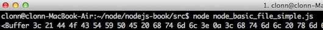

## 3 Node.js 基础

前篇文章已经由介绍、安装至设定都有完整介绍，nodeJS 内部除了javascript
常用的函数(function)、对象(object)之外，也有许多不同的自订对象，nodeJS
预设建立这些对象为核心对象，是为了要让开发流程更为，这些资料在官方文档已经具有许多具体说明。接下来将会介绍在开发nodeJS
程序时常见的对象特性与使用方法。

### 3.1 node.js http 服务器建立


在\`node.js官方网站&lt;<http://nodejs.org>&gt;里面有举一个最简单的HTTP 服务器建立，一开始初步就是建立一个服务器平台，让node.js 可以与浏览器互相行为。每种语言一开始的程序建立都是以 Hello world 开始，最初也从Hello world 带各位进入node.js 的世界。

输入以下程序码，储存档案为 node\_basic\_http\_hello\_world.js 
```javascript
var server,
    ip   = "127.0.0.1",
    port = 1337,
    http = require('http');

server = http.createServer(function (req, res) {
  res.writeHead(200, {'Content-Type': 'text/plain'});
  res.end('Hello World\n');
});

server.listen(port, ip);

console.log("Server running at http://" + ip + ":" + port);
```
程序码解讲，一开始需要有几个基本的变数。 
- ip: 机器本身的ip 位置，因为使用本地端，因此设定为127.0.0.1
- port: 需要开通的阜号，通常设定为http port 80，因范例不希望与基本port 相冲，随意设定为1337

在node.js 的程序中，有许多预设的模组可以使用，因此需要使用require 方法将模组引入，在这边我们需要使用http这个模组，因此将http载入。Http 模组里面内建有许多方法可以使用，这边采用createServer 创建一个基本的http 服务器，再将http 服务器给予一个server 变数。里面的回调函数(call back function)可以载入http 服务器的资料与回应方法(request, response)。在程序里面就可以看到我们直接回应给浏览器端所需的 Header，回应内容。

```javascript
    res.writeHead(200, {'Content-Type': 'text/plain'});
    res.end('Hello World\\n');
```
Http 服务器需要设定port, ip，在最后需要设定Http 监听，需要使用到 listen 事件，监听所有Http 服务器行为。

```javascript
    http.listen(port, ip);
```
所有事情都完成之后，需要确认服务器正确执行因此使用console，在javascript 里就有这个原生对象，console所印出的资料都会显示于node.js 服务器页面，这边印出的资料并不会传送到用户页面上，之后许多除坏(debug) 都会用到console 对象。

```javascript
    console.log("Server running at http://" + ip + ":" + port);
```
### 3.2 node.js http 路径建立 


前面已经介绍如何建立一个简单的http 服务器，接下来本章节将会介绍如何处理服务器路径(route) 问题。在http的协定下所有从浏览器发出的要求(request) 都需要经过处理，路径上的建立也是如此。

路径就是指服务器 ip 位置，或者是域名称之后，对于服务器给予的要求。修改刚才的hello world 档案，修改如下。

```javascript
    server = http.createServer(function (req, res) {
      console.log(req.url);
      res.writeHead(200, {'Content-Type': 'text/plain'});
      res.end('hello world\\n');
    });
```
重新启动node.js 程序后，在浏览器端测试一下路径行为，结果如下图，

.. image:: ../images/zh-tw/node\_basic\_rout\_test.png
   :scale: 100%
   :align: center

当在浏览器输入http://127.0.0.1:1337/test ，在服务器端会收到两个要求，一个是我们输入的/test 要求，另外一个则是 /favicon.ico。/test 的路径要求，http 服务器本身需要经过程序设定才有办法回应给浏览器端所需要的回应，在服务器中所有的路径要求都是需要被解析才有办法取得资料。

从上面解说可以了解到在node.js 当中所有的路径都需要经过设定，未经过设定的路由会让浏览器无法取得任何资料导致错误页面的发生，底下将会解说如何设定路由，同时避免发生错误情形。先前node.js 程序需要增加一些修改，才能让用户透过浏览器，在不同路径时有不同的结果。根据刚才的程序做如下的修改，

.. literalinclude:: ../src/node\_basic\_http\_rout\_done.js
   :language: javascript

程序做了片段的修改，首先载入url 模组，另外增加一个path 变数。
url 模组就跟如同他的命名一般，专门处理url 字符串处理，里面提供了许多方法来解决路径上的问题。
因为从浏览器发出的要求路径可能会带有多种需求，或者GET 参数组合等。因此我们需要将路径单纯化，取用路径部分的资料即可，例如用户可能会送出 http://127.0.0.1:1337/test?send=1 ，如果直接信任\*\*req.url\*\* 就会收到结果为 /test?send=1 ，所以需要透过url 模组的方法将路径资料过滤。

在这边使用url.parse 的方法，里面带入网址格式资料，会回传路径资料。为了后需方便使用，将回传的资料设定到path 变数当中。在回传的路径资料，里面包含资讯，如下图，

.. image:: ../images/zh-tw/node\_basic\_rout\_url.png
   :scale: 100%
   :align: center

这边只需要使用单纯的路径要求，直接取用path.pathname ，就可以达到我们的目的。

最后要做路径的判别，在不同的路径可以指定不同的输出，在范例中有叁个可能结果，第一个从浏览器输入/index 就会显示 index 结果， /test 就会呈现出 test 页面，最后如果都不符合预期的输入会直接显示 default 的页面，最后的预防可以让浏览器不会出现非预期结果，让程序的可靠性提升，底下为测试结果。

.. image:: ../images/zh-tw/node\_basic\_rout\_url\_index.png
   :scale: 100%
   :align: center

.. image:: ../images/zh-tw/node\_basic\_rout\_url\_test.png
   :scale: 100%
   :align: center

.. image:: ../images/zh-tw/node\_basic\_rout\_url\_default.png
   :scale: 100%
   :align: center

.. image:: ../images/zh-tw/node\_basic\_rout\_url\_error.png
   :scale: 100%
   :align: center

### node.js 档案读取 

前面已经介绍如何使用路由（rount）做出不同的回应，实际应用只有在浏览器只有输出几个文字资料总是不够的，在本章节中将介绍如何使用档案读取，输出档案资料，让用户在前端浏览器也可以读取到完整的html, css, javascript 档案输出。

档案管理最重要的部分就是File system
<http://nodejs.org/docs/latest/api/fs.html>
这个模组，此模组可以针对档案做管理、监控、读取等行为，里面有许多预设的方法，底下是档案输出的基本范例，底下会有两个档案，第一个是静态html
档案，

另一个为node.js 程序，

一开始直接载入\**file system 模组，载入名称为fs*\*
。读取档案主要使用的方法为readFile ，里面以叁个参数 **路径(file path)**
, **编码方式(encoding)** ， **回应函数(callback)**
，路径必须要设定为静态html
所在位置，才能指定到正确的档案。静态档案的编码方式也必须正确，这边使用静态档案的编码为
**utf8** ，如果编码设定错误，node.js 读取出来档案结果会使用 byte raw
格式输出，如果 **错误编码格式，会导致输出资料为 byte raw**



**回应函数** 中里面会使用两个变数，error
为错误资讯，如果读取的档案不存在，或者发生错误，error 数值会是 true
，如果成功读取资料 error 将会是 false 。 content
则是档案内容，资料读取后将会把资料全数丢到content 这个变数当中。

最后程序的输出结果画面如下，


### node.js http 静态档案输出

前面已经了解如何读取本地端档案，接下来将配合http
服务器路由，让每个路由都能够输出相对应的静态 html 档案。
首先新增加几个静态html 档案，

准备一个包含基本路由功能的http 服务器

```javascript
var server,
    ip   = "127.0.0.1",
    port = 1337,
    http = require('http'),
    url = require('url');

server = http.createServer(function (req, res) {
    var path = url.parse(req.url);
});

server.listen(port, ip);

console.log("Server running at http://" + ip + ":" + port);
```

加入 **file system** 模组， 使用 **readFile**
的功能，将这一段程序放置于createServer 的回应函数中。

```javascript
fs.readFile(filePath, encode, function(err, file) {
});
```

readFile
的回应函数里面加入页面输出，让浏览器可以正确读到档案，在这边我们设定读取的档案为
html 静态档案，所以 Content-type 设定为 **text/html**
。读取到档案的内容，将会正确输出成 html 静态档案。

```javascript
fs.readFile(filePath, encode, function(err, file) {
  res.writeHead(200, {'Content-Type': 'text/html'});
  res.write(file);
  res.end();
});
```

到这边为止基本的程序内容都已经完成，剩下一些细节的调整。首先路径上必须做调整，目前的静态档案全部都放置于
**static 资料夹** 底下，设定一个变数来记住资料夹位置。

接着将浏览器发出要求路径与资料夹组合，读取正确html
静态档案。用户有可能会输入错误路径，所以在读取档案的时候要加入错误处理，同时回应
**404** 服务器无法正确回应的 http header 格式。

加入这些细节的修改，一个基本的http 静态 html
输出服务器就完成了，完整程序码如下，

### node.js http GET 资料采集


http 服务器中，除了路由之外另一个最常使用的方法就是采集GET
资料。本单元将会介绍如何透过基本http 服务器采集浏览器传来的要求，采集GET
资料。

在http 协定中，GET 参数都是藉由URL
从浏览器发出要求送至服务器端，基本的传送网址格式可能如下，

    http://127.0.0.1/test?send=1&test=2

上面这段网址，里面的GET 参数就是 send 而这个变数的数值就为
1，如果想要在http 服务器取得GET
资料，需要在浏览器给予的要求(request)做处理，

首先需要载入 **query string**
这个模组，这个模组主要是用来将字符串资料过滤后，转换成 **javascript
对象**。

```javascript
qs = require('querystring');
```

接着在第一阶段，利用url 模组过滤浏览器发出的URL
资料后，将回应的对象里面的 query
这个变数，是一个字符串值，资料过滤后如下，

透过 query string ，使用parse 这个方法将资料转换成javascript
对象，就表示 GET 的资料已经被服务器端正式采集下来，

```javascript
path = url.parse(req.url);      
parameter = qs.parse(path.query);
```

整个node.js http GET 参数完整采集程序码如下，

程序运作之后，由浏览器输入要求网址之后，node.js 服务器端回应资料为，

    Server running at http://127.0.0.1:1337
    { send: '1', test: '1' }

### 本章结语


前面所解说的部份，一大部分主要是处理 http
服务器基本问题，虽然在某些部分有牵扯到http
服务器基本运作原理，主要还是希望可以藉由这些基本范例练习node.js
，练习回应函数与语法串接的特点，习惯编写javascript
风格程序。当然直接这样开发node.js
是非常辛苦的，接下来在模组实战开发的部份将会介绍特定的模组，一步一步带领各位从无到有进行node.js
应用程序开发。
