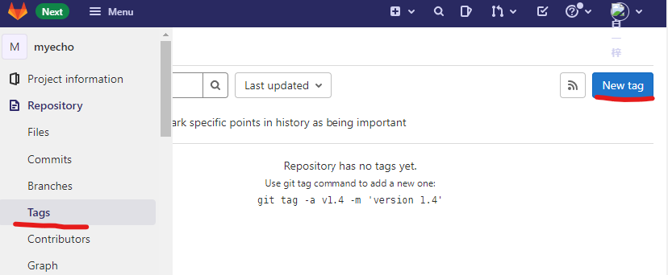
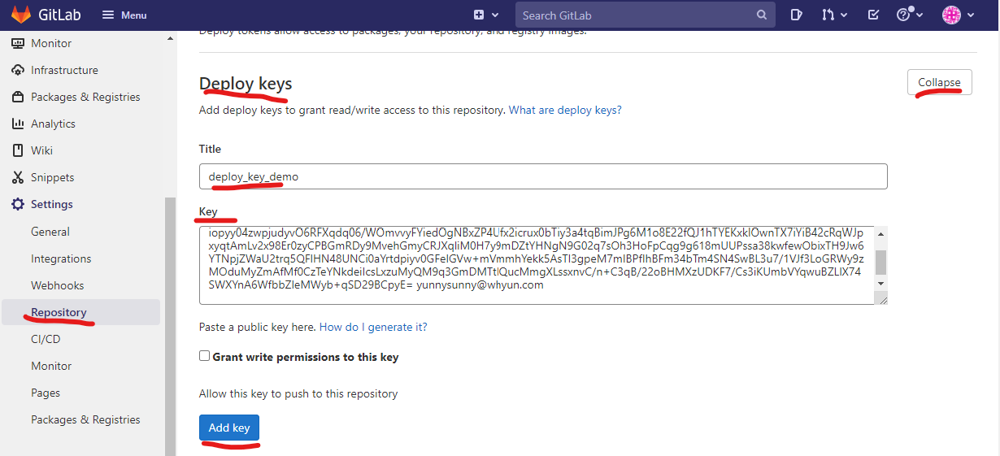
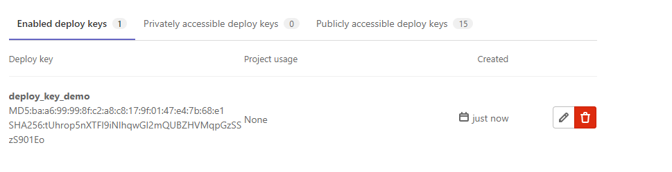

## 4 NPM 包管理工具

在Node出现之前，我们在做前端的时候经常用到一些开发工具使用ruby和python开发的（比如说[sass](https://sass-lang.com/)，一种CSS预编译语言，依赖于ruby；(Pygments)[https://pygments.org/] ，一种代码语法高亮插件，依赖于python），这个时候就会看到[gem](https://rubygems.org/)和[pip](https://pypi.python.org/pypi)的身影。熟悉java的同学，应该也对[maven](https://maven.apache.org/)如数家珍。和这些语言类似，Node 也提供了包管理工具，它就是 npm ，全名为 **N**ode **P**ackage **M**anager，集成于 Node 的安装程序中。

### 4.1 使用NPM

npm 不仅可用于安装新的包，它也支持搜寻、列出已安装模块及更新的功能。

npm 目前拥有数以百万计的包，可以在 https://www.npmjs.com/ 使用关键字搜寻包。举例来说，在关键字栏位输入“coffee-script”，下方的清单就会自动列出包含 coffee-script 关键字的包。


虽然也可以通过`npm search`来在命令行中查询，但是初次查询过程中要在本地建立索引，等待的时间巨漫长，还是不介绍的为好。

找到需要的包后，即可使用以下指令安装：

    npm install coffee-script

> 在 win 10 下的 powershell 中运行命令，如果出现提示 `无法加载文件，因为在此系统上禁止运行脚本` 的提示，那么需要使用超级管理员打开 powershell ，然后运行 `set-ExecutionPolicy RemoteSigned`，接着会提示`是否要更改执行策略`，输入 y。操作完成之后，即可执行 npm 命令。

运行完之后，就会在当前目录下的 `node_modules`目录下安装coffee-script包。

```
  ├─┬ node_modules 
  │ └── coffee-script 
```

**目录结构 4.1.1 将包安装到本地后的目录结构**  
一般情况下，我们在node项目目录下创建package.json，里面包含项目名称、作者、依赖包等配置，我们可以通过 `npm init`快速创建一个package.json文件，我们新建一个目录，然后在命令执行`npm init`，则会要求你填入若干信息：

```
name: (app) test                                           
version: (1.0.0) 0.0.1                                     
description: test app                                      
entry point: (index.js)                                    
test command:                                              
git repository:                                            
keywords:                                                  
author: yunnysunny                                         
license: (ISC) MIT                                         
About to write to I:\node\app\package.json:                

{                                                          
  "name": "test",                                          
  "version": "0.0.1",                                      
  "description": "test app",                               
  "main": "index.js",                                      
  "scripts": {                                             
    "test": "echo \"Error: no test specified\" && exit 1"  
  },                                                       
  "author": "yunnysunny",                                  
  "license": "MIT"                                         
}                                                          


Is this ok? (yes)                                       
```

**命令输入 4.1.1 npm init命令输入示例**  
我们接着在项目中安装express包（在第5章会讲到这个包的使用），不过我们执行命令的时候加个参数：`npm install express --save`。命令执行完成之后，再看package.json，发现多了一个配置属性：

```json
"dependencies": {
    "express": "^4.14.0"
}
```

这个dependencies属性里面描述的就是当前项目依赖的各种包，你可以通过运行`npm install packageName --save`来将其安装到本地的同时在package.json中同时添加依赖声明。当你代码开发完成时，要把项目往服务器上部署，那么这时候package.json中的依赖声明都已经写好了，这时候，你直接在项目目录运行`npm install`，就可以自动将声明中的文件全部下载安装到项目目录的`node_modules`子目录下。  
我们在来稍微留意一下，我们配置的这个express的版本号，咦，`^`是个什么鬼？讲这个东东，还要从[Semantic Versioning](https://semver.org/)这个概念讲起，它将版本号分为三段：  

1. 主版本，你可以在这个版本中做不兼容性改动
2. 小版本，你可以在这个版本上增加共嗯那个，不过要向后兼容
3. 补丁版本，在这里可以做一些bug修复，不过依然要保持向后兼容

在这里对于express来说，主版本号是`4`，小版本号是`14`，补丁版本号是`0`。啰嗦了这么多，那么`^`呢，它告诉你使用从`4.14.0`到`5.0.0`（不包括5.0.0）之间的最新版本，也就是说它选择的版本号 x 的取值范围:`4.14.0<=x<5.0.0`。不过，如果版本号是 `0` 打头的一个字符串，比如说 `0.1.2` `0.0.2`，则会被特殊对待，对于前者来说， 0.1.0<=x<0.2.0，对于后者来说 0.0.0<=x<0.1.0。
除了`^`，还有一个版本号标识符`~`也很常用，假设我们将这里express的版本号设置为`~4.14.0`，那么它表示从`4.14.0`到`4.15.0`（不包括4.15.0）之间的最新版本，也就是说它选择的版本号x的取值范围：`4.14.0<=x<4.15.0`。  
另外还有一些版本号的特殊标志符，由于不常用，有需要的可以参考https://docs.npmjs.com/cli/v6/using-npm/semver 。
一般情况下，我们通过将依赖安装到项目目录下，但是有时候我们需要做全局安装，这种全局安装的包一般都是些命令行程序，这些命令行程序安装到全局后就可以保证我们通过 cmd.exe（或者bash） 中调用这些程序了。下面我们演示一下如何全局安装[express-generator](https://www.npmjs.com/package/express-generator)：  

```
npm install -g express-generator
```

安装完成后会提示安装到了目录 `C:\Users\[用户名]\AppData\Roaming\npm\node_modules`目录下，其实这个安装目录是可以自指定的，老是往系统盘安装会让人抓狂，下面要讲到这个问题。  
安装完 express-generator ，我们在命令行中新建一个目录`mkdir first-express`，然后进入这个目录运行 `express` ，如果发现生成了一堆express项目文件，恭喜你成功了！

### 4.2 NPM用不了怎么办

互联网拉近了整个世界的距离，有时候让你感觉到近到只有一墙之隔。前面讲了很多npm的使用方法，但是我们要想到 [npmjs](https://npmjs.org) 毕竟是一个外国网站，作为一个开发人员，相信你也许经历过很多技术网站，安安静静的躺在那里，但是就是无法访问的问题，但是谁又能保证npmjs不会是下一个中枪者呢？  
幸好，阿里开发出了 [cnpm](https://npmmirror.com/) ，一个完整 npmjs.org 镜像，每隔10分钟和官方库进行一次同步。其安装命令很简单：  

```
npm install -g cnpm --registry=https://registry.npmmirror.com
```

**命令 4.2.1**

不过你需要注意，由于最新版本的cnpm不兼容低版本node,如果你当前使用的node版本低于4.x，那么你需要在安装的时候指定版本号：  

```
npm install -g cnpm@3.4.1 --registry=https://registry.npmmirror.com
```

**命令 4.2.2**

否则的话，安装完之后运行命令会报错。  
接着你可以使用 cnpm 来代替 npm，比如说`cnpm install`来代替`npm install`，又可以愉快的玩耍了。  

但是我们在使用一些第三方工具的时候，其包裹的命令行内部会调用 npm install 命令来安装依赖包，这时候 cnpm 排不上用场，那么将 npm 的安装源手动切换到淘宝源，就是解决这个问题的大法：

```shell
npm config set registry https://registry.npmmirror.com
```

**命令 4.2.3**

接着，我们尝试使用cnpm全局安装lodash，运行假设你的nodejs安装在windows的C盘的话，运行完`cnpm install lodash -g`后，你会惊奇的发现报错了：

```
npm ERR! Error: EPERM, mkdir 'C:\Program Files (x86)\nodejs\node_modules\lodash'
npm ERR!  { [Error: EPERM, mkdir 'C:\Program Files (x86)\nodejs\node_modules\lodash']
npm ERR!   errno: 50,
npm ERR!   code: 'EPERM',
npm ERR!   path: 'C:\\Program Files (x86)\\nodejs\\node_modules\\lodash',
npm ERR!   fstream_type: 'Directory',
npm ERR!   fstream_path: 'C:\\Program Files (x86)\\nodejs\\node_modules\\lodash',
npm ERR!   fstream_class: 'DirWriter',
npm ERR!   fstream_stack:
npm ERR!    [ 'C:\\Users\\sunny\\AppData\\Roaming\\npm\\node_modules\\cnpm\\node_modules\\npm\\node_modules\\fstream\\lib\\dir-writer.js:35:25',
npm ERR!      'C:\\Users\\sunny\\AppData\\Roaming\\npm\\node_modules\\cnpm\\node_modules\\npm\\node_modules\\mkdirp\\index.js:47:53',
npm ERR!      'Object.oncomplete (fs.js:108:15)' ] }
npm ERR!
npm ERR! Please try running this command again as root/Administrator.

npm ERR! Please include the following file with any support request:
```

**输出 4.2.1 cnpm全局安装错误输出**  
为啥呢？首先，cnpm 会在将包默认安装在nodejs安装目录下的`node_modules`子文件夹中，其次我们这里将node安装到了系统盘`C:\Program Files (x86)`目录下，最后写入这个目录需要超级管理员权限。  
本来就讨厌往系统盘写入数据文件，这下子非要改掉它这个默认设置不可了。我们命令

```
npm config set prefix "D:\npm"
```

**命令 4.2.4**

> 设置完成后，记得将 d:\npm 添加到环境变量 PATH 中，否则在终端中无法找到全局安装的命令。

这样你使用 `npm install -g package` 命令安装的包就会被放置到 ${prefix}/node_modules   下。同时使用命令

```
npm config set cache "D:\npm-cache"
```

**命令 4.2.5**

可以设置npm的缓存路径，否则的话它默认会缓存一部分下载的包到系统目录中。

我们推荐仅仅在全局安装命令行工具类型的包，因为同一个包在不同项目中很有可能使用不同的版本，所以如果将其安装在全局的话，就没办法使用不同版本了。如果你非要将某一个类库安装到全局的话，那就增加一个 `NODE_PATH` 环境变量，指向我们刚才设置的目录 `D:\npm`。

### 4.3 npm 包中的预编译二进制文件无法下载

上一小节我们讨论了如何更改 npm 包安装源，但是这种修改只针对 js 代码有效，如果要下载的包中还包含预编译的二进制文件，则需要进行额外的配置。一般来说，这些第三方包都会提供 npmrc 的配置项，来指定预编译二进制文件的下载地址。
例如，对于 [electron](https://www.npmjs.com/package/electron) 包，你可以在项目根目录创建一个 .npmrc 文件，并添加如下内容：

```
electron_mirror=https://npmmirror.com/mirrors/electron/
```

**代码 4.3.1**

这样在安装包时，npm 会优先从淘宝源下载预编译的二进制文件，而不是从官方源下载。不过为了后续其他项目的安装便捷，我们推荐将这个配置直接写入到系统的 ~/.npmrc 文件中。下面给出常见的配置项：

```
disturl=https://npmmirror.com/mirrors/node
chromedriver-cdnurl=https://npmmirror.com/mirrors/chromedriver
couchbase-binary-host-mirror=https://npmmirror.com/mirrors/couchbase/v{version}
debug-binary-host-mirror=https://npmmirror.com/mirrors/node-inspector
electron-mirror=https://npmmirror.com/mirrors/electron/
flow-bin-binary-host-mirror=https://npmmirror.com/mirrors/flow/v
fse-binary-host-mirror=https://npmmirror.com/mirrors/fsevents
fuse-bindings-binary-host-mirror=https://npmmirror.com/mirrors/fuse-bindings/v{version}
git4win-mirror=https://npmmirror.com/mirrors/git-for-windows
gl-binary-host-mirror=https://npmmirror.com/mirrors/gl/v{version}
grpc-node-binary-host-mirror=https://npmmirror.com/mirrors
hackrf-binary-host-mirror=https://npmmirror.com/mirrors/hackrf/v{version}
leveldown-binary-host-mirror=https://npmmirror.com/mirrors/leveldown/v{version}
leveldown-hyper-binary-host-mirror=https://npmmirror.com/mirrors/leveldown-hyper/v{version}
mknod-binary-host-mirror=https://npmmirror.com/mirrors/mknod/v{version}
node-sqlite3-binary-host-mirror=https://npmmirror.com/mirrors
node-tk5-binary-host-mirror=https://npmmirror.com/mirrors/node-tk5/v{version}
nodegit-binary-host-mirror=https://npmmirror.com/mirrors/nodegit/v{version}/
operadriver-cdnurl=https://npmmirror.com/mirrors/operadriver
phantomjs-cdnurl=https://npmmirror.com/mirrors/phantomjs
profiler-binary-host-mirror=https://npmmirror.com/mirrors/node-inspector/
puppeteer-download-base-url=https://npmmirror.com/mirrors/chrome-for-testing
python-mirror=https://npmmirror.com/mirrors/python
rabin-binary-host-mirror=https://npmmirror.com/mirrors/rabin/v{version}
sass-binary-site=https://npmmirror.com/mirrors/node-sass
sodium-prebuilt-binary-host-mirror=https://npmmirror.com/mirrors/sodium-prebuilt/v{version}
sqlite3-binary-site=https://npmmirror.com/mirrors/sqlite3
utf-8-validate-binary-host-mirror=https://npmmirror.com/mirrors/utf-8-validate/v{version}
utp-native-binary-host-mirror=https://npmmirror.com/mirrors/utp-native/v{version}
zmq-prebuilt-binary-host-mirror=https://npmmirror.com/mirrors/zmq-prebuilt/v{version}
canvas-binary-host-mirror=https://npmmirror.com/mirrors/node-canvas-prebuilt/v{version}
canvas-prebuilt-binary-host-mirror=https://npmmirror.com/mirrors/node-canvas-prebuilt/v{version}
swc_binary_site=https://npmmirror.com/mirrors/node-swc
xprofiler_binary_host_mirror=https://npmmirror.com/mirrors/xprofiler
```

**代码 4.3.2**

如果不过有一些包的预编译二进制文件的下载地址不是在 npmmirror.com 上，这时候就只能自己上传到一个可访问的服务器上，然后再将地址添加到 .npmrc 上。还有一种特殊情况，部分包修改了预编译二进制的自定义下载地址的读取方式，不再支持通过 .npmrc 文件来配置，这时候只能按照官方文档来手动指定下载地址，比如说新版的 [puppeteer](https://www.npmjs.com/package/puppeteer) 包，你需要使用环境变量来指定自定义下载地址。

```
PUPPETEER_CHROME_DOWNLOAD_BASE_URL=https://npmmirror.com/mirrors/chrome-for-testing
```

**代码 4.3.3**

> 为了方便在容器中使用，我专门制作了一个[基础镜像](https://github.com/whyun-docker/node)，包含了上述自定义地址的配置。

### 4.4 我只想在某些项目中使用特定 npm 仓库

上面讲了如何修改 Node 的安装仓库的地址，但是这个修改是全局的，一旦你修改了之后，装所有的包都是用同一个仓库。但是我们在实际开发过程中，公司内部一般都会自己搭建一个 npm 仓库，用来托管私有包并提供对于公开包的反向代理功能。这时候就必须将 npm 仓库地址改成公司库才行。但是这样还会带来其他问题，为了防止代码泄露，公司的私有仓库一般都是部署在内网，有时开发一些类似开源项目的时候还得不得不切换到公开仓库地址。那么有没有项目级别的 npm 配置呢？还真有。

我们只需要在项目的根目录中创建 .npmrc 文件，并输入如下内容

```
registry="私有仓库地址"
```

**代码 4.4.1**

这样你在项目中运行 npm install 时使用的就是私有仓库地址，而在其他地方运行时使用的还是默认仓库地址。

### 4.5 其他一些命令

如果你想查看当前全局安装了哪些包，可以使用`npm list -g`命令，运行完成后会打印一个目录树，但是如果安装的包比较多的话，在命令行中会打印不全，所以可以采用重定向的方式将打印结果输出到硬盘，例如`npm list -g > d:\package.txt`。 如果不加`-g`参数就是打印当前目录下 `node_modules` 文件夹下的包结构。

有时候，我们需要将安装好的包删除掉，如果包是安装在项目目录下的话，其实直接可以把 `node_modules` 下对应的文件夹删除即可，如果是全局安装的话，那还是使用命令进行卸载吧，比如卸载我们上面安装的 express-generator ： `npm uninstall express-generator -g`。同样这里的 `-g` 是说卸载全局安装的 express-generator 包。

### 4.6 pnpm

pnpm 作为最近几年的后起之秀，在包管理这块拥有更新的理念。类似于 npm ，在项目中安装包的时候，都需要将包文件实实在在的写入到项目中的 node_modules 文件夹下，但是 pnpm 采用的是文件链接的形式，真正的文件存储在其公共文件夹中，这个文件夹是所有项目所共享的，这中方式极大加快了包的安装的速度。所以在新项目中，可以使用 pnpm 来作为自己的包管理器。我们可以通过 `npm install pnpm -g` 来全局安装 pnpm。

> 很多其他语言的包管理器也是采用类似链接的方式，比如说 Java 中的 maven。

pnpm 的命令行使用方式和 npm 是类似的，`pnpm install` 等同于 `npm install` 。使用 pnpm 安装完成后，会生成或者更新一个 pnpm-lock.yaml 文件，其格式如下:

```yaml
lockfileVersion: '6.0'

settings:
  autoInstallPeers: true
  excludeLinksFromLockfile: false

dependencies:
  puppeteer:
    specifier: ^22.6.3
    version: 22.6.3

packages:

  /@babel/code-frame@7.24.2:
    resolution: {integrity: sha512-y5+tLQyV8pg3fsiln67BVLD1P13Eg4lh5RW9mF0zUuvLrv9uIQ4MCL+CRT+FTsBlBjcIan6PGsLcBN0m3ClUyQ==}
    engines: {node: '>=6.9.0'}
    dependencies:
      '@babel/highlight': 7.24.2
      picocolors: 1.0.0
    dev: false
```

**代码 4.6.1**

pnpm 没有自己专有的 npm 仓库地址设置，而是借用了 npm 的仓库地址，所以你可以直接复用 **命令 4.2.3** 和 **代码 4.3.1** 两种方式来设置 pnpm 仓库地址。
如果想更改 pnpm 下载文件的存放位置，可以使用如下命令：
```
pnpm config set store-dir d:\.pnpm-store
```
**命令 4.6.1**

同时需要留意的是，pnpm 全局安装命令前必须得设置 `global-bin-dir` 属性，否则会提示 global-dir 不存在，不让安装。具体设置命令如下：
```
pnpm config set global-bin-dir D:\pnpm
```
**命令 4.6.2**

当然设置完这条命令后，并不能保证安装的全局可执行的包可以通过命令行直接调用，你还需要将 `D:\pnpm` 添加到环境变量 `PATH` 中去。
### 4.7 发布自己的包到 npmjs

刚才演示了这么命令都是安装别人的包，现在我们自己开发一个包。首先你要注册一个npmjs的账号（注册地址：https://www.npmjs.com/signup ）。注册完成后，通过`npm adduser`命令来将注册的账号绑定到本地机器上，运行完改命令后会让你输入 npmjs 的注册账号和密码。  
要想在 npmjs 上发布自己的包，首先要做的是明确你发布的包名在这个网站上有没有存在，在4.1小节，我们上来就介绍了怎么通过包名搜索npmjs上的包。不过，这里提供一个简单暴力的方法，就是直接在浏览器里输入：npmjs.com/package/packageName ， 将packName替换成你所想创建的包名，然后回车，如果打开的网页中有404映入你的眼帘，恭喜你，这个包名没有被占用。  
我这里演示一下，我开发包slogger的过程，首先在浏览器地址栏里输入：npmjs.com/package/slogger ，很不幸，slogger 这个包名已经被占用了。于是乎我输入 npmjs.com/package/node-slogger ，咦没有被占用（我们应该用发展的眼光的看待问题）。接着新建一个目录 node-slogger ，在命令行中进入这个目录，运行 `npm init`: 

```
name: (node-slogger) node-slogger                                           
version: (1.0.0) 0.0.1                                     
description: A wrapper of logger package , which can write same code even if you change you logger api.                                         
entry point: (index.js)                                    
test command:                                              
git repository: git@github.com:yunnysunny/slogger.git                                           
keywords:  logger                                                
author: yunnysunny                                         
license: (ISC) MIT
```

**输出 4.7.1 运行 npm init 后的部分输出**  
注意我们在 `git repository` 位置填写了一个 git 地址，这就意味着当前的代码要托管在github上。接着我们编写代码，然后将代码push到github，接着给预发布的代码打一个tag，最后运行`npm publish`（在此之前需要运行 `npm login` 完成在 npmjs 网站上的授权），打完收工，现在我们看 https://npmjs.com/package/node-slogger ，包已经可以访问了！

使用 publish 命令有如下两个注意点：

如果你待发布的代码中含有可执行脚本，且在安装的时候需要运行这个可执行脚本，则你的 publish 命令是不能在 Windows 上运行的，否则你发布的包是没有可执行权限的。

其次如果你之前使用 **命令4.2.3** 手动切换非官方源的话，是没法直接 publish 成功的，这种情况下执行 publish 命令，会将其发布到淘宝源上去，但是我们又没有淘宝源的账号（况且我们也不想发布到淘宝源）。解决的方法是删除 ~/.npmrc 中的这行配置 `registry=https://registry.npmmirror.com/`。当然通过 `npm config set registry https://registry.npmjs.org/` 也能实现相当的效果。

### 4.8 发布自己的包到私有仓库

有的时候，我们写的包是公司内部使用的，不适合公开发布，为了方便大家协作开发，需要一个私有仓库。网上很多教程，都是借用 cnpm 的源代码，自己搭建类似于 cnpm 的系统来做私有仓库，如果嫌这种私有仓库部署麻烦的话，可以借用 npm 自带的 git 链接功能来实现类似的功能。不过如果公司内部已经有私有仓库的话，还是直接用私有仓库，毕竟私有仓库是比较贴合原始 npm 用法的。

npm 中的 dependices ，默认是从镜像仓库中来拉取代码，其实这个地址也可以写成一个 git 地址，比如说类似于 `https://git-domain/project-path.git` 或者 `git@git-domain:project-path.git` 这种格式。不过推荐使用后者，这样可以借助于 git 仓库自带的部署密钥的功能，更好的控制权限。

鉴于目前市面上使用最多的 git 私有托管工具是 gitlab，所以下面的教程内容会直接使用 [gitlab](https://gitlab.com) 做演示。首先在 gitlab 上创建一个项目，https://gitlab.com/yunnysunny/myecho。提交完代码后，打开菜单 **Repository** -> **Tags**，点击 **New tag** 按钮，创建一个 git tag。



**图 4.8.1**

这里创建的版本号是 v0.1.0。

接着到了关键的一步，设置部署密钥。输入 key 的内容和标题后，点击 **Add key** 按钮。



**图 4.8.2**

添加成功后，就会显示在下面的列表中



**图 4.8.3**

这样就算是配置完成了，下次在发布新版本的时候，直接按照 **图4.6.1** 的步骤打个 tag 即可。

最后就是引用这个新创建的包了，使用命令 `npm install git@gitlab.com:yunnysunny/myecho.git#v0.1.0`, 即可完成安装（注意井号后面是 tag 名称）。一般来说，如果是公司的开发人员的话，对于要安装的自定义依赖包是有项目权限的，这时候不用更改任何 ssh 配置，就能完成对其的下载。但是如果要在服务器上运行这个安装命令的话，大家肯定不会把某一位同事的开发用的 git 密钥文件放置在服务器上，这时候就需要在服务器上配置部署密钥了，修改 ~/.ssh/config ，添加类似如下配置即可：

```
# 主机名要改成内网的 gitlab 地址
Host gitlab.com
  Hostname gitlab.com
  User git
  IdentityFile ~/.ssh/test_ssh
```
