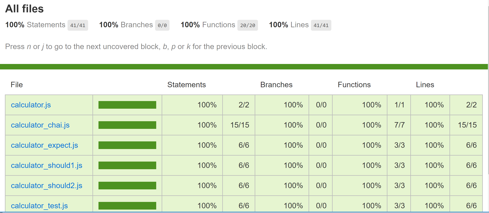

## 8 Node.js 单元测试

### 8.1 单元测试

#### 8.1.1 引子

对于一个程序员来说不仅要写代码，还要验证一下代码写得到底对不对，写单元测试就是一个通用且有效的解决方案。单元测试很重要，可以将错误扼杀在摇篮中，如果你认为没有写单元测试也过得很好，也许等我介绍完 [mocha](https://mochajs.org/) 之后，你会改变主意的。  
下面给出一个栗子，假设有一个计算器的项目，不过这个项目周期比较长，后期需要增加更多的人手，所以对于每一个模块都要有相应的测试用例。下面是程序员小明开工后写的第一个函数，一个加法函数：

```javascript
function add(a,b) {
    return a+b;
}
```

**代码 8.1.1.1 add函数**  
如果你之前没有接触过单元测试，可能写出的测试用例是这样的：

```javascript
var s = add(1,2);
if (s == 3) {
    console.log('恭喜你，加法测试成功了');
} else {
    console.error('哎呦，加法测试出错了啊');
}
```

**代码 8.1.1.2 不使用测试框架的测试用例**  
接着又需要写减法函数、乘法函数、除法函数，但是随着模块的增加，就会遇到一个问题，如果按照代码8.1.2的模式的话，一则输出格式比较乱，二则缺失测试结果统计。这时候大名鼎鼎的 `mocha` 就要闪亮登场了。  
有了 `mocha` ,测试结果输出格式化和测试结果统计的需求就可以迎刃而解了。比如说对于上面那个加法测试用例，就可以这么写了：

```javascript
var assert = require('assert');
describe('Calculator', function() {
  describe('#add()', function() {
    it('should get 3 when 1 add 2', function() {
      assert.equal(3, add(1,2));
    });
  });
});
```

**代码 8.1.3 使用mocha改写测试用例**  

> mocha 在使用的时候，可以选择全局安装的模式，也可以安装为当前项目的开发依赖包（即在安装的时候使用`--save-dev`参数），不过每个项目中使用的版本可能会略有差异，并且部分 IDE 对于全局安装的支持并不是很好，所以推荐安装为当前项目的开发依赖。  

我们将加法运算的代码封装在 `calculator.js` 中，并且提供一个 mocha 的测试文件 `calculator_test.js`:  

```javascript
var assert = require('assert');
var calculator = require('./calculator');

describe('Calculator', function() {
  describe('#add()', function() {
    it('should get 3 when 1 add 2', function() {
      assert.equal(3, calculator.add(1,2));
    });
  });
});
```

**代码 8.1.4 文件calculator_test.js部分代码**  
接着运行`node calculator_test.js`，不出意外会报错：

```
e:\kuaipan\code\node\myapp\chapter7\src\test\mocha>node calculator_test.js 
e:\kuaipan\code\node\myapp\chapter7\src\test\mocha\calculator_test.js:4   
describe('Calculator', function() {     
^                             
ReferenceError: describe is not defined  
    at Object.<anonymous> (e:\kuaipan\code\node\myapp\chapter7\src\test\mocha\calculator_test.js:4:1)  
    at Module._compile (module.js:456:26)           
    at Object.Module._extensions..js (module.js:474:10)     
    at Module.load (module.js:356:32)           
    at Function.Module._load (module.js:312:12)  
    at Function.Module.runMain (module.js:497:10)  
    at startup (node.js:119:16)     
    at node.js:929:3
```

**输出 8.1.1.1 命令 node calculator_test.js 的输出**  
这是由于函数 `describe` 只有通过 mocha 命令运行时才存在，换成使用 `mocha calculator_test.js` 来运行则能看到正确结构：

```
e:\kuaipan\code\node\myapp\chapter7\src\test\mocha>mocha calculator_test.js                                
  Calculator                 
    #add()                    
      √ should get 3 when 1 add 2  

  1 passing (7ms)
```

**输出 8.1.1.2 命令 mocha calculator_test.js 的输出**  

#### 8.1.2 断言

这里之所以使用 node 自带的 assert 包，是由于 mocha 仅仅是一个测试框架，本身并没有提供断言（Assertion）库。很多第三方的断言库都可以和 mocha  完美结合： 
**1.should.js**  
他使用的格式是 `(something).should` 或者 `should(something)`，更多使用方法还得参阅其 [github文档](https://github.com/Automattic/expect.js "") ，例如上面我们使用 assert 进行判断的代码就可以写成:

```javascript
var should = require('should');

(calculator.add(1,2)).should.be.exactly(3).and.be.a.Number();
```

**代码 8.1.2.1 should判断1**  
或者：  

```javascript
var should = require('should/as-function');

should(calculator.add(1,2)).be.exactly(3).and.be.a.Number();
```

**代码 8.1.2.2 should判断2**  

> 上面仅仅是简单说明使用方法，完整的测试用例大家可以参见第七章源码`test/mocha/calculator_should1.js` 和 `test/mocha/calculator_should2.js`。  

**2.expect.js**  
首先给出expect.js的 [github地址](https://github.com/Automattic/expect.js) ，下面是用expect重写的测试用例：  

```javascript
var expect = require('expect.js');
expect(calculator.add(1,2)).to.be(3);
```

**代码 8.1.2.3 expect判断**  
**3.chai**  
[chai](https://www.chaijs.com/) 将前面提到的assert should expect融合到了一起，你仅仅需要使用 chai 这一个包就能享用以上三者的功能，所以前面讲到的三种判断在chai中是这么实现的：  

```javascript
var chai = require('chai');

var assert = chai.assert;//use assert
assert.equal(3, calculator.add(1,2));

chai.should();//use should
(calculator.add(1,2)).should.be.equal(3).and.be.a('number');

var expect = chai.expect;//use expect
expect(calculator.add(1,2)).to.equal(3);
```

**代码 8.1.2.4 使用chai判断**  
这个 chai 还真是个大杀器呢。不过注意，在 chai 中下面关键字

    to be been is that which and has have with at of same

只能作为属性使用，不能作为函数使用（除非你自己写代码把这些属性覆盖掉），所以 `to.be(3)` 要写作`to.equal(3)`，另外 chai 中也没有 `exactly`  这个函数，所以这里也是用 `equal` 来替代，同时在 chai 中 `a` 只能作为函数使用，其函数声明为 `a(type)` ,所以这里用了 `a('number')`，其他技术细节，请移步官方API [BDD部分](https://www.chaijs.com/api/bdd/)。  

#### 8.1.3 HTTP 测试

上面演示的是对程序本地调用的测试，不过很多情况下，我门的 API 是通过 HTTP 的形式对外提供访问的，比如说我们将上面提到的计算器的功能改为使用 HTTP 方式对外提供访问，这样的项目依然可以给出测试用例。  
HTTP请求和本地调用从流程是有很多不一样的地方的：当中隔着一个网络层，请求数据以 HTTP 报文的格式在网络上进行传输，服务器端解析 HTTP 报文内容后再调用本地 API 进行处理，然后再将处理结果通过 HTTP 报文返回给调用者。[supertest](https://github.com/visionmedia/supertest "")  这个工具可以很好得在 mocha 中处理 HTTP 请求断言。  

下面是一个 HTTP 接口：

```javascript
exports.doAdd = function(req, res) {
    var _body = req.body;
    var a = parseInt(_body.a, 10);
    if (isNaN(a)) {
        return res.send({code:1,msg:'a值非法'});
    }
    var b = parseInt(_body.b, 10);
    if (isNaN(b)) {
        return res.send({code:2,msg:'b值非法'});
    }
    res.send({code:0,data:a+b});
};
```

**代码 8.1.3.1 加法运算的 HTTP 接口**  

对应的supertest的测试用例代码就是这样的：

```javascript
var request = require('supertest');
var app = require('../../app');

describe('POST /calculator/add', function() {
  it('respond with json', function(done) {
    request(app)
      .post('/calculator/add')
      .send({a: 1,b:2})
      .expect(200, {
          code:0,data:3
      },done);
  });
});
```

**代码 8.1.3.2 加法运算HTTP接口的单元测试代码**  

> 此代码放置于第七章代码的目录 /src/test/http目录下，变量app其实是引用的项目根目录的app.js。  

对于一个普通的网站来说，它的接口在访问之前，一定是经过授权的，否则就会将整个网站置于危险之中。用户名、密码登陆是我们常见的一种授权模式，为了简化我们的教程，我们姑且将 **代码7.1.3** 作为我们的登陆处理代码，那么登陆链接即为`/user/login`，管理后台首页为`/user/admin`。我们现在来测试登录到后台这个动作。

登录过程要牵扯到我们在第 6 章讲过的session的知识，但是 session 在前端对应的 sessionid 会写入 cookie 中，鉴于我们的测试运行环境是命令行，不是浏览器，这就需要我们自己来维护 cookie 的存储操作。同时我们还需要用到 mocha 中的钩子（Hook）函数，在这里用到的是 mocha 中的 before 函数，它表示在所有测试用例之前执行，当然还有 beforeEach 函数，它表示在每次测试用例执行前都执行一次。显然两者的区别是前者只在所有测试用例前执行一次，而后者要在每个测试用例执行前都要重新执行。先看这个钩子函数：

```javascript
var request = require('supertest');
var app = require('../../app');
var cookie = exports.cookie = '';

before(function(done) {
    request(app)
      .post('/user/login')
      .send({username:'admin', password:'admin'})
      .expect(200,{code:0})
      .end(function(err,res) {
          if (err) {
              return done(err);
          }
          var header = res.header;
          var setCookieArray = header['set-cookie'];

          for (var i=0,len=setCookieArray.length;i<len;i++) {
              var value = setCookieArray[i];
              var result = value.match(/^express_chapter7=([a-zA-Z0-9%\.\-_]+);\s/);
              if (result && result.length > 1) {
                  exports.cookie = cookie = result[1];
                  break;
              }
          }
          if (!cookie) {
              return done(new Error('查找cookie失败'));
          }
          done();
      });
});
```

**代码 8.1.3.3 钩子函数**  
这里我们使用全局变量 cookie 来存储我们提到的 sessionid ，在 supertest 的 end 函数中，我们读取响应体变量res中的 set-cookie 头信息，通过正则把 sessionid 读取出来。注意我们这里将 `cookie` 这个变量还专门做导出了，这样子我们就可以在其他测试文件中引用这个变量了。  
接着就可以使用这个读取到的cookie来进入后台了：  

```javascript
var request = require('supertest');
var app = require('../../app');
var before = require('./login_before');

describe('Backend',function() {

    it('first test',function(done) {
        request(app)
        .get('/user/admin')
        .set('Cookie','express_chapter7=' + before.cookie)
        .expect(200,/<title>admin<\/title>/,done);
    });
});
```

**代码 8.1.3.4 请求中使用cookie**  
我们在模板 `user/admin.ejs` 有这么一句：`<title><%=user.account%></title>`，所以我们这里在测试时使用正则 `/<title>admin<\/title>/` 来验证是否真的进入后台了。  还有就是在读取 `cookie` 变量的时候没有直接在 require 完成之后立即读取，因为那个时候，这个变量还没有被赋值，而是在测试用例内部通过 `before.cookie` 读取。

> 注意，由于我们使用了 redis 来存储 session 数据，所以如果你忘记启动 redis 服务器的话，我们的登录操作会失败，而且在 mocha 中给出的报错提示是请求超时，这个问题比较隐蔽，大家一定要注意。

#### 8.1.4 仿真测试

上面讲的所有的断言都是对结果进行断言，执行某一个函数，查看返回值是否符合预期，或者请求某一个接口看看响应内容是否符合预期。但是某些情况下，我们想对中间步骤进行测试，比如说在执行 `函数 A` 的时候，正常情况下其内部应该调用了 `函数 B`，我们想验证 `函数 B` 是否真的被调用了。

解决这个需求，就需要用到 [sinon](https://npmjs.com/package/sinon) 这个包。将代码 **代码 8.1.1.1** 稍作改造：

```javascript
function add(a,b) {
    console.log(a, b);
    return a+b;
}
```

**代码 8.1.4.1**

然后我们可以编写测试用例，用来验证 console.log 是否被调用了：

```javascript
var assert = require('assert');
var sinon = require('sinon');
var calculator = require('./calculator');

describe('Calculator sinon', function () {
    describe('#add()', function () {
        it('should call console.log in add function', function () {
            var spy = sinon.spy(console, 'log');
            calculator.add(1, 2);
            assert(spy.calledOnce);
            assert(spy.calledWith(1, 2));
            console.log.restore();
        });
    });
});
```

**代码 8.1.4.2**

上述代码的最后一行也可以写成 `sion.restore()` , 这样的话，会将所有通过 sinon 改造的函数都做还原。

上面的 spy 函数相当于做了一个钩子，可以检测是否被调用，可以获取调用时传的参数。有了这个函数，就可以让我们的代码测试的覆盖面更广。但是有的时候，我们的代码在调用中间件时，肯定要书写中间件不可用时的处理逻辑，但是真实情况是，我们的中间件绝大多数情况下都是可用的，按照正常流程测试，这部分错误处理函数从来都不会被触发，这时候我们就要用到 stub 这个函数。

```javascript
const {expect} = require('chai');
const sinon = require('sinon');
const {UserModel} = require('../../models');
const user = require('../../models/user_model');

describe('user check sinon', function() {
    it('错误处理', function(done) {
        const myFake = sinon.stub(UserModel, 'findOne').callsFake(function(filter, fields, option, callback) {
            callback(new Error('error from sinon'));
        });
        user.loginCheck('','', function(err) {
            expect(err).not.be.null;
            myFake.restore();
            done();
        });
    });
});
```

**代码 8.1.4.3**

这里面对于 `UserModel.findOne` 函数进行改写，强制让其 callback 触发时返回一个 Error 对象，这样我们就可以测试我们代码在数据库查询失败的逻辑处理了。当然在每次测试完成之后，按照惯例需要对于改造进行还原，也就是 `myFake.restroe` 这句代码的调用，如果不写这句话，`UserModel.findOne` 就会一直处在被改写的状态，很有可能影响下面的测试。

stub 这个函数不仅仅可以用来模拟中间件出错的场景，还可以用来模拟调用第三方服务返回数据的场景，模拟这种场景可以让你的测试代码脱离第三方服务的依赖。

### 8.2 测试覆盖率

我们写测试用例是为了及时发现开发中产生的 bug，这就引申出来一个问题，怎样写测试用例才能更好的将潜在的 bug 更好的暴漏出来，这也就是我们现在要讲的话题——测试覆盖率。

> 我们的测试代码是在源码的基础上编写的，那么它属于白盒测试，还有一种基于需求的测试，这种测试不接触源代码，属于黑盒测试。我们这一小节讲覆盖率，只讲白盒测试的覆盖率。

首先我们程序中有各种条件判断分支，理想的情况是，各个分支在测试用例中都有断言检测，但是实际情况中我们很难写出测试代码将所有分支都覆盖。将`覆盖到的条件分支数 / 总的条件分支数`，得到的比例数，是测试覆盖率的一种算法。为什么说一种呢？因为实际情况中，一个程序的执行是几个分支依次运行的，这些程序中执行的分支组合就形成一条条路径，所以说还有一种覆盖率的算法是 `覆盖的测试路径 / 总的路径数`。这种计算方法比较复杂，现在一些测试覆盖率的统计工具都是基于前者的，比如说我们下面要讲到的 [nyc](https://www.npmjs.com/package/nyc)。

通过 npm 安装 nyc 后，修改 `npm test` 对应的命令，在 `mocha` 命令前添加一个 `nyc` 。比如说你之前的 `npm run test` 的命令是 `mocha --recursive src/test/mocha --timeout 99999 --exit `, 那么就可以改为 `nyc mocha --recursive src/test/mocha --timeout 99999 --exit `。同时新增一个 `coverage` 的 `npm` 命令：

`"coverage": "nyc report --reporter=html" `

之所以加一个 reporter 的参数，是因为默认的输出格式是文本格式的，可读性不强。

先后运行 `npm run test` 和 `npm run coverage`，打开项目更路径下的文件夹 `coverage` 下的 `index.html`，即可看到对于各个文件的测试分支覆盖情况。



**图 8.2.1 测试覆盖率报告**

最后说一下，在实践中的一些测试准测，由于覆盖率检测工具是基于分支的，所以即使覆盖率是 100%，依然无法保证所有的测试路径都会被涵盖到。并且当下的程序开发越来越依赖于团队协作，越来越倾向于往微服务的方向发展，单纯的一个服务 100% 没有问题，并不能保证整个系统是没有问题的。更有甚者，客户端存在的一些问题会倒逼服务器端去强行修改业务逻辑，保证线上业务的顺利进行。所有说，测试人员的集成测试还是至关重要的且无可替代的。

> 本章配套代码：https://github.com/yunnysunny/expressdemo/tree/master/chapter8
