## Node.js 调优

作为一门后端语言，肯定要求运行的效率最优化，以实现对于资源最小损耗，这一章正是围绕这个话题展开。调优是一个有挑战性的活儿，可能经常让人摸不着头脑，下面的内容尽量使用实例来带入一个个调优的场景。

### 11.1 准备工作

首先我们准备一个 http server 端代码，请求后返回一个二维码图片：

```javascript
var http = require('http');
var ccap = require('ccap')();//Instantiated ccap class 

http.createServer(function (request, response) {
    if(request.url == '/favicon.ico')return response.end('');//Intercept request favicon.ico
    var ary = ccap.get();
    var txt = ary[0];
    var buf = ary[1];
    response.end(buf);
    console.log(txt);
}).listen(8124);

console.log('Server running at http://127.0.0.1:8124/');
```

**代码 11.1.1 app.js**

对于 node 版本大于 6.3 的会比较简单，运行

```shell
node --inspect=9229 app.js
```

**命令 11.1.1**

启动的 node 进程会带有调试功能，使用 Chrome DevTools 即可远程查看当前运行的 js 源码，并且能够生成 CPU 和 内存快照，这对于我们分析性能十分有帮助。

运行完**命令11.1.1**之后，我们在控制台上会看到如下输出：

```
> node --inspect=9229 app.js

Debugger listening on port 9229.
Warning: This is an experimental feature and could change at any time.
To start debugging, open the following URL in Chrome:
    chrome-devtools://devtools/remote/serve_file/@60cd6e859b9f557d2312f5bf532f6aec5f284980/inspector.html?experiments=true&v8only=true
&ws=127.0.0.1:9229/1a19bc9d-7175-4df3-b131-2eca35c7c844
Server running at http://127.0.0.1:8124/
Debugger attached
```

**输出 11.1.1**

我们将输出的地址 `chrome-devtools://devtools/remote/serve_file/@60cd6e859b9f557d2312f5bf532f6aec5f284980/inspector.html?experiments=true&v8only=true
&ws=127.0.0.1:9229/1a19bc9d-7175-4df3-b131-2eca35c7c844` 贴到 chrome 地址栏中访问，然后我们看到的竟然是一个空白页，好多教程中都说会直接打开一个 chrome 开发面板，然而并没有（我使用的是 Chrome 62 版本）。这时候，你在任何一个网页中手动打开一个开发面板，

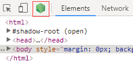

**图 11.1.1**

你会发现多了一个 Node 的小图标，这个图标就是之前我们输入 `chrome-devtools` 地址后生成的，我用红色矩形专门标记了出来，点击这个图标又弹出了一个面板，

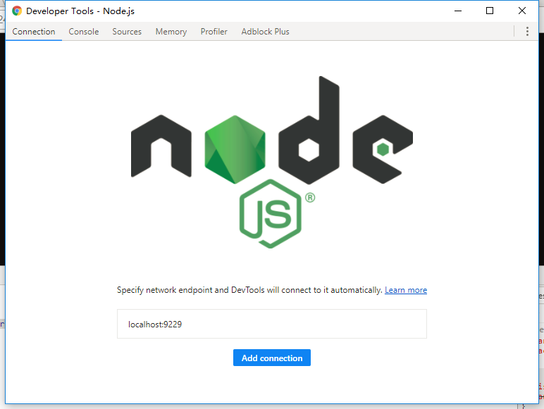

**图 11.1.2**

或者你在开发面板中选择 `Remote Devices`：

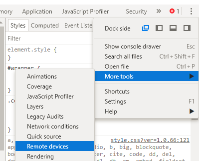

**图 11.1.3**

然后在弹出的 Tab 页中找到 `Add Address` 按钮，点击然后输入Node 应用部署的 ip 和 inspect 端口号（即启动node程序的 `inspect` 参数），甚至可以监听任意远程电脑的 Node 应用（如**图 11.1.4**所示），添加成功后，同样可以触发开发面板上出现**图 11.1.1**中的 Node 小图标。

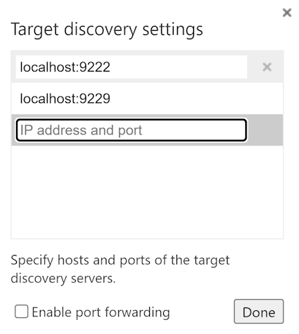

**图 11.1.4**

继续回到**图 11.1.2**，里面有一个按钮 `Add connection`，其实我们在这里一样可以添加远程 Node 应用的 inspect信息，这里的功能和**图 11.1.4** 中是一样的。我们点开他的 `Source` tab 页，能够找到我们启动的 app.js 的源码：

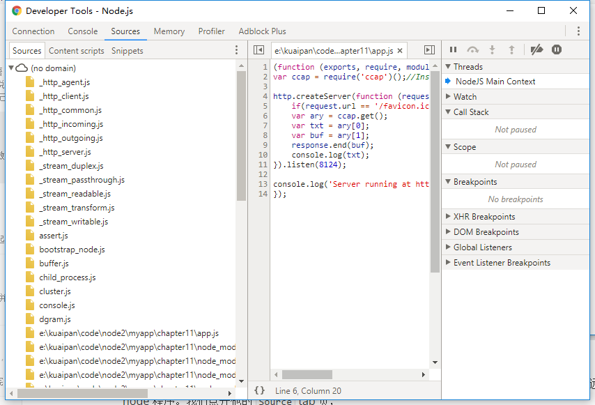**图 11.1.5**

> 这项功能对于chrome来说还处于实验状态，所以在操作过程中如果你的浏览器崩溃，不要怀疑，这属于正常现象。

### 11.2 测试工具 JMeter

要想知道性能如何，需要首先借助压力测试工具，这里我们选择开源的 [JMeter](http://jmeter.apache.org/) 。

打开 JMeter 后，首先创建一个线程组，用过 LoadRunner 的同学，可能会比较熟悉`用户数`，这个概念对应到 JMeter 的话，就是线程组中的线程


**图 11.2.1 添加线程组**

接着我们添加一个 HTTP 请求的默认参数

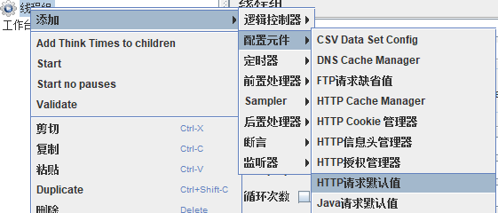

**图 11.2.2 HTTP请求默认参数设置**

在这里我们仅仅需要设置 ip 和端口号即可：

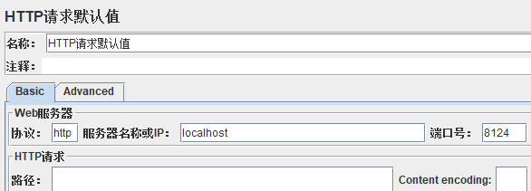

**图 11.2.3 设置HTTP请求默认参数**

其实这个步骤并不是必须的，下面我们要设置一个 http 请求的 sampler，在那里面设置请求的 ip 和端口号也是可以的，只不过这里提前设置好了，这样如果你想对当前网站配置多个请求 sampler 的时候，可以省去公共部分的配置，特别当你的请求都有公共参数的时候，不过由于我们这里仅仅测试一个 URL，所以优势没有体现出来。


**图 11.2.4 添加 HTTP 请求 sampler**

由于前面在图 11.2.3 中已经设置了请求的 ip 和端口，这里仅仅设置一下请求路径即可：

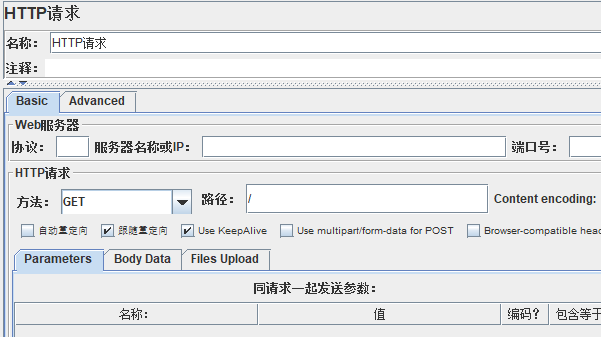

**图 11.2.5 配置 HTTP 请求 sampler**

最后点击工具栏中的按钮 即可开始测试。

接着我们回到线程组的配置，

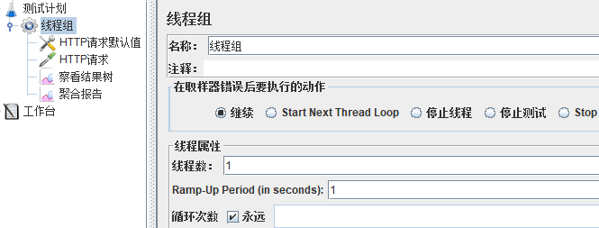

里面配置的线程数，可以控制同时发送请求的线程数，我们在做测试的时候逐步增加线程数，然后查看 Node 进程的 CPU 占有率，直到达到 100% （windows下多核CPU的操作系统，显示看是否达到100%/n，其中n为 CPU 核心数，比如说常见的 4 核心的 windows，达到 25%，则代表一颗 CPU 核心被吃满）。

当你的 Node 进程达到满负载之后，回到**图11.1.2**的 Profiler 标签页，选择 Start 按钮开始生成 CPU profile 文件，等待一段时间时候，选择 Stop 则会得到一份 CPU profile，

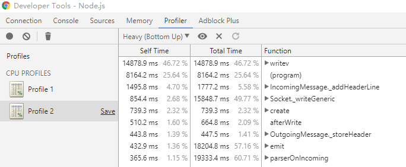

**图 11.2.6 生成的 CPU profile 文件**

通过分析可知 Socket 的write 操作和原生代码操作（即第二行标记为program的调用）比较耗费CPU，由于我们在**代码 11.1.1** 使用了 ccap 这个验证码生成库，而这个库的核心代码是 C/C++ 编写的，所以耗时操作统一算在 program 身上。

回到**代码 11.1.1**，我们将产生的二维码图片数据作为 HTTP 的响应数据，鉴于一个二维码有几十KB的数据，服务端短时间内大批量的写操作，我们在 JMeter 中添加一个聚合报告（如**图 11.2.6**所示），然后在压力测试的过程中就会发现网络吞吐量是非常大的（如**图 11.2.7** 所示）。

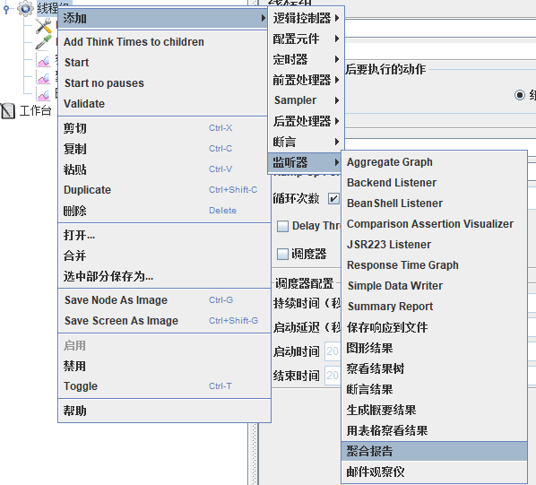

**图 11.2.6**

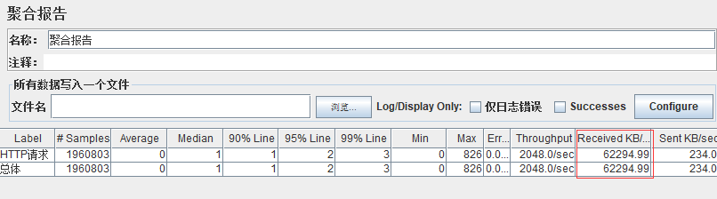

**图 11.2.7**

综上两点，做一个实时的验证码生成程序是不合适的，所以这里推荐的解决方案是提前预生成一批验证码图片，然后放到 CDN 上，并且将关联数据存入数据库（比如说 redis），等浏览器请求过来的时候再随机从数据库中抽取一个，至于实现代码留给各位同学自己实现了。

上面讲了很多 JMeter 的基本使用都是基于 UI 的，正式使用的时候，UI 会占用若干资源，所以官方推荐使用命令行来运行，UI 工具只是用来负责生成 jmx 文件。点击保存按钮即可生成当前 UI 设置的 jmx 文件，然后在命令行中使用如下命令：

```shell
bin/jmeter.sh -n -t the_path_of_jmx -l the_path_of_jtl -e -o the_result_output_directory
```

**命令 11.2.1**

`jmeter.sh` 可以在 JMeter 的 bin 目录下找到 (Windows 下是 jmeter.bat)； `the_path_of_jmx` 即保存后生成 jmx 文件；`the_path_of_jtl` 代表生成的每条测试情况详情，多次运行命令时，要保证每次用的文件名不一致。

如果在设置线程组的时候，指定了循环次数为无线循环，则 jmeter 在命令行运行过程中无法判断什么时候结束，如果手动 CRTL+C 结束命令行时，`the_result_output_directory` 中不会生成测试报表 html 文件。

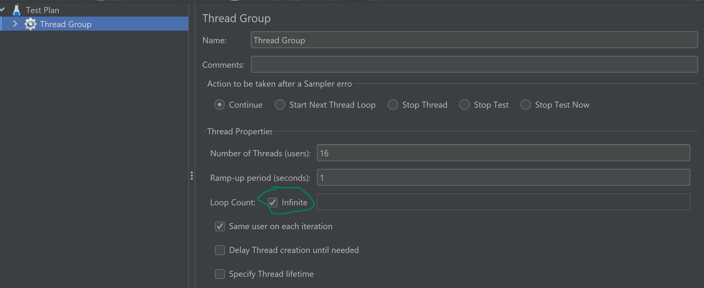

**图 11.2.8**

这时候，你需要使用命令行讲 jtl 文件转化成报表文件，具体命令为：

```shell
bin/jmeter.sh -g the_path_of_jtl -e -o the_path_of_result_report_html
```

**命令 11.2.2**

如果在 **图 11.2.8** 中指定了一个循环次数，则运行完 **命令 11.2.1** 后，会在目录 `the_result_output_directory` 直接生成报表文件。

### 11.3 内存分析

Node 的程序中一般不会操作大内存，一般是一个请求过来，处理完数据，变量的生命周期就结束了，会被垃圾回收器回收掉。但是如果有高并发需求时，我们希望从数据库中查询到的数据能够在内存中得到缓存，这样就能减轻对于数据库的压力，提高吞吐率。

我们看下面一段代码：

```javascript
const db = require('./db');
const cacheResult = new Map();
const DEFAULT_CACHE_AGE = 1000;

class CacheItem {
    constructor(data,expire) {
        this.expire = expire || (new Date().getTime() + DEFAULT_CACHE_AGE);
        this.data = data;
    }
}

/*const queryWithCache = */exports.queryWithCache = function(itemName) {
    const item = cacheResult.get(itemName);//console.log(cacheResult.size);

    if (item) {
        if (item.expire > new Date().getTime()) {
            return (item.data);
        }
        cacheResult.delete(item);//console.log('expired cache..........................');
    }

    const value = db[itemName];
    cacheResult.set(itemName,new CacheItem(itemName,value));    
    return (value);
};
```

**代码 11.3.1** 

将从数据库中查询到的数据缓存到内存，不过设置了一个过期时间，下次 查询的时候，先判断内存中有没有，如果内存中存在且数据尚未过期，就直接返回。如果内存中存在数据，但是过期了，就将其删除。看上去这个算法比较简单高效，但是却存在严重的内存泄漏问题，缓存的数据只有再下次被重新请求到的时候才有可能被删除，如果每次请求恰好都是新数据，那么之前缓存的数据永远得不到机会删除，导致内存暴涨。

为了方便的复现这个问题，我们对**代码11.1.1**进行改造：

```javascript
const http = require('http');
const ccap = require('ccap')();//Instantiated ccap class 
const cache = require('./lib/cache');
const rand = require('./lib/rand');

http.createServer(function (request, response) {
    const url = request.url;
    if(url === '/favicon.ico')return response.end('');//Intercept request favicon.ico
    if (url === '/cache-test') {
        return response.end(cache.queryWithCache(rand.create(3))||'__');
    }
    const ary = ccap.get();
    const txt = ary[0];
    const buf = ary[1];
    response.end(buf);
    // response.end('ok');
    //console.log(txt);
}).listen(8124);

console.log('Server running at http://127.0.0.1:8124/');
```

**代码 11.3.2**

增加一个地址 `/cache-test`来模拟这个请求，这里使用随机字符串来达到每次请求都使用新数据的目的。回到 Chrome 开发面板，选择 Memory 标签页，然后再选择 `Take heap snapshot`，点击 `Take snapshot` 按钮即可生成堆快照：

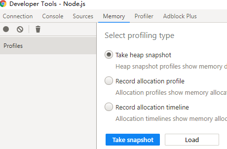

**图 11.3.1**

回到我们的 JMeter，再新建一个 HTTP sampler，

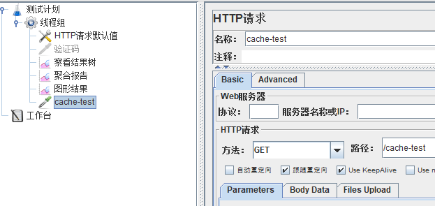

**图 11.3.2**

为了单测试内存泄漏，我们在测试之前先把之前的验证码的测试用例禁用掉，然后点击启动按钮。在测试之前，测试过程中，测试结束之后过一段时间之后，分别点击 `Take snapshot` 按钮：

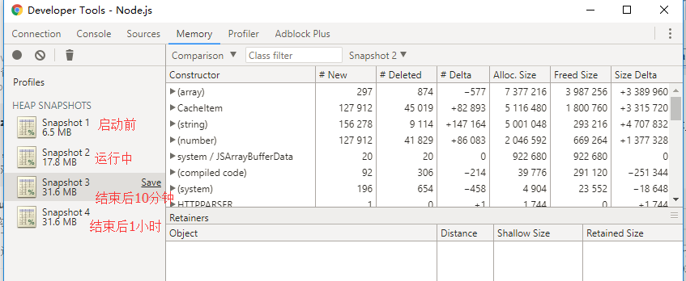

**图 11.3.3**

Snapshot 1 对应开始前，Snapshot 2 为进行中和 Snapshot 3 、4 结束后的堆快照，最终发现即使在测试结束后，堆内存依然没有释放，我们选择 `Snapshot 3` ，然后在 `Class filter` 左边的下拉框中选择 `Comparison` ，它会自动和上一个快照做对比，我们发现 `CacheItem` 类型的对象在这当中新增了 82893 个，然后再对比 `Snapshot 4` 和 `Snapshot 3` 发现，`CacheItem` 类型对象完全没有被回收掉。以此我们可以认定，我们写的代码有内存泄漏了。

> 为了解决这个问题，我单独做了一个闪存处理的包，借鉴了 JVM 或者 V8 中在 GC 中所使用的新生代、老生带的算法，
> 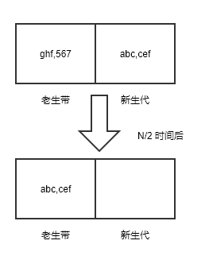
> **图 11.3.4**
> 假设缓存声明周期为 N，内部会预置一个定时器，每隔 N/2时间后将新生代拷贝到老生带，并且清空新生代，具体代码参考包 [flash-cache](https://www.npmjs.com/package/flash-cache) 。

### 11.4 alinode

上面讲的性能分析都是基于 chrome devtools 的，国内的阿里公司也大量的使用 Node 来处理自己的业务，为了发现自己程序的性能问题，他们研发了 alinode 和其对应的性能监控平台，提供一系列的工具来定位性能问题。值得称赞的是，他们将此工具免费提供给大家使用👍。

直接浏览 https://node.console.aliyun.com ，使用自己的淘宝或者支付宝账号即可登录。登录完成，进入其性能平台管理界面，选择右上角的 `创建新应用` 按钮，在弹出的对话框中，输入应用名称。创建成功后，会弹出对话框，提示应用的 appid 和 secret。

使用 alinode ，要安装阿里开发的专用 Node 版本，它在官方 Node 代码的基础上集成了性能收集功能，以便将性能数据上传到 alinode 平台做分析。为此你需要安装 tnvm，这是一个类似于 nvm 的 Node 版本安装工具，使用它你才能够顺利地安装 alinode 订制版 Node。

```shell
# 安装 tnvm
wget -O- https://raw.githubusercontent.com/aliyun-node/tnvm/master/install.sh | bash
# 安装后更新一下环境变量，否则找不到 tnvm 命令
source ~/.bashrc
```

**代码 11.4.1 安装 tnvm**

接下来需要安装你需要的 tnvm 版本，阿里官方提供了一份 alinode 和原始 Node 的版本对照，详细数据可以参照 [官方文档](https://help.aliyun.com/knowledge_detail/60811.html) 。大体上的规则是 alinode 的 2.x 对应原始 Node 的 6.x 版本，3.x 对应 8.x，4.x 对应 10.x。举一个例子，从官方文档得知，原始 Node v6.14.4  对应的 alinode 为 v2.5.2 ，那么安装这个版本的命令如下：

```shell
tnvm install alinode-v2.5.2 # 安装需要的版本
tnvm use alinode-v2.5.2 # 使用需要的版本
```

**代码 11.4.2 安装对应的 alinode 版本**

为了能将 alinode 运行时产生的数据收集到性能监控平台，你还需要安装 agenthub 这个工具，通过运行 `npm install @alicloud/agenthub -g ` 即可完成安装。

默认 alinode 不会收集运行时的数据，首先你需要保证你的 Node 程序在启动前，设置如下环境变量：

```shell
# 设置为 YES，相当于允许产生 Node 运行时的日志
export ENABLE_NODE_LOG=YES
# 默认日志保存目录为 /tmp，你可以通过这个环境变量修改她
export NODE_LOG_DIR=/var/log/alinode
```

 **代码 11.4.3 设置 alinode 的环境变量**

可以将上述代码写在 `/etc/profile` 中，然后 `source /etc/profile` 让其生效。同时在你的 Node 程序启动之前，你还需要启动 agenthub，否则数据无法上报。还记得之前我们创建应用时生成的 appid 和 secret 参数不，我们创建一个配置文件写入 `~/alinode.json` 中，将 appid 和 secret 填入：

```json
{
    "appid":"",
    "secret":"",
    "logdir":""
}
```

**代码 11.4.4 配置 agenthub 启动参数**

如果你在 **代码 11.4.3** 中指定了环境变量 `NODE_LOG_DIR` 的话，这个地方就需要设置 `logdir`，agenthub 无法上报数据。

最后运行 `agenthub ~/alinode.json` 启动 agenthub，注意如果你在启动 agenthub 之前就已经通过 pm2 启动了应用，必须通过 pm2 kill 杀死当前进程，然后再重新启动，否则设置不会生效。

最终我们在性能平台中点击之前创建应用的主页，鼠标移动到左侧菜单中的`实例`上，会看到之前配置的那台机器：

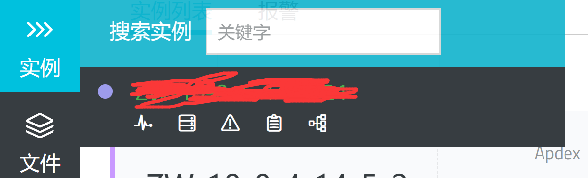

**图 11.4.1 alinode 实例**

点击这个实例，然后在右侧的进程列表中选择你需要监控的进程：

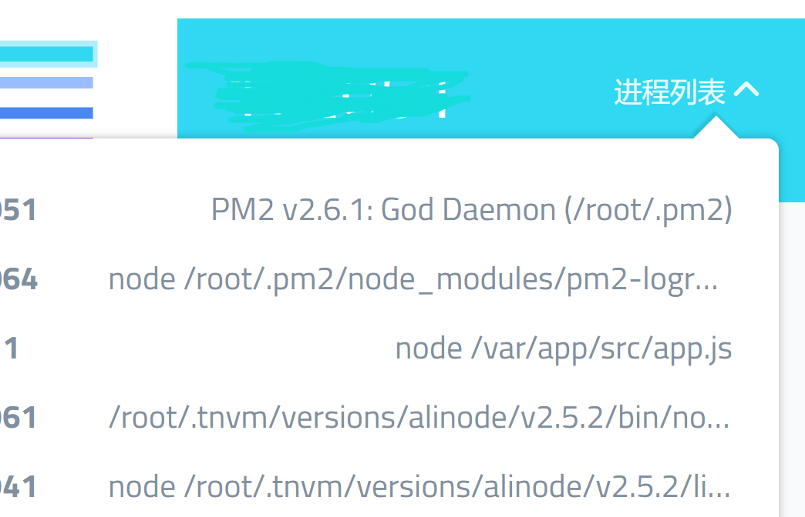

**图 11.4.2 alinode 进程列表**

同时，你可以在右侧面板中找到一系列的性能数据收集工具，包括我们之前用过的堆快照和 CPU Profile。下面着重讲解一下 alinode 平台中，CPU Profile 收集的功能，我们点击一下 `CPU Profile` 按钮，会提示 `操作成功，请访问 文件列表 查看详情`，点击`文件列表` 链接，我们等待 CPU Profile 生成完成，然后选择 `转储` 按钮，它会将生成的文件从 Node 运行所在的服务器上传到 alinode 平台。转储完成之后，点击 `分析` 按钮，你会查看到生成的火焰图；点击 `分析(devtools)` 会将 CPU Profile 呈现在控制台中，跟图 **图 11.2.6 ** 中呈现的效果是相同的。

火焰图是一种非常有效的性能分析工具，因为它很直观，即使你并不是代码的编写者，你也一眼能看出哪一块代码运行时间长：

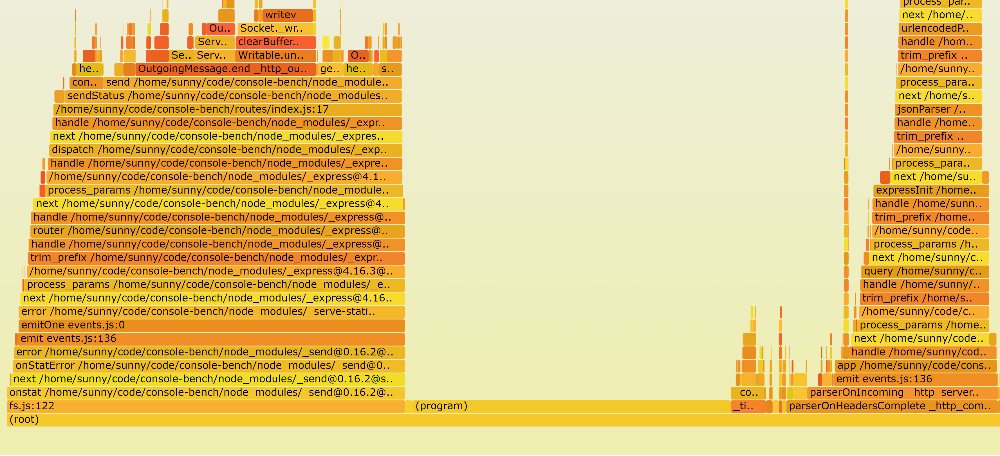

**图 14.3.3 火焰图**