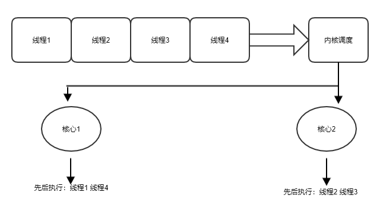

## 13 Web Worker

Web Worker 技术，本是前端 API，作为 HTML5 标准 API ，被各大浏览器支持。借助于 V8 引擎的东风，Node 在 10.x 开始引入 Web Worker 的 API。引入了这个API 后，Node 中也可以将应用代码单独运行在某个创建的线程中。

### 13.1 简单开始

下面是一个使用 Web Worker 的简单例子

```javascript
const path = require('path');
const { Worker } = require('worker_threads');

const worker = new Worker(
    path.join(__dirname, './worker.js'),
    { workerData: { a: 1} }
);
worker.postMessage('begin');
worker.on('message', (msg) => {
    console.log('info from child', msg);
});
worker.on('error', (err) => {
    // 子线程崩溃时，会抛出异常，触发 error 事件，这里可以重新触发线程的创建过程，保证线程一直在线
    console.error('worker emmit error', err);
});
worker.on('exit', (code) => {
    //线程退出事件
});
```

**代码 13.1.1 parent.js**

```javascript
const { parentPort, workerData } = require('worker_threads');
console.log('data from parent', workerData);
parentPort.on('message', data => {
    parentPort.postMessage(' worker recive: ' + data);
});
```

**代码 13.1.2 worker.js**

Web Woker 的构造函数比较简单，只有两个参数，第一个参数为 js 代码路径或者 js 代码字符串，第二个参数用来传递给子线程初始化参数，该参数目前仅支持 `workerData` 这一个属性，通过 **代码 13.1.2 worker.js** 可以看出，它被注入到了子线程的上下文中了，可以通过读取 `require('worker_threads').workerData` 来直接获取它的值。

### 13.2 适合什么和不适合什么

Web Woker 的 API 本身并不复杂，但是它为 Node 的编程打开了一扇大门。站在大门口的开发者们，相比于新 API 带来的兴奋感，我们更应该提防“乐极生悲”。

当前 Node 中使用多进程来利用多核 CPU 资源。每个 CPU 核心在使用的过程中，都会被拆分成各个时间片，然后操作系统通过轮转各个时间片给具体的某个线程，来保证各个线程都能获得时间被处理。但是让每个 CPU 核心都有活干，却可能仅仅是一个理想状态。“一个和尚挑水喝，两个和尚抬水喝，三个和尚没水喝”的故事还经常萦绕在耳边，其实根本原因就在于组织调度没有做好。虽然你创建的每个 Web Worker 都运行在独立的线程上，而且这些独立线程不会让 V8 的主线程卡顿，但是我们可以这么认为吗？我只能说上面说法，在满足一定条件下是正确的，这个条件就是你创建的线程总数一定要在一个可控的范围内。前面讲到操作系统通过轮转时间片来让每个线程都得到处理时间。



**图 13.2.1 CPU 调度流程**

用户的各个应用中创建的线程，都会在内核中通过调度算法进行分配 CPU 核心。如果线程数少，那么调度算法的损耗比较小，但是一旦用户的应用程序的线程规模失控，整个调度过程就会变得十分低效，会严重拖垮整个系统的性能。我们做这么一个假设，假设去银行办理业务的时候，必须通过大堂经理来决定办业务的顾客是去哪个窗口，如果当前办业务的人数居多，这个大堂经理肯定会忙不过来。

同时我们还应该留意到 CPU 核心在处理完一个线程，然后切换到下一个线程的时候，需要做上下文切换，即需要将上一个线程的数据切换出当前核心，然后把下一个线程的数据切入当前核心。虽然这个过程很快，但是分跟谁比，相比 CPU 的运算指令来说，这就是一个慢操作，也就是说单个核心上频繁的 CPU 线程切换，会让 CPU 的有效利用率下降。

我们再考虑一个极端情况，就是假定现在所有被等待调度的线程，里面的用户代码都是做运算，那么每个线程都可以在一定时间内把单个 CPU 核心吃满，这也就是我们常说的计算密集型的线程。假设当前主机的 CPU 核心数为 N，那么操作系统中最多服务 N 个计算密集型线程，超过 N 个后，线程和线程之间就必须得互相竞争 CPU 的时间片，导致每个线程的处理时延被拉大。然而我们在 Node 中开启 Web Worker ，很多情况下就是为了处理计算密集型任务，这种情况下最好不要将创建的 Web Worker 数大于 CPU 核心数。在实际使用中，一般会采用池化技术来限定线程的使用数目，让 CPU 核心数得到合理的运用。

> 关于 Web Worker 池化的技术，可以参考笔者的项目 [yunnysunny/threads](https://github.com/yunnysunny/threads)。

线程和进程都可以用来控制并发，且线程比进程要更加轻量级，为何社区没有对于 Web Worker 出现大面积使用的情况呢？可能有些人面对 Web Worker 的时候还会发出上述的疑问。

Web Worker 虽是线程级别的技术，但是它是从浏览器领域中引入的 API，跟传统后端语言中线程相比欠缺了很多关键技术细节。在绝大多数语言中，子线程和父线程是可以直接共享变量的，而在 Web Worker 中，父子线程之间必须得通过通信的方式进行数据传递，也就是我们在 **代码 13.1.1** 和 **代码 13.1.2** 中看到的 `postMessage` 函数。V8 内部在实现 `postMessage` 函数的时候，会将传递的数据先在内部做序列化为二进制，然后将序列化后的二进制数据追加到接收线程的内部队列中；同时发送者还会在拷贝还会触发一个信号量，通知对端线程有新数据到来，对端线程在收到这个通知后，会通过反序列化将数据还原。

Web Worker 通过数据拷贝的方式而不是通过共享内存的方式来进行通信，从一定程度使子线程具有一定的安全性，只能操作给定的内存，不会破坏父线程环境，这在前端是具有积极意义的，特别是拿子线程作为一个单独密集型运算的模块来说；但是对于后端来说，本身的代码逻辑跟操作系统系统更加靠近，做这么一个类似沙箱的环境反而会显得多余，还会带来一定的副作用，就比如说上面讲到的数据序列化和拷贝部分。

 `postMessage` 函数支持传递 `ShareArrayBuffer` 类型的数据，使用这个类型之后，父子进程之间无需做数据拷贝和序列化，但是实际生产环境中我们操作二进制数据的情况比较少，一般是通过传递 js 对象来进行相互通信，所以这个功能用到的机会很少。同时留意到  `postMessage` 函数的第二个参数支持传递一个数组，里面可以放 `ArrayBuffer` 类型的数据，且存放的变量需要和第一个参数是同一个变量，代表当前数据发送到对端线程后，本端线程将直接销毁掉这个变量，这样可以加快 GC 的过程，但是由于大家二进制用到的情况少，所以这个功能应该也会很少用到。

虽然上面说了很多 Web Worker 的“坏话”，不过也只是说其和传统后端编程语言的线程使用方式上有不足，但是和 Node 中的进程间通信模式比起来，又颇有几分“比上不足比下有余”的感觉。Web Worker 间的通信是有序列化的过程，还有内存拷贝，但是仅仅是发生在同一个进程内部；跨进程通信时需要借助于管道技术，同样需要做序列化，且需要序列化为字符串类型。所以说，不管是从通信效率上，还是序列化效率上，Web Worker 都要高于进程间通信。那么回到之前的疑问，为何 Web Worker 没有取代进程呢？

首先要面临的一个问题是，旧有 API 的改造是个庞大的工程。如果说第一个原因仅仅是托词的话，那么第二个问题就必须得面对了，Node 中的旧有代码都是按照单线程设计的，如果换成多线程操作后，会面临线程不安全的问题。拿最常见的 HTTP 请求处理来说，假定服务器端先后接到了两个请求，对应的请求对象为 `req1` `req2`，对应的处理 HTTP 响应的对象 `res1` 和 `res2`，这两个响应对象底层关联的是同一个 socket 句柄，用户端在书写代码的时候尽管写响应对象的 send 函数即可，Node 底层在处理的时候会先发 res1 的响应，后发 res2 的响应。但是同样的情况换成 Web Worker 之后，这种请求的先后顺序在子线程中无感，也就无从处理这种先后顺序，很容易导致客户端接收到乱序的数据从而解析失败。不过上面的例子多少有些不合时宜，因为目前 Web Worker 在调用 `postMessage` 的时候仅仅只能传简单对象，对于上面这种含有 socket 属性的数据是不能传递的。这里仅仅是举一个让大家更容易理解的例子，大家可以依此展开联想。

上面提到使用线程后，导致的不安全问题，举例子的场景是在 HTTP 请求接收完成之后，将后续的业务逻辑处理交给子线程的情形。如果我们在主进程中接收到 socket 请求后，不是将 socket 交给子进程，而是传递到子进程中去，这样就几乎没有 cluster 模块啥事了。理论上是可行的，不过这样就得 Node 官方将原有的代码彻底做重构，且必须让 Web Worker 支持传递 socket 句柄才行。

最后一个问题，讲一下多进程不能做，但是 Web Worker 可以缓解的功能。现在设想我们在使用内存级别的缓存，并且我们的应用是多进程的，就会导致缓存的各个 key 在单位时间内分配到各个进程上，每个进程上的 key 都不是全集。


**图 13.2.2**

如上图所示，进程1不含有 `key2`，用户请求 `key2` 的 请求被分配到进程 1 上时，就会出现缓存击穿的问题，明明在进程2 上含有 `key2` 的数据，但是进程 1 感知不到。

使用 Web Worker 能解决这个问题吗？前面可是讲到了，Web Worker 也是没有共享内存的啊。是的，没有错，但是我们可以使用线程间通信。那如果使用进程，也可以使用进程间通信啊，方案不是类似的吗？也没错，但是线程间的通信要更高效。不过我们依然要面临一个尴尬的问题，Web Worker 还只能支持父子之间通信，兄弟线程之间如果想通信，必须经过父线程做中转。好消息是，从 Node 15 开始，Node API 中增加 [BroadcastChannel](https://nodejs.org/dist/latest-v16.x/docs/api/worker_threads.html#class-broadcastchannel-extends-eventtarget) 类，它支持父子、兄弟线程之间广播数据，估计等上一年半载大家就能用上这个 API。

如果说之前，Node 还是乖乖的实现 V8 API 中的 Web Worker API，那么这次新出来`BroadcastChannel` 的 API，算是对上述行为的“僭越”了。V8 原生的 Web Worker 毕竟设计初衷是为了应对前端计算密集型的场景，Node 官方最终也算是看出来它的不足。我大胆猜测，以后会有更多超出 V8 原生 API 的自定义 API 出现。目前的 Web Worker 在 Node 领域还只是一个初生牛犊，未来还需要茁壮成长。
