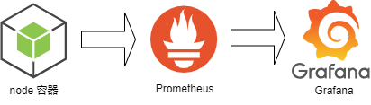
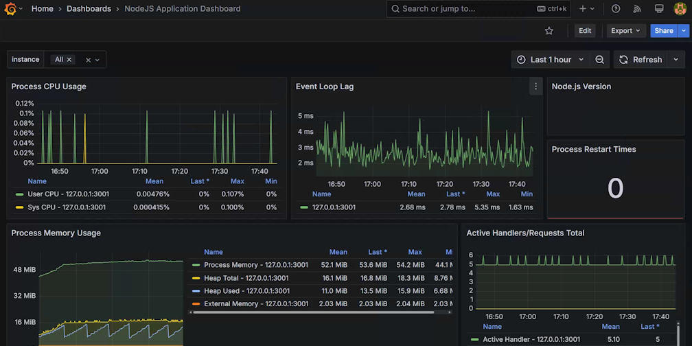
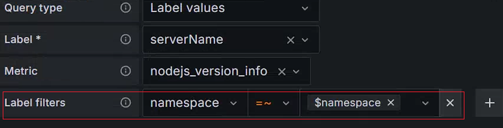
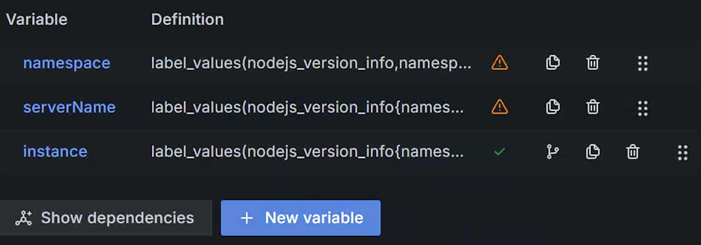
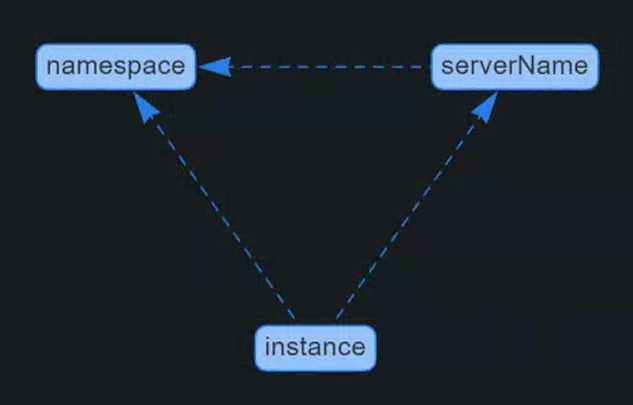

## 14 日志和监控

软件开发过程中，将一个需求以代码的形式实现，并且部署到线上，并不代表当前需求的开发周期完成了。首先我们无法保证这次交付的代码是没有逻辑缺陷；其次我们无法保证当前的代码能够高效运行，能够抗住高并发的冲击。对于前者，我们需要能在用户反馈软件的使用障碍的时候，能够方便找到他们使用过程中产生的现场数据，方便定位问题；对于后者我们需要将软件运行过程的性能指标数据收集起来，在指标数据超过设定阈值的时候能够立马采取人工干预，做扩容操作。

解决上述这两方面的问题，我们就需要软件运行过程中收集日志和监控指标。日志，确切的说是访问日志，在服务器每次被请求的时候，将请求的参数和响应字段做记录；监控指标，可以收集服务的运行响应时间、请求频率、内存损耗等信息。从上述分析中可以看出，日志和监控指标的内容是有重合的部分的，详细日志中也可以记录响应时间，也可以推算除请求频率。但是监控指标不会讲所有明细数据都采集，而是在固定时间间隔内采集一次，用这些采集到的离散的点来从逻辑上描述一个趋势，以此来预感服务是否正常，不正常则报警。所以说监控指标采集的数据量更小，日志数据收集的更精细，力求涵盖单次请求的所有上下文数据。两者各有所长，在不同的场景下发挥其作用。

### 14.1 收集日志

日志收集代码在 Node 中还是比较容易实现的，拿使用 Express 的情况做一个介绍，在其中添加一个中间件，然后把请求头信息、请求参数、响应码、响应正文等数据收集起来，可以发送到消息队列然后转存到日志分析服务中，或者可以直接发送到数据库中。

以下以笔者的项目 [@yunnysunny/request-logging](https://github.com/yunnysunny/request-log) 为例进行讲解 。

```javascript
const requestLog = require('@yunnysunny/request-logging').default;
const express = require('express');
const path = require('path');
const bodyParser = require('body-parser');
const http = require('http');
const {
    slogger,
    port,
    kafkaSchedule,
} = require('./config');
const { setTimeout } = require('timers/promises');

const app = express();
app.enable('trust proxy');

app.set('port', port);
app.use(requestLog({
    onReqFinished: (data) => {
        kafkaSchedule.addData(data);
    },
}));

app.use(bodyParser.json({ limit: '1mb' }));
app.use(bodyParser.urlencoded({
    extended: false,
    limit: '1mb'
}));

app.use(express.static(path.join(__dirname, 'public')));
const codes = [1, 2, 3];
app.use('/', async (req, res) => {
    const duration = Math.random() * 1000;
    await setTimeout(duration);
    const resCode = duration > 500 ? codes[Math.floor(Math.random() * 3)] : 0;
    res.set('res-code', '' + resCode);
    res.send('hello world');
});

// catch 404 and forward to error handler
app.use(function (req, res, next) {
    const err = new Error('Not Found:' + req.path);
    (err).status = 404;
    next(err);
});

// error handlers
app.use(function (err, req, res, next) {
    const status = err.status;
    if (status === 404) {
        return res.status(404).send(err.message || '未知异常');
    }
    res.status(status || 500);
    slogger.error('发现应用未捕获异常', err);
    res.send({
        msg: err.message || '未知异常',
        code: 0xffff
    });
});

const server = http.createServer(app);

server.listen(port);
server.on('error', (err) => {
    slogger.error('发现应用启动异常', err);
});
function onListening () {
    const addr = server.address();
    const bind = typeof addr === 'string'
        ? 'pipe ' + addr
        : 'port ' + addr.port;
    slogger.info('Listening on ' + bind);
}
server.on('listening', onListening);

setInterval(() => {
    const path = ['/a', '/b', '/c'][Math.floor(Math.random() * 3)];
    const options = {
        port,
        host: '127.0.0.1',
        method: 'GET',
        path,
    };

    const req = http.request(options, (res) => {
        res.on('data', (chunk) => {
            // console.log(`BODY: ${chunk}`);
        });
    });
    req.end();
}, 1000);
```

**代码 14.1.1**

在 17 行中引入了 `@yunnysunny/request-logging` 包，它会将请求数据做收集，并将收集的数据发送到 kafka 中。kafka 在日志采集和大数据领域广泛采用，它支持将数据批量写入，常用的 kafkajs 提供了批量写入的 API，但是不支持定时批量写入功能，我们在上述代码中的对象 kafkaSchedule 变量初始化自 [queue-schedule](https://www.npmjs.com/package/queue-schedule) 库，它提封装了定时批量写入功能。

> kafka 服务可以选择本地搭建，具体参见 **代码 14.1.1.1** 。

为了方便后续的数据分析，这里将收集到的数据字段列到下面的表格中：

**表 14.1.1 请求日志字段说明**

| 名称                 | 类型          | 描述                                                                                        |
| ------------------ | ----------- | ----------------------------------------------------------------------------------------- |
| req_id             | String      | 日志的唯一 ID                                                                                  |
| domain             | String      | 请求域名                                                                                      |
| original_url       | String      | 请求原始链接，包含 query string 内容                                                                 |
| path               | String      | 请求路径，不包含 query string 内容                                                                  |
| router             | String      | 请求对应的 Express 路由                                                                          |
| user_agent         | String      | 请求者的 UA 信息                                                                                |
| custom_headers     | Object      | 你希望收集的特定 HTTP 请求头                                                                         |
| custom_envs        | Object      | 你希望收集的特定服务器环境变量                                                                           |
| method             | String      | HTTP 请求的 method                                                                           |
| ip                 | String      | 请求者的 IP                                                                                   |
| server_id          | String      | 服务器的 IP 地址                                                                                |
| server_host        | String      | 服务器的hostname                                                                              |
| duration           | Number      | 请求耗时，单位为毫秒                                                                                |
| pid                | Number      | 服务器的进程 ID                                                                                 |
| req_seq            | Number      | 内部请求 ID，是一个自增数字                                                                           |
| content_length_req | Number      | 请求头中的 content-length 值                                                                    |
| content_length     | Number      | 响应头中的 content-length 值                                                                    |
| status_code        | Number      | HTTP 响应的状态码                                                                               |
| res_code           | Number      | 请求响应返回的逻辑 code 值，从响应头`res-code`中读取 或者从 `res.locals._res_code` 中读取。                        |
| res_data           | String\|any | 请求响应正文，包内部默认转成 JSON 字符串，从 `res.locals._res_data` 中读取原始数据。                                 |
| req_time           | Number      | 请求开始处理的时间戳                                                                                |
| req_time_string    | String      | 请求开始处理的时间戳对应的时间字符串，符合 [ISO 8601 Extended Format](https://en.wikipedia.org/wiki/ISO_8601). |
| req_data           | String\|any | 请求正文，包内部默认转成 JSON 字符串                                                                     |
| referer            | String      | 请求头的 referer 值                                                                            |
| session            | Object      | 请求会话对象，代码编写者要避免其内部单个属性拥有多个类型的情况，否则会导致 ES 写入失败                                             |
| aborted            | Boolean     | 请求是否被取消，在响应体发送前请求者 socket 句柄关闭时，此值为 `true`                                                |

#### 14.1.1 使用 ksqldb

将日志采集到 kafka 后，我们可以使用 ksqldb 来快捷查询日志数据。这里给出一个 docker-compose 文件，用来快速启动一个 ksqldb 环境：

```dockercompose
services:
  kafka:
    image: yunnysunny/kafka
    container_name: kafka
    hostname: kafka
    ports:
      - "9092:9092"
      - "9999:9999"
    networks:
      - my_network
    environment:
      KAFKA_ADVERTISED_LISTENERS: PLAINTEXT://kafka:9092
      # JMX_PORT: 9999
      KAFKA_JMX_OPTS: "-Dcom.sun.management.jmxremote -Dcom.sun.management.jmxremote.port=9999 -Dcom.sun.management.jmxremote.authenticate=false -Dcom.sun.management.jmxremote.ssl=false"
  ksqldb-server:
    image: confluentinc/ksqldb-server:0.28.2
    hostname: ksqldb-server
    container_name: ksqldb-server
    user: root
    depends_on:
      - kafka
    ports:
      - "8088:8088"
    networks:
      - my_network
    environment:
      KSQL_BOOTSTRAP_SERVERS: kafka:9092
      KSQL_LISTENERS: http://0.0.0.0:8088/
      # KSQL_KSQL_SERVICE_ID: ksql_service_1_
      KSQL_KSQL_LOGGING_PROCESSING_STREAM_AUTO_CREATE: "true"
      KSQL_KSQL_LOGGING_PROCESSING_TOPIC_AUTO_CREATE: "true"

  kafka-ui:
    container_name: kafka-ui
    image: provectuslabs/kafka-ui:latest
    depends_on:
      - ksqldb-server
      - kafka
    ports:
      - 8090:8080
    networks:
      - my_network
    environment:
      KAFKA_CLUSTERS_0_NAME: local
      KAFKA_CLUSTERS_0_BOOTSTRAPSERVERS: kafka:9092
      KAFKA_CLUSTERS_0_KSQLDBSERVER: http://ksqldb-server:8088
      DYNAMIC_CONFIG_ENABLED: true # not necessary for sasl auth, added for tests
#    volumes:
#      - ~/kui/config.yml:/etc/kafkaui/dynamic_config.yaml
networks:
  my_network:
    driver: bridge
```

**代码 14.1.1.1 kafka 本地环境搭建 dockerfile 文件**

> 这里 confluentinc/ksqldb-server 镜像用了 0.28.2 版本，笔者曾经尝试过官方文档中的 0.29.0 版本，发现无法正常启动。
> 为了让 docker compose 中的 ksqldb-server 正确的连接到 kafka 容器中，kafka 容器在启动的时候设置环境变量 KAFKA_ADVERTISED_LISTENERS 的值为 `kafka:9092`，这就导致你在 Node 程序中连接到 kafka broker 后，其会返回集群的连接地址为 `kafka:9092`，为了保证你的电脑能够识别这个地址，你需要在操作系统的 hosts 文件中添加一条记录 `127.0.0.1 kafka`，否则无法正常和 kafka 服务进行通信。

ksqldb 的端口号，改写成了 8090，因为很多人电脑上 8080 端口号被占用了。为了方便数据演示，我们安装了 kafka ui 这个工具，它支持显示 ksql 查询结果。

点击 kafka ui 的 KSQL DB 菜单，然后点击 Execute KSQL Request 按钮，即可发现一个 KSQL 的输入文本框。


图 14.1.1.1 kafkaui 中创建

在上图的文本框中输入以下语句

```ksqldb
CREATE STREAM req_log (
  req_id STRING,
  domain STRING,
  original_url STRING,
  path STRING,
  router STRING,
  user_agent STRING,
  custom_headers MAP<STRING, STRING>, 
  custom_envs MAP<STRING, STRING>,
  method STRING,
  ip STRING,
  server_id STRING,
  server_host STRING,
  duration BIGINT,
  pid BIGINT,
  req_seq BIGINT,
  content_length_req BIGINT,
  content_length BIGINT,
  status_code INT,
  res_code INT,
  res_data STRING,
  req_time BIGINT,
  req_time_string STRING,
  req_data STRING,
  referer STRING,
  session MAP<STRING, STRING>,
  aborted BOOLEAN
) WITH (
  kafka_topic='req-log',
  value_format='JSON'
);
```

**代码 14.1.1.2 创建流语句**

执行完成后，清空文本框，重新输入 `select * from req_log;` 并执行，就能查询到 kafka 中的数据了


像我们正常使用 sql 一样，你也可以使用查询条件对于结果进行过滤，比如说你输入，

```sql
 select path, res_code, req_time_string from req_log where res_code <> 0;
```

**代码 14.1.1.3**

就能展示所有 res_code 不能 0 的请求日志，并只返回 path res_code req_time_string 三个字段。

我们相对 res_code 进行聚合分析，可以使用如下语句：

```sql
SELECT COUNT(*) AS sum, path, res_code
FROM req_log 
WHERE res_code <> 0 
GROUP BY path, res_code 
EMIT CHANGES;
```

**代码 14.1.1.4**

注意上述代码有一个变化就是结尾加了 `EMIT CHANGES` 关键字，这是由于 ksql 默认使用 pull 的模式来查询数据，可以查询存入 kafka 的所有历史数据，pull 模式查询完成后就退出查询进程。但是如果你想做聚合分析时，其只能支持 push 模式，在 push 模式下你只能收到新增的数据，查询过程中会一直卡住，等待新数据的到来。所以由于 push 机制的限制，你没法对历史数据做聚合分析。

#### 14.1.2 使用 ELK

KSQL 虽然能对日志进行查询和分析，但是功能过于简单，业内最著名的日志分析工具，非 **E**(lasticSearch)**L**(ogstash)**K**(ibana) 莫属。

ElasticSearch，简称 ES， 基于 [Lucene](https://lucene.apache.org/) 开发，是一个搜索和数据分析引擎；Kibana 用来对 ES 数据进行可视化查询和报表展示；Logstash 是一个日志数据转换工具，可以支持从 kafka 、本地文件、HTTP、TCP、UDP、ES、sqlite、s3、标准输入等数据源采集数据，并将其转发到 kafka、ES、s3、http、TCP、UDP、zabbix、标准输出、mongodb、syslog 等目标。

我们在上一节中已经将日志收集到了 kafka，下面将讲述如何将 kafka 中的数据转存到 ES 中，并通过 Kibana 进行数据分析。

首先需要用 Logstash 工具，将 kafka 的数据导入到 ES 中。为了演示方便，直接从[官网](https://www.elastic.co/cn/downloads/logstash)下载最新版本到本地。解压缩下载得到的压缩包后，进入解压目录，在 config 文件夹下新建一个 kafka.conf 的文件，贴入如下内容：

```shell
input {
  kafka{
    bootstrap_servers => ["127.0.0.1:9092"]
    group_id => "es-cloud-next"
    auto_offset_reset => "earliest" #从最新的偏移量开始消费
    consumer_threads => 2
    topics => ["req-log"] #数组类型，可配置多个topic
  }
}
filter {
    json {
        source => "message"
        remove_field => "message"
    }
}
output {
  elasticsearch { 
    action => "index"
    cloud_id => "" 
    api_key => "" 
    index => "nodejs-demo-%{+YYYY-MM-dd}"
    codec => "json"
  }
}
```

**代码 14.1.2.1 config/kafka.conf**

整个配置文件分为 `input` `filter` `output` 三个部分：`input` 用来配置 kafka 连接信息，`filter` 用来做一些数据格式转化，output 用来指定输出目标的配置。这里将从 kafka 中读取到的数据序列化成 json，因为 logstash 会将读取到的数据挂载到 message 字段上，所以要指定一下 `source` 参数为 `message`，同时我们在解析完 json 后，就将 message 字段删除掉，读者可以自行选择是否保留这个原始的 `message` 字段，防止出现 json 解析失败后无法得知原始消息的问题。

最下面的 elasticsearch 的配置中的 `cloud_id` `api_key` 字段，我们先留空。鉴于 ES 使用了全文索引等特性，运行起来比较耗费机器资源，使用笔记本来运行的话比较吃力，所以这里我们演示的时候会用到云厂商的 ES 服务。[Elastic Cloud](https://www.elastic.co/cn/cloud) 提供了 14 天的试用时间，且其 ES 版本为最新的 8.x 版本，所以笔者选择了这个官方版本的服务进行讲解。

>如果想使用永久免费的服务，可以选择 [Bonsai](https://bonsai.io/pricing)提供的服务，它可以允许最多存储 3 万条数据，对于新手练习来说也够用。

使用任意邮箱注册 Elastic Cloud 后，会提示你创建一个部署


**图 14.2.1.1 创建 ES 部署**

点击按钮 Create deployment 后，会跳转到 Kibana 界面，在其中选择 Search 标签页，然后选择 Connect to the Elasticsearch API 按钮，在弹出的窗口中，点击 API key 选项卡，然后输入 API key 的名字，点击 Create API key 按钮，会弹出创建 key 的配置界面。


**图 14.2.1.2 生成 API key**

在 key 的配置界面中记得把下拉框选择成 logstash，否则默认生成密钥不能给 logstash 使用：


**图 14.2.1.3 选择 Logstash 密钥类型**

`cloud_id` 参数从 **Endpoint** 选项卡中可以查看到：


**图 14.2.1.4 cloud_id 参数获取**

至此 cloud_id 和 api_key 两个参数就都拥有了，运行 `bin/logstash -f config/kafka.conf` 即可将 kafka 中的数据消费到 ES 中。

运行成功后，我们通过 kibana 左侧菜单中的 Stack Management -> Index Management ，可以找到我们新建的 ES 索引


**图 14.2.1.5 es 索引列表查看**
##### 14.1.2.1 kibana 简单数据查询

为了让 kibana 中能查询到 ES 索引中的数据，我们需要在左侧菜单中一次点开 Stack Management -> Data View ，在打开界面中点击按钮 Create data view，


**图 14.1.2.1.1 创建 kibana data view**

Index pattern 选项中我们使用 * 通配符进行索引，是由于我们的 ES 所以是按照日期生成的，使用 * 后可以匹配到所有以 nodejs-demo- 开头的索引。Timestamp field 默认值 @timestamp 是指单条记录写入 ES 的时间，这里可填写的字段只要是符合  [ISO 8601 Extended Format](https://en.wikipedia.org/wiki/ISO_8601) 格式即可，而我们日志中 req_time_string 在代码中之所以要格式化成 ISO 8601 格式，就要用在这个地方做时间索引，这样在 kibana 中数据就可以精确的使用请求开始时间进行排序，更利于我们统计 RPS（每秒请求数）。

点击按钮 Save data view to Kibana 之后，通过点击左侧菜单的 Discover ，然后再下图中 ② 号位置下拉选择我们之前创建的 nodej-demo，就可以从 kibana 中看到 ES 的数据了。


**图 14.1.2.1.2 kibana 数据表展示**

在③号位置可以看到，在单位时间内的并发量，柱状图越高代表并发量越大。其上面显示为 Auto interval 的区域可以调整单位时间的颗粒度，展开后会发现里面有毫秒、秒、分钟、小时、天、星期、月、年等单位。⑥号位可以调整当前数据的时间段，kibana 支持按照秒、分钟、小时、天、年等粒度来划分时间段，也支持指定开始、截至的时间点来划分时间段。柱状图下面显示的数据详情，Documents 中 显示数字代表当前时间段内有 883 条数据，数据使用分页展示，④号可以调整分页大小，⑤号位可以切换页码。

如果想检索数据可以在⑦号位中输入 [KQL](https://www.elastic.co/guide/en/kibana/current/kuery-query.html) 表达式，举几个例子，我们前面收集的日志中有 method 这个字段，那么我们搜 method 为 GET 的日志，可以用以下表达式，输入⑦号位后回车即可展现查询结果：

```kql
method: GET
```

**表达式 14.1.2.1.1**

如果想查 method 为 GET，并且 router 为 /a 的日志，可以用 AND 关键字连接两个查询表达式：

```kql
method: GET AND router: /a
```

**表达式 14.1.2.1.2**

如果想查 user_agent 字段中包含 Windows NT 10.0; Win64; x64 字符串的日志，你需要使用下面的表达式：

```kql
user_agent: "Windows NT 10.0; Win64; x64"
```

**表达式 14.1.2.1.3**

注意我们将值的内容用引号包裹起来了。如果你不加引号写成 user_agent: Windows NT 10.0; Win64; x64，其会隐式转化为 user_agent: Windows AND user_agent: NT AND user_agent: 10.0; AND user_agent: Win64; AND user_agent: x64 ，这样搜索的时候只要包含空格分隔的五个单词就能匹配到日志记录，并不关心当前的五个单词是否是按照我们指定的顺序出现的。

还有一点需要注意，如果你查询的字符串中包含如下字符 `\():<>"*` ，那么你需要使用 \ 字符进行转义，或者使用引号将查询字符串包裹起来。比如说我们查询 referer 字段为 http://localhost 的时候，可以写成以下两种方式：

```kql
referer: http\://localhost
referer: "http://localhost"
```

**表达式 14.1.2.1.4**

如果我们查询的逻辑比较负责，可以使用小括号来更改逻辑判断的优先级，比如说我们想查询 method 为 GET ，且 router 为 /a 或者 /b 的日志，可以写成如下表达式：

```kql
method: GET AND (router: /a OR router: /b)
```

**表达式 14.1.2.1.5**

最后，如果想不区分任何字段做全文检索，可以直接输入在⑦号位输入你想查询的字符串即可，例如我们想查询包含 desktop 的字符串，直接在输入框输入 desktop 回车即可。

上面讲了 kql 的一些基本使用教程，如果你觉得记住这些规则太过麻烦，kibana 还提供了图形界面来简化你的操作，比如说对于 **表达式 14.1.2.1.5**，可以在 ⑧ 号位点击加号，在弹出的输入框中依次输入


**图 14.1.2.1.2 kibana 数据筛选面板**

输入完第一行后，点击选择 AND 按钮，继续添加第二行。注意这里我们筛选的字段后面有一个 .keyword 后缀，拿第一行举例，你在点击开第一列的时候，会弹出 method 和 method.keyword 两个选项。两者的区别是 method 会做部分匹配，也就是说筛选值可以是当前字段值的子字符串；但是使用 method.keyword 就会做严格匹配，你的筛选值必须得和字段值完全相同才行，同时如果你选择了 .keyword 的格式后，kibana 会自动列出来部分可选值，这对于可以枚举的字段值来说筛选起来比较方便。

由于我们一条记录中包含的字段比较多，为了显示更多的记录，kibana 默认只显示前面几个字段，一般我们筛选完数据后更关心跟筛选字段相关联的几个字段，这时候你可以在左侧搜索到你关心的字段名，然后点击 ＋ 号。


**图 14.1.2.1.3 kibana 选择展示特定字段**

这里我们选择 router 和 res_code 两个字段，着重进行展示，可以得到表格视图的展示效果：


**图 14.1.2.1.4 kibana 选择字段后展示表格视图**

鼠标悬浮在每个字段名上面后，会出现 ┇ 的图标，点击这个图标之后，弹出菜单中可以选择删除此字段：


**图 14.1.2.1.5 kibana 数据条件弹出菜单**

 ⑧ 号位还可以多次点击添加多个筛选条件，各个筛选条件之间是 AND 的关系，所以也可以将 **图 14.1.2.1.2** 中的筛选条件拆成两条。


**图 14.1.2.1.6 kibana 数据条件弹出菜单**

拆成多条有一个好处，在任何一个刷线条件上单击，就会弹出菜单来对当前条件进行反向求值（Exclude results）、临时禁用（Temporarily disable）或者删除（Delete）等操作。

点击 ⑨ 号位位置会在弹出的对话框中选择 Copy link 按钮，会将当前地址栏对应的地址生成一个短链接拷贝到剪贴板中。


**图 14.1.2.1.7 kibana 拷贝链接**

最后是 ⑩ 号位位置，如果你想将当前查询的筛选条件
### 14.2 采集监控指标

对于监控指标的采集，一般采用的是 [Prometheus](https://prometheus.io/) ，它需要定时请求应用程序自己提供 HTTP 接口来拉取监控指标数据。

> 这种行为跟传统的监控服务的 zabbix 正好相反（zabbix 需要依赖应用程序主动将监控指标上报上去），但是这种主动拉取的行为更具有灵活性，这样可以在 Prometheus 侧统一控制数据抓取时间间隔，还可以通过感知应用侧的 HTTP 接口是否可用来触发预警。

所以如果想让 Prometheus 正确的抓取到数据，必须使用它的驱动程序生成符合 Prometheus 读取格式的数据，这个驱动就是 [prom-client](https://github.com/siimon/prom-client) 。要想学习这个驱动的使用方法，必须先了解 Prometheus 中的数据结构。

#### 14.2.1 指标数据结构

##### 14.2.1.1 计数器 （Counter）

计数器随着时间的增加，只能增加不能减少，从数学意义上讲其值和时间的关系是一个线性的递增的曲线。


**图 14.2.1.1.1**

##### 14.2.1.2 仪表盘（Guage）

仪表盘可以理解为汽车的速度表，其取值随着时间的推移可以忽高忽低，从数学意义上讲其值和时间的关系是一个不规律的曲线。从理论上也可以出现负值，这主要取决于指标采集者采集的数据的具体内容，比如说采集的数据是摄氏度，就有可能出现负值的情况。


**图 14.2.1.2.1**

##### 14.2.1.3 直方图（Histogram）

直方图是一种统计学上的数据结构，它一般用来将一个固定取值空间内的数据划分为若干区间，这里提到的“区间”，在 Prometheus 中被称之为桶（bucket）。应用程序在生成指标数据的时候，需要在每个桶里填入落入当前桶所关联的取值区间的总数。和前两小节讲到的数据结构不同，计数器和仪表盘在一个时间点上取到的是一个值，而直方图会取到个值，每个桶都会对应一个值。同时注意到各个桶的取值范围都是 `[begin, y]`，其中 `begin` 为取值空间的最小值，`y` 取值空间中的一个具体取值，如果有三个数值满足 `y3 > y2 > y1`，则很明显桶 `[begin, y3]` 包含 `[begin, y2]`，桶 `[begin, y2]` 包含 `[begin, y1]`。


**图 14.2.1.3.1**

借助于第三方可视化工具，我们可以会截取一个时间段，将其绘制成我们更直观看到的直方图，比如说我们我们在上图中截取一个虚线指示的时间段。


**图 14.2.1.3.2**

就可以转化成一个如下的可视化结构


**图 14.2.1.3.3**

由于展示的是一个时间段内的取值，所以上图中 n1 n2 n3 代表三个不同的桶在当前时间段内的平均值。由于 y3 y2 y1 三个桶是互相包含的关系，所以一定会保持这个关系 `n3 >= n2 >= n1`。

##### 14.2.1.4 摘要（Summary）

摘要和直方图类似，都是对于数据划分不同的统计区间，只不过摘要的桶是按照百分位数划分的。百分位数是一个统计学术语， 需要通过一个例子来解释其含义。假设一个年级有 100 位学生，我们将学生的分数按照从小到大排列形成一个数组（这里假定没有同分现象），则数组第 5 名对应的学生的分数就叫做 95 分位数，我们记这个分数为 `α`，则代表该年级 95% 的学生的学生分数都低于或者等于 `α` 。

由于我们在采集样本的时候，样本数目肯定不会恰好等于 100 个，所以在计算百分位数的时候，会有一定误差，所以 Prometheus 的各个语言的 API 在初始化摘要的时候，都会设定一个误差允许范围。同时留意到，和直方图不同的是摘要的计算是发生在客户端。但是如果你的程序是分布式的，将多个机器上的计算的同一指标的摘要是没法做加和运算的，但是同一指标的直方图数据却是可以加和的。

同直方图类似，百分位数大的桶是包含百分位小的桶的样本的，但是直方图录入  Prometheus 落入某一个桶的总数，而摘要代表的是落入当前桶里面的所有样本的最大值。假设我们将一个服务的各个接口的处理时长做成摘要录入 Prometheus ，则 95 分位的值代表所有时长正序排序后前 95% 的样本中的最大值。

将摘要的各个桶绘制出来时间曲线的话，跟直方图也是类似的形状：


**图 14.2.1.4.1**

#### 14.2.2 指标采集代码

讲述玩 Prometheus 中的数据结构后，就可以编写代码了。首先 `prom-client` 根据 Prometheus [官方推荐](https://prometheus.io/docs/instrumenting/writing_clientlibs/#standard-and-runtime-collectors)已经内置了若干指标，可以通过如下代码进行收集：

```javascript
const client = require('prom-client');
const collectDefaultMetrics = client.collectDefaultMetrics;
collectDefaultMetrics();
```

**代码 14.2.2.1**

里面包含 CPU 时间、堆大小、进程文件句柄数、Event Loop 暂停时间、libuv 句柄数、GC 耗时等信息。

和其他语言的驱动不同，prom-client 没有和任何 http 框架集成，你需要手动将其包裹在一个 http 路由中：

```javascript
http.createServer((req, res) => {
    if (req.url === '/metrics') {
        client.register.metrics().then(function (str) {
            res.end(str);
        }).catch(function (err) {
            res.end(err);
        });
        return;
    }
    res.end('Hello World');
}).listen(port);
```

**代码 14.2.2.2**

如果想收集自定义指标，使用起来也比较简单。现在拿 http 请求场景举例，请求计数，由于其只能增加，所以只能使用计数器数据结构；请求的处理时长，由于是上下波动的，所以可以使用仪表盘来上报，也可以指定若干桶数值将其上报为直方图结构，与其类似，指定百分位数就可上报为摘要结构。两者的示例代码如下：

```javascript
const client = require('prom-client');
const counter = new client.Counter({
    name: 'req_count',
    help: 'http request count',
});
exports.addReqCount = function () {
    counter.inc(); // Increment by 1
    console.log('add one');
};
```

**代码 14.2.2.3 对于计数器使用的示例代码**

```javascript
const client = require('prom-client');
const gauge = new client.Gauge({
    name: 'req_duration',
    help: 'request duration'
});
const histogram = new client.Histogram({
    name: 'req_duration_histogram',
    help: 'request duration histogram',
    buckets: [10, 20, 40, 60, 80, 100, 120, 140, 160, 180]
});
const summary = new client.Summary({
    name: 'req_duration_summary',
    help: 'request duration summary',
    percentiles: [0.01, 0.1, 0.5, 0.9, 0.99],
});
exports.collectDuration = function (duration) {
    gauge.set(duration);
    histogram.observe(duration);
    summary.observe(duration);
};
```

**代码 14.2.2.4 对于仪表盘、直方图、摘要的示例代码**
：
### 14.3 指标可视化
指标写入 Prometheus 后，我们还需要使用 grafana 将其做可视化。Prometheus 主动来应用服务中抓取指标数据， grafana 也会定时从 Prometheus 中抓取指标数据来绘制报表。


**图 14.3.0 指标采集数据流图**

#### 14.3.1 默认指标收集

**代码 14.2.2.1** 是一个简单的指标收集代码，但是它没有考虑到生产环境使用时会部署若干个容器节点，为了更便捷观测某一个服务的运行状态，我们更倾向通过集群名称或者部署服务名称来对节点进行筛选。为了这么做，我们首先改造一下 **代码 14.2.2.1** ，因为我们要引入一个 `lable` 的概念。 为了方便数据做聚类统计，Prometheus 支持对每条采集数据中添加如果标签（`label`）。我们这里正是利用这个特性，对我们的数据添加上服务名称和命名空间（这里模拟 k8s 的命名空间概念）标签：

```javascript
const client = require('prom-client');
const { commonLabels } = require('./config');  

const collectDefaultMetrics = client.collectDefaultMetrics;
collectDefaultMetrics({
    labels: commonLabels,
});
```
**代码14.3.1.1 添加了 lables 属性的采集数据**

为了快速搭建一个 Prometheus 的数据采集环境，这里准备了一份 docker-compose 文件
```yaml
version: "3"
services:
  alertmanager:
    restart: always
    image: prom/alertmanager
    network_mode: host
    volumes:
      - ./alertmanager:/etc/alertmanager
  prometheus:
    restart: always
    user: root
    privileged: true
    image: bitnami/prometheus
    container_name: prometheus-dev
    network_mode: host
    volumes:
      - ./prometheus:/opt/bitnami/prometheus/conf
    depends_on:
      - alertmanager
  grafna:
    restart: always
    image: grafana/grafana
    user: root
    volumes:
      - ./grafana-persistence:/var/lib/grafana
    network_mode: host
    environment:
       GF_SECURITY_ADMIN_PASSWORD: "secret"
    depends_on:
      - prometheus
```
**代码 14.3.1.1 docker-compose.yml**

上面配置文件中，我们设置了一个卷映射 `./prometheus:/opt/bitnami/prometheus/conf` ，这是为了方便我们修改配置文件用，因为镜像 `bitnami/prometheus` 默认将配置文件放置到了 `/opt/bitnami/prometheus/conf` 目录下，我们在本机 `prometheus` 文件夹下放一个 `prometheus.yml` 文件即可被 Prometheus 读取到，这个配置文件的内容如下：
```yaml
# my global config
global:
  scrape_interval:     15s # Set the scrape interval to every 15 seconds. Default is every 1 minute.
  evaluation_interval: 15s # Evaluate rules every 15 seconds. The default is every 1 minute.
  # scrape_timeout is set to the global default (10s).
# Alertmanager configuration
alerting:
  alertmanagers:
  - static_configs:
    - targets:
      - alertmanager:9094
# A scrape configuration containing exactly one endpoint to scrape:
# Here it's Prometheus itself.
scrape_configs:
  # The job name is added as a label `job=<job_name>` to any timeseries scraped from this config.
  - job_name: 'prometheus'

    # metrics_path defaults to '/metrics'
    # scheme defaults to 'http'.

    static_configs:
    - targets: ['localhost:9090']
  - job_name: 'nodejs'

    # metrics_path defaults to '/metrics'
    # scheme defaults to 'http'.

    static_configs:
    - targets: ['你node进程所在的ip1:3001', '你node进程所在的ip2:端口2']
```
**代码 14.3.1.2 prometheus/prometheus.yml**

>注意最后一行，你需要正确填写你的 node 进程所在的 IP，在某些环境下，这个 IP 可以用 `host.docker.internal` 替代。

在 docker-compose.yml 所在目录中，通过命令 `docker compose up -d` 可以快速启动一个运行环境。在浏览器中打开地址 http://localhost:9090/ ，然后在输入框中输入 `nodejs_version_info`，然后回车。 


**图 14.3.1.1**

执行输出的结构格式会是这样的：

nodejs_version_info{instance="127.0.0.1:3001", job="nodejs", major="20", minor="9", namespace="default", patch="0", serverName="chapter14", version="v20.9.0"} 1

**输出 14.3.1.1**

其中 instance job major 等类键值对的数据，在 Promethues 中称之为 Lable，最后面那个 1 是当前这条 metric 记录的值。


>如果输入 node_version_info 表达式后回车没有出现任何值，你可以通过打开 http://localhost:9090/targets 连接来看一下被收集的 Endpoint 有没有 Error 信息打印出来。
>
>正常情况下，每行 targets 记录的 Error 列应该是空的。

接着打开 http://localhost:3000/login ，输入用户名密码 `admin` `secret` 即可进入。然后依次选择左侧菜单 **Connection** -> **Data Source** ，然后点击按钮 **Add Data Source**，接着会提供一系列的数据源供给选择，我们选择 Promethues 即可。最后是 Prometheus 的连接配置，我们在 `Prometheus server URL` 栏填入 `http://localhost:9090` ，然后点击 **Save & test** 按钮，正常情况下会提示 `✔ Successfully queried the Prometheus API.` 。


**图 14.3.1.2 添加 prometheus 数据源**

然后我们来添加一个面板将指标数据呈现出来，重新回到左侧菜单，选择 Dashboards ，然后点击按钮 Create Dashboard ，显示的操作方式中选择 Import a dashboard：

**图 14.3.1.3 选择导入面板**

在展示的 Find and import dashboards for common applications at [grafana.com/dashboards](https://grafana.com/grafana/dashboards/) 输入框中写入 11159，并点击 **Load** 按钮。

**图 14.3.1.4 输入面板 id**

`1159` 是 grafana.com 上公开的模板 id，具体说明可以参见 [NodeJS Application Dashboard | Grafana Labs](https://grafana.com/grafana/dashboards/11159-nodejs-application-dashboard/)，我们将使用这个模板来对 **代码 14.2.2.1** 采集的数据做图标展示。最后我们需要绑定一下面板关联的数据源，在下拉框 prometheus 输入框中选择我们刚才创建的数据源：

**图 14.3.1.5 绑定数据源**

点击上图的 Import 按钮后，我们就初步完成了报表展示了，会长成这个样子：

**图 14.3.1.6 配置初始化完成后展示的面板**

目前我们仅仅演示了一个服务，正常生产环境的服务数可不止一个，有可能有十几个、几十个，甚至更多，而我们在从上图中的 Instance 下拉框中进行筛选是一个很困难的事情。还记得我们改造过的 **代码14.3.1.1** 不，现在它能派上用场了。

**代码14.3.1.1** 中引用了来自文件 config.js 的 commonLabels 常量，这个常量的定义如下：

```javascript
const { name } = require('./package.json');
exports.commonLabels = {
    serverName: name,
    namespace: 'default',
};

exports.commonLabelNames = Object.keys(exports.commonLabels);
```

**代码 14.3.1.3 config.js**

通过上述代码可以看出 commonLabels 常量有 `serverName` 和 `namespace` 两个属性，分别代表启用服务的名称和所在命名空间（可以理解为 k8s 系统中的命名空间的概念），另外从**输出 14.3.1.1** 中也能看到这两个 Lable 的具体值。我们的目标就是在 **图 14.3.1.6** 中再增加两个筛选框，分别为 `namespace` 和 `serverName`，保证选中指定 `namespace` 时能够级联筛选出其下的 `serverName`，选中 `serverName` 时能够筛选出级联的 `instance` 实例。

点击 **图 14.3.1.6** 上部中间位置的 ⚙ 图标，进入设置界面，点击 **Variables** 选项卡，界面中会呈现出来当前的 instance 变量的定义，


**图 14.3.1.7**

现在我们要添加一个 `namespace` 变量，点击 **New variable** 按钮。


**图 14.3.1.8 添加 namespace 变量**

表单项中 name 输入框我们输入 namespace ，这样我们就新建了一个变量名字，叫 namespace；Lable 输入框填入的 namespace 值，将会导致在 **图 14.3.1.6 ** 中新增一个下拉框，且标记为 namespace，这里你也可以将其改为任何字符，比如说说改成中文名字 `集群`。

Query options 区域是这里配置的核心区域，首先在 Data source 区域选择好之前创建好的 Promethues 数据源。下面的 Query 表单中，Query type 选择 Label values，代表我们将从 Prometheus 数据中的 label 属性中提取数据；Labels 选择 namespace ，代表我们使用数据中 label 名字为 namespace 的值进行提取；Metric 选择 node_version_info ，代表我们只从 node_version_info 中提取 label 名字为 namespace 的值。

回到 Variables 选项卡再创建一个 `serverName` 变量，这次我们所有的操作都跟 `namespace` 类似，唯独下图中红框中标出来的内容：



**图 14.3.1.9 筛选 Lable 值**

我们增加一个 `namespace = $namespace` 的表达式，就能够实现在指定 `namespace` 值下筛选 `serverName` Label 值的能力。对于这个表单时来说等号前面代表名字为 `namespace` 的 Prometheus Label，等号后面的代表前面我们定义的 `namespace` 变量。

最后我们要修改一下原来的 instance 变量的，将其的 Label filters 改为 `serverName = $serverName` 。然后回到 Variables 选项卡，拖动调整一下三个变量的顺序，保证 namespace 第一位、serverName 第二位、instance 第三位。



**图 14.3.1.10 调整顺序后的变量**

上图中 namespace 和 serverName 上面标识了 ⚠️，代表当前变量没有被其他变量引用，但是我们刚才通过设置过滤表达式，已经将所有变量关联起来了，这属于误报，你可以通过点击变量列表左下角按钮 **Show dependencies**，即可查看依赖关系，正常情况下你看到的依赖关系如下图所示：



**图 14.3.1.11 变量依赖关系**

如果你看到的依赖关系没有形成上述依赖链的形式，代表上述的配置中哪个地方是有问题的，需要重新检查一遍。

最后，还有一件最重要的事情，你上面做的所有操作都只是临时操作，如果你不点击顶部右上侧的 **Save dashboard** 按钮话，所有你做的一切都将是无用功。点击保存按钮后，还是提示你写入这次更改变动的说明信息，方便你以后查阅的时候使用。

重新回调面板，我们最终就能看到一个可供级联筛选的三个下拉框了：


**图 14.3.1.12 级联下拉框**

#### 14.3.2 收集自定义指标

**代码 14.2.2.3** 和 **代码 14.2.2.4** 中演示调用 prom-client 来生成指标数据的函数，而下面代码就是来调用这些这封装函数的代码

```javascript
const SAMPLES = [20, 50, 80, 80, 100, 100, 100, 120, 120, 140, 160];
const SAMPLES_LEN = SAMPLES.length;
http.createServer((req, res) => {
    const duration = SAMPLES[Math.floor(Math.random() * SAMPLES_LEN)];
    const begin = Date.now();
    setTimeout(function () {
        const url = req.url;
        console.log('url', url);
        const path = url.split('?')[0];
        addReqCount(path);
        collectDuration(path, Date.now() - begin);
        if (req.url === '/metrics') {
            client.register.metrics().then(function (str) {
                res.end(str);
            }).catch(function (err) {
                res.end(err);
            });
            return;
        }
        res.end(JSON.stringify({
            url,
            method: req.method,
        }));
    }, duration);
}).listen(port, '0.0.0.0');
```

**代码 14.3.2.1 http请求指标采集**


### 示例代码

本章节示例代码可以从这里找到 https://github.com/yunnysunny/nodebook-sample/tree/master/chapter14
