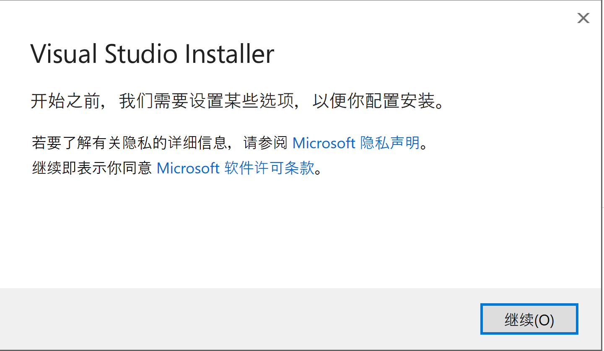
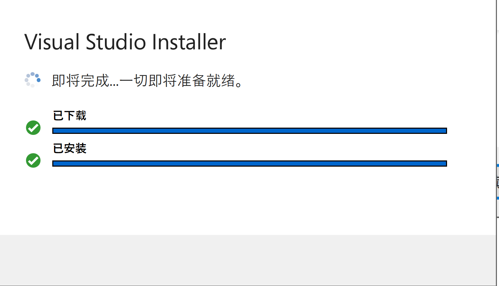
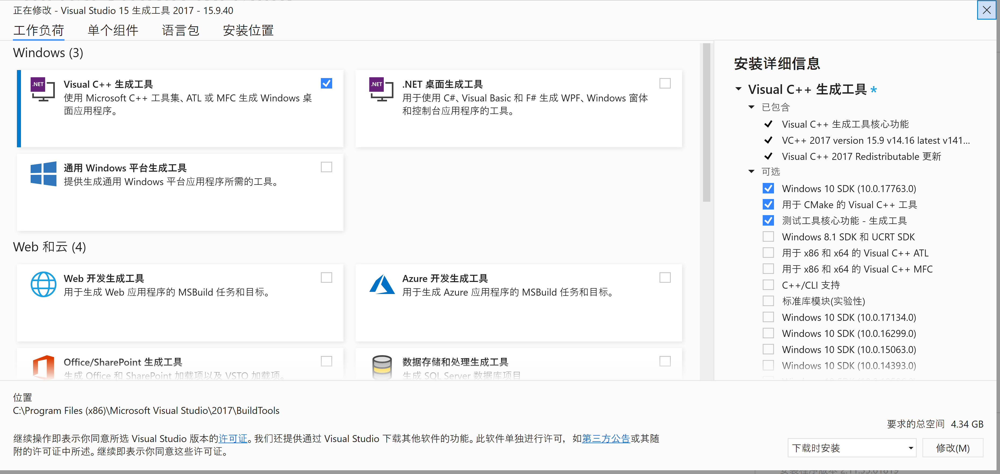
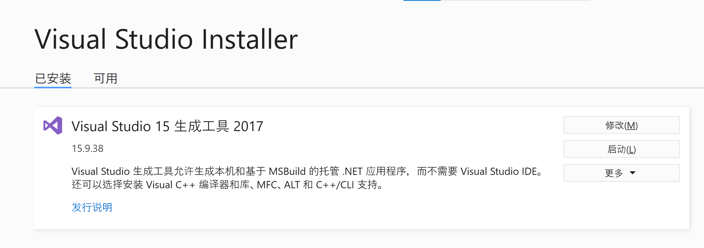
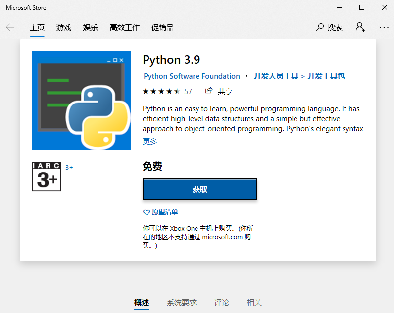
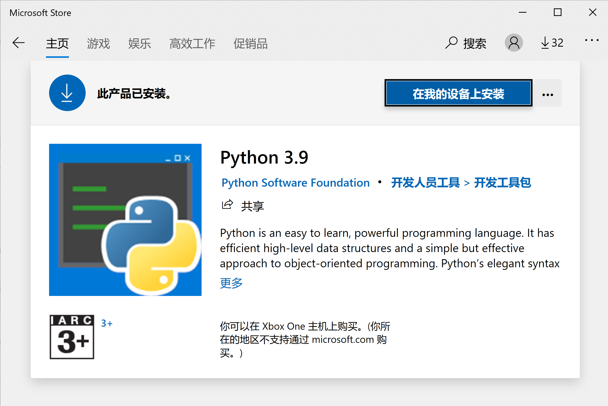
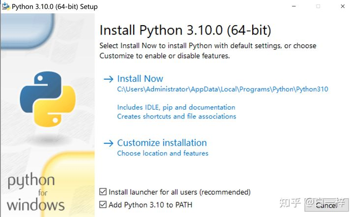

## A6 Node 原生扩展编译环境搭建

Node 使用 node-gyp 来编译原生扩展，需要操作系统具有原生代码的编译能力，下面分别给出类 Unix 环境和 Windows 环境的编译环境搭建说明。

### A 6.1 类 Unix 环境

linux 下安装编译环境的命令比较简单，debian 内核中可以通过 apt-get install build-essential -y 来安装，redhat 内核下可以使用 yum groupinstall "Development Tools" 来安装。

mac 下需要手动安装 Xcode。

### A 6.2 Windows 环境

Windows 环境比较复杂，需要手动安装 VS build tools 和 python。首先是 VS build tools 官网没有提供直接的下载页面，需要通过下面的链接手动下载：https://visualstudio.microsoft.com/thank-you-downloading-visual-studio/?sku=BuildTools&rel=15 , 其中 `rel` 参数代表 VS 的版本号，`15` 代表 VS 2017, `16` 代表 VS 2019。

下载完成后双击运行，会弹出如下界面：

**图 A 6.2.1**

点击继续按钮，会弹出安装准备进度条，这期间会下载所需的安装包：

**图 A 6.2.2**

安装包下载完成后，会弹出可选安装组件，只勾选 **Visual C++ 生成工具** ,然后点击 **修改** 按钮即可。

正常情况下，进度条走完后会显示安装成功界面

**图 A 6.2.3**

这时候关闭安装界面即可。

接下来是 python 的安装过程，直接在命令行中输入 python 命令，正常情况下会弹出 Windows Store 的安装界面，

**图 A 6.2.4**

如果你之前已经安装完成了，会显示如下界面

**图 A 6.2.5**

对于没有 windows store 的操作系统，可以直接从这个链接安装 python https://www.python.org/ftp/python/3.10.8/python-3.10.8-amd64.exe 安装时记得勾选添加到环境变量的标识。

**图 A 6.2.5**

### A 6.3 测试

接下来就可以测试一下刚才搭建的环境是否好使了，使用 `npm install native-linked-list` 来测试。注意如果你是在 Windows 上新安装的 python，那么不要在安装 python 之前的命令行的界面中运行上述测试命令，而是应该新打开一个命令行窗口来执行。
