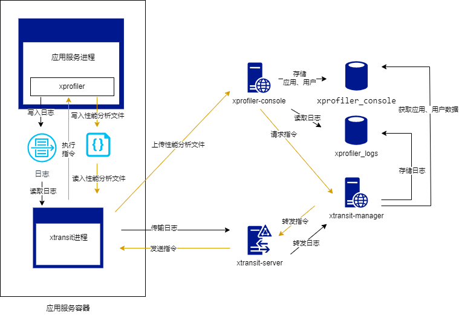
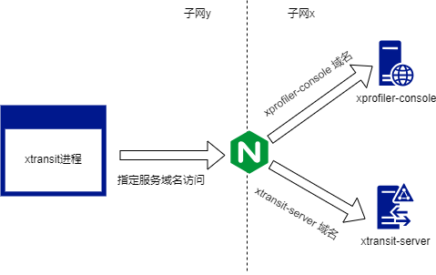
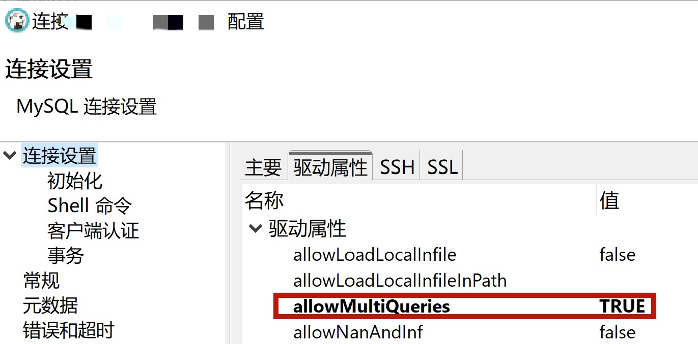
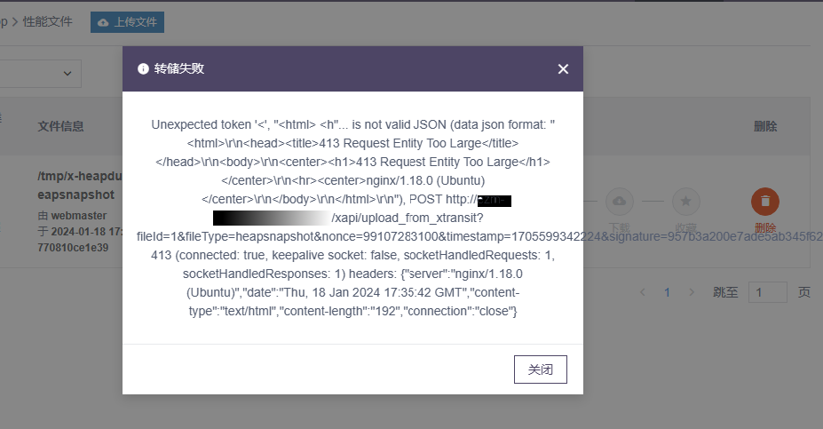

## A7 easy-monitor 环境搭建

easy-monitor 是一个 alinode 的平替开源项目。

### A 7.1 准备环境

easy-monitor 需要 MySQL 和 redis 两个外部服务来存储数据和缓存。所以在开始配置之前起码需要准备一台 MySQL 和 redis。
为了方便使用，笔者将用到服务制作成了 docker 镜像，所以这里还需要用到 docker 运行环境。

### A 7.2 拓扑结构

easy-monitor 的组件比较复杂，所以需要先讲清楚其拓扑结构才能将其正确的部署。


**图 A7.2.1**

> 这里面 xtransit-server 是一个 websocket 服务器，其他两个服务是 http 服务器。xtransit-server 用来和 xtransit 进程建立长连接，xprofiler-console 服务用来提供管理后台，xtransit-mannager 用来处理性能日志数据。

> 虽然 xtransit 部分的功能，可以合并到应用服务代码中，但是这样有可能会干扰应用服务程序本身，所以这里给出拓扑图的时候，将其和应用服务进程分离开。

整个架构图中有两条数据流线，一条是日志收集数据流，一条是指令控制数据流。前者是将应用服务中采集到的性能指标日志发送到服务器端。后者是通过 console 控制台中发送生成 CPU Profile 或者堆快照的指令到应用程序中，同时还可以通过发送指令来命令 xtransit 进程将收集到日志文件上传到服务器端。

考虑到不同公司的网络拓扑结构会有不同，比如说有的公司内部所有服务之间网络是互通的，可以通过 IP 地址直接访问；但是有的公司会将公共服务单独隔离到一个子网中，外部必须通过网络边缘的反向代理服务器来访问。

对于需要配置反向代理服务器的情况，我们一般会选择使用 nginx，这种情况下，xtransit 进程会通过 nginx 来访问 xtransit-server 和 xprofiler-console 。下面只画出三者之间的拓扑结构：

**图 A7.2.2**
为了实现上图的拓扑结构，需要在 nginx 中配置不同的域名来实现反代到不同服务的目的。
### A 7.3 运行服务器端
#### A 7.3.1 数据库初始化

库 `xprofiler_console` 使用 [xprofiler-console/db/init.sql](https://github.com/X-Profiler/xprofiler-console/blob/master/db/init.sql) 进行初始化，库 `xprofiler_logs` 使用 [xtransit-manager/db/init.sql](https://github.com/X-Profiler/xtransit-manager/blob/master/db/init.sql) 以及 [xtransit-manager/db/date.sql](https://github.com/X-Profiler/xtransit-manager/blob/master/db/date.sql) 进行初始化。
> 使用 dbear 等工具的时候，新建完连接后，默认只能执行单条 SQL 语句，将上面的 SQL 代码全选复制到其控制台中执行时，会报语法错误。需要设置驱动属性的 `allowMultiQueries` 参数为 true ：
> **图 A7.3.1.1**


这里需要注意的是，easy-monitor 后端服务使用的 MySQL 库是 [egg-mysql](https://github.com/eggjs/egg-mysql)，其最终是对 [mysql](https://github.com/mysqljs/mysql)的封装，但是这个库有一个缺陷，MySQL 8 默认使用的 caching_sha2_password 的鉴权方式，但是这个库不支持这种鉴权模式。所以在如果你使用的数据库是 MySQL 8 的话（使用 docker 创建的 MySQL 容器，默认版本就是 8.x 的版本），在不修改默认配置的情况下，得用超级管理员新建一个用户用来提供对 `xprofiler_console` 和 `xprofiler_logs` 两个库的访问：
```sql
CREATE USER 'easy'@'%' IDENTIFIED WITH mysql_native_password BY '********';
grant all privileges on xprofiler_console.* to 'easy'@'%';
grant all privileges on xprofiler_logs.* to 'easy'@'%';
flush privileges;
```
#### A 7.3.2 启动服务器端
##### A 7.3.2.1 启动容器
为了简化部署，笔者做了一个集成 xtransit-server xprofiler-console xtransit-mannager 三个服务的 docker 容器，是基于官方的 [all-in-one](https://github.com/X-Profiler/all-in-one) 项目优化而来。之所以重新做一个镜像出来，是由于官方镜像将配置信息采用磁盘文件映射的方式来提供，不是很贴合传统运维使用习惯，所以这里提供了一版全部通过环境变量来设置的镜像。
> 镜像项目地址为 [whyun-docker/node (github.com)](https://github.com/whyun-docker/node)

由于牵扯到的环境变量比较多，所以这里直接给出一个 .env 文件：
```shell
CONSOLE_MYSQL_HOST=mysql 访问 ip 或者域名
CONSOLE_MYSQL_PORT=mysql 端口号
CONSOLE_MYSQL_USER=mysql 用户名
CONSOLE_MYSQL_PASSWORD=mysql 密码
LOGS_MYSQL_HOST=mysql 访问 ip 或者域名
LOGS_MYSQL_PORT=mysql 端口号
LOGS_MYSQL_USER=mysql 用户名
LOGS_MYSQL_PASSWORD=mysql 密码
REDIS_SERVER=reidsIp1:redisPort1[,redisIp2:redisPort2]
REDIS_PASSWORD=redis 密码
CONSOLE_BASE_URL=console 服务的访问地址，例如 http://xxx-console.domian.com
```
然后我们可以通过 `sudo docker run --env-file ./.env -p 8443:8443 -p 8543:8543 -p 9190:9190 --name=easy-monitor -d yunnysunny/easy-monitor` 来启动服务。注意环境变量 CONSOLE_BASE_URL 的配置，根据 **图 A7.2.1** 的拓扑结构结构，其值要保证集成 easy-monitor 的 Node 服务能够访问到，否则上传性能分析文件就会失败。
##### A 7.3.2.2 配置nginx
如果当前网络拓扑结构中不需要配置 nginx，可以跳过此小节。如果需要配置 nginx 的话，则需要添加反向代理配置。其中对于 xprofiler-console 来说给出如下配置示例：
```nginx
server
{
    listen 80;
    server_name ezm-console.your-domian.com;
    client_max_body_size 100m;

    location / {
        proxy_redirect off;
        proxy_set_header Host $host;
        proxy_set_header X-Real-IP $remote_addr;
        proxy_set_header X-Forwarded-For $proxy_add_x_forwarded_for;
        proxy_pass http://127.0.0.1:8443;
    }

    access_log  /var/log/nginx/access.log  main;
}
```
> 我们这里将反代的地址写成了  127.0.0.1，这是由于我的环境中 nginx 和 docker 是部署在一台机器上的，读者如果部署时，根据情况自己做修改。

由于 xprofiler-console 是纯 HTTP 服务，所以反向代理的配置比较简单。需要注意的是，这里配置了一个 `client_max_body_size` 属性（此属性支持在 http server location 块中设置，具体使用方法参见官方[文档](https://nginx.org/en/docs/http/ngx_http_core_module.html#client_max_body_size)），这是由于 nginx 默认的上传大小是 1MB，但是我们生成的性能分析文件，大多数情况下又超过 1MB。如果使用默认值配置，稍后上传文件的时候 nginx 会返回 413 状态码，在 xprofiler-console 管理界面中会有弹出如下提示：

对于 xtransit-server 服务的配置，则比较特殊，因为其牵涉到 WebSocket 服务：
```nginx
# 如果没有Upgrade头，则$connection_upgrade为close，否则为upgrade
map $http_upgrade $connection_upgrade {
    default upgrade;
    ''      close;
}
server
{
    listen 80;
    server_name ezm-ws.your-domain.com;

    location / {
        proxy_redirect off;
        proxy_set_header Host $host;
        proxy_set_header X-Real-IP $remote_addr;
        proxy_set_header X-Forwarded-For $proxy_add_x_forwarded_for;
        proxy_pass http://127.0.0.1:9190;

        proxy_http_version 1.1;
        proxy_set_header Host $host;
        # 下面这两行是关键
        proxy_set_header Upgrade $http_upgrade;
        proxy_set_header Connection $connection_upgrade;
    }

    access_log  /var/log/nginx/access.log  main;
}
```
首先反向代理的的 HTTP 协议版本要选择 1.1，其次要设置 Upgrade 和 Connection 两个头信息来请求 Node 服务，否则无法正常完成 WebSocket 的握手过程。
### A 7.4 配置客户端
为了方便读者使用，这里我将集成 xtransit 的 node 镜像也制作出来了。可以先通过一个 dockerfile 文件了解一下使用步骤：
```dockerfile
ARG IMAGE_VERSION
FROM yunnysunny/node-compiler:${IMAGE_VERSION} as build-stage

COPY package.json .
COPY yarn.lock .

RUN yarn install

FROM yunnysunny/node-xtransit:${IMAGE_VERSION}
ARG JEMALLOC_HOME=/usr/lib/x86_64-linux-gnu
RUN mkdir -p /app $JEMALLOC_HOME
WORKDIR /app
# 使用jemalloc
COPY --from=build-stage ${JEMALLOC_HOME}/libjemalloc.so.2 $JEMALLOC_HOME
COPY --from=build-stage /tmp/node_modules ./node_modules
ENV LD_PRELOAD=${JEMALLOC_HOME}/libjemalloc.so.2
COPY . .
ARG EZM_APP_ID
ENV EZM_APP_ID=${EZM_APP_ID}
ARG EZM_APP_SECRET
ENV EZM_APP_SECRET=${EZM_APP_SECRET}
ARG XTRANSIT_SERVER
ENV XTRANSIT_SERVER=${XTRANSIT_SERVER}
CMD ["node", "src/app.js"]
```
注意最后面的那几个环境变量的设置，`EZM_APP_ID` `EZM_APP_SECRET` `XTRANSIT_SERVER` 是连接到 easy-monitor 必须的环境变量，`EZM_APP_ID` `EZM_APP_SECRET` 用来填写应用的 ID 和 密钥；`XTRANSIT_SERVER` 是连接到 `xtransit-server` 的 WebSocket 地址，格式为 `ws://host:port` 。
> 如果 `xtransit-server` 启用了 https ，WebSocket 地址还可以写成 `wss://host:port` 格式。

> 这里将环境变量通过 docker build 的 --build-arg 参数来指定，这样可以不用将环境变量写死在 dockerfile 中，同时从一定程度上保护了隐私。如果仅仅是测试用，可以直接将 ENV 写死在 dockerfile 中，当然也可以在 docker run 命令中通过 -e 参数来手动指定环境变量。

配合这个 `yunnysunny/node-xtransit` 镜像，xtransit 的配置基本就搞定了。下面就剩下在应用程序中引入 xprofiler 了，如果你没有啥特殊配置的话，直接在程序入口第一行写入一句话即可：
```javascript
require('xprofiler').start();
```
> xprofiler 安装时要下载原生代码的预编译库，默认从 github 下载，考虑到众所周知原因，下载比较慢。`yunnysunny/node-xtransit` 镜像基于 `yunnysunny/node` 构建，里面配置 npm config 选项，将其下载地址指向阿里云，有效的解决了这个问题。

### A 7.5 疑难解答
#### A 7.5.1 找不到应用实例

如果构建完镜像后，容器运行完之后，xprofile-console 后台中迟迟看不到启动容器的监控实例。则需要查看容器的 ~/.xtransit.log 文件，比如说在启用 nginx 的情况下，反向代理配置错误，忘记添加 Upgrade 头信息了，就会报如下错误：
```
[2024-01-19 01:31:10] [2.4.1] [info] [36] websocket client connecting to ws://ezm-ws.your-domain.com...
[2024-01-19 01:31:10] [2.4.1] [warn] [36] websocket client error: Error: Unexpected server response: 404.
```
通过日志我们就可以更快的定位问题所在。
### A 7.6 未尽事宜
由于本篇教程仅仅涉及部署内容，关于 easy-monitor 的操作指南，还请参照[官方文档](https://www.yuque.com/hyj1991/easy-monitor)。